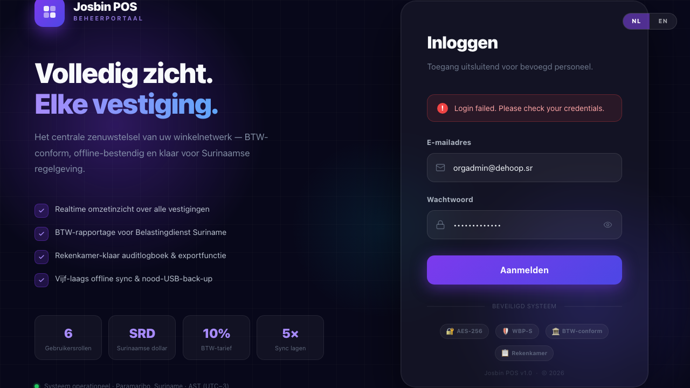

# Chapter 1 — Roles & Permissions: Who Can Do What

**Who needs this:** Anyone creating users or setting up Josbin POS for the first time. Especially the Super Admin and Organisation Admin.

Josbin POS has **6 user roles**. Each role sees a different set of menus and can take a different set of actions. Picking the right role for each person is the single most important security decision you'll make in the system.

This chapter explains:
- What each role does in plain English
- Exactly which menus and actions each role can use
- How to pick the right role when adding a new user
- Special rules for government departments and single-shop businesses



---

## 1.1 The six roles at a glance

```
SUPER ADMIN  ─── your Josbin POS vendor (the people who installed it)
   │
   ▼
ORG ADMIN    ─── HQ / head office of one organisation
   │           (e.g. the buyer at "Supermarkt De Hoop" head office)
   ▼
STORE MGR    ─── runs one shop
   │           (e.g. shop floor manager at the Paramaribo branch)
   ▼
CASHIER      ─── works at the till
               (rings up customers — uses the POS app, not the dashboard)

AUDITOR      ─── read-only, for compliance reviews
                 (e.g. Belastingdienst inspector, internal accountant)

API INTEG.   ─── machine-to-machine account
                 (a third-party POS system pushing sales via the API)
```

The first four form a **hierarchy** — each can do everything below it. Auditor and API Integration sit to the side; they're special-purpose.

---

## 1.2 What each role actually does

### 👑 Super Admin (your vendor)

This is **us — the Josbin POS team**. Your client never gets this role.

**Daily job:** install Josbin POS, onboard new client organisations, troubleshoot. Once a client is live and trained, the Super Admin doesn't log in unless something needs vendor attention.

**Can do:** everything — create organisations, issue licenses, manage every store across every client.

> **Security note:** Super Admin accounts must have 2FA enabled (the system enforces this — see Chapter 16). If you give your Super Admin password to someone else, you've effectively given them the keys to every client's data.

### 🏢 Organisation Admin (HQ / head office)

This is the **head-office account** of one client — for example, the buyer or operations lead at "Supermarkt De Hoop" head office. Owns the master catalogue.

**Daily job:**
- Add new products to the catalogue
- Bulk-import the price list (CSV / Excel)
- Push catalogue updates to all stores
- Create per-store price overrides (Nickerie sells at +5% because of transport cost)
- Open new branches (stores)
- Hire new staff (create Store Manager + Cashier accounts)
- Watch consolidated reports across all branches
- Issue and revoke API integration keys for third-party systems

**Cannot do:** ring up sales (HQ doesn't sell at the till). Manage other organisations (that's Super Admin).

**Real-world example:** Sandra Codrington at Supermarkt De Hoop head office. She decides what gets stocked, what it costs, and which staff member runs which store.

### 🏪 Store Manager (one shop)

The **person who runs one physical shop**. Reports to the Org Admin at HQ.

**Daily job:**
- Open the store in the morning (set today's exchange rate)
- Supervise cashiers — approve refunds, void wrong sales
- Close a register if a cashier leaves mid-shift
- End-of-day: run the Z-Report, count the cash, submit to HQ
- Hire and train new cashiers (create Cashier accounts)
- Run store-level reports (BTW, daily, monthly)
- Fix typos on individual products

**Cannot do:** bulk-import the catalogue, push the catalogue, create API keys (those are HQ-level — single-shop businesses can solve this by giving the same person Org Admin instead, see §1.6).

**Real-world example:** Rashied Alibaks at "De Hoop — Paramaribo Centrum". He opens the shop, sets the day's USD→SRD rate, makes sure all cashiers reconcile their drawers at end of shift.

### 🧾 Cashier (at the till)

The **person ringing up customers** on the POS terminal.

**Daily job:**
- Open their register with the opening float
- Scan or tap products to add to cart
- Accept cash / card / mixed payment
- Print or email the receipt
- Hold a bill if a customer needs more time
- Close their register at end of shift, count the cash

**Cannot do:** see other cashiers' sales (until end of day Z-Report), refund (manager only), see the catalogue (just see/sell what's there), see any reports beyond their own performance.

**Where they work:** the **POS app** on the till — *not* the dashboard. If a cashier logs into the dashboard, they only see their personal "My Account" page (own sales, own shifts, profile + password).

**Real-world example:** Sharmila Jankipersad on Kassa 1. Logs in, opens the till, sells for 8 hours, closes the till.

### 👁️ Auditor (read-only)

A **read-only** account for someone reviewing the books — for example a Belastingdienst tax inspector, a Rekenkamer compliance officer, or an internal accountant.

**Can see:**
- All sales (across stores in the organisation)
- All BTW figures (and the Belastingdienst-formatted BTW report)
- The full audit log (every action by every user, immutable)
- The Rekenkamer signed-PDF export
- All daily / monthly reports

**Cannot do:** edit, delete, void, refund, or create anything. Truly read-only.

**Real-world example:** A Belastingdienst tax inspector visits De Hoop's office for a quarterly check. She gets an Auditor account, reads what she needs, and her account is deactivated when the audit is done.

### 🔌 API Integration (machine account)

Not a person. A **machine-to-machine** account used when a third-party system (e.g. an external POS, an inventory tool, a webshop) needs to push sales into Josbin POS or pull report data.

**Can do:** call the `/api/v1/*` endpoints with an `X-Api-Key` header. Scoped to one specific store.

**Cannot do:** anything in the dashboard UI — it's a non-human account. If someone logs in interactively as an API Integration role, the dashboard refuses with "no UI for machine accounts".

**Real-world example:** the client's e-commerce site pushes daily web orders into a specific store's sales feed via the API.

---

## 1.3 The permission matrix

Concrete list of what each role can touch. Every row is enforced by the backend — the dashboard just hides menus a role can't use.

| Capability | Super Admin | Org Admin | Store Manager | Cashier | Auditor | API Integ. |
|---|:-:|:-:|:-:|:-:|:-:|:-:|
| Log into the **dashboard** | ✅ | ✅ | ✅ | view My Account only | ✅ (read-only) | ❌ |
| Log into the **POS** | (rare) | ❌ | ❌ | ✅ | ❌ | ❌ |
| **My Account** (own sales, shifts, password) | ✅ | ✅ | ✅ | ✅ | ✅ | n/a |
| **Ring up a sale** | ✅ | ❌ | ✅ | ✅ | ❌ | ✅ (via API) |
| **Refund / void** a sale | ✅ | ✅ | ✅ | ❌ | ❌ | ❌ |
| **Lock the daily exchange rate** | ✅ | ✅ | ✅ | ❌ | ❌ | ❌ |
| **Open / close a register** | ✅ | ✅ | ✅ | ✅ | ❌ | ❌ |
| **Run a Z-Report** + submit to HQ | ✅ | ✅ | ✅ | ❌ | ❌ | ❌ |
| **View / create individual products** | ✅ | ✅ | ✅ | view only | view only | view only |
| **Delete products** | ✅ | ✅ | ❌ | ❌ | ❌ | ❌ |
| **Bulk import** (CSV / Excel) | ✅ | ✅ | ❌ | ❌ | ❌ | ❌ |
| **Push catalogue** to POS terminals | ✅ | ✅ | ❌ | ❌ | ❌ | ❌ |
| Manage **categories** | ✅ | ✅ | ✅ | ❌ | ❌ | ❌ |
| **Per-store price overrides** | ✅ | ✅ | ❌ | ❌ | ❌ | ❌ |
| **Discount rules** (create/edit) | ✅ | ✅ | ✅ | view only | ❌ | ❌ |
| **Stock adjust** (receive, write-off) | ✅ | ✅ | ✅ | ❌ | ❌ | ❌ |
| **Customers** (view/create/edit) | ✅ | ✅ | ✅ | view + create | view only | ❌ |
| **All store-level reports** | ✅ | ✅ | ✅ | own only | ✅ | ❌ |
| **Consolidated cross-store reports** | ✅ | ✅ | ❌ | ❌ | ✅ | ❌ |
| **BTW report** (Belastingdienst format) | ✅ | ✅ | ✅ | ❌ | ✅ | ❌ |
| **Rekenkamer signed PDF export** | ✅ | ✅ | ❌ | ❌ | ✅ | ❌ |
| **AI insights** (weekly summary, anomalies) | ✅ | ✅ | ✅ | ❌ | ❌ | ❌ |
| Create / edit **users** | ✅ | ✅ | ✅ (cashiers only) | ❌ | ❌ | ❌ |
| Delete users | ✅ | ✅ | ❌ | ❌ | ❌ | ❌ |
| Create / edit **stores** | ✅ | ✅ | ❌ | ❌ | ❌ | ❌ |
| Manage **organisations** | ✅ | ❌ | ❌ | ❌ | ❌ | ❌ |
| Manage **API keys** (issue, revoke) | ✅ | ✅ | ❌ | ❌ | ❌ | ❌ |
| View **audit log** | ✅ | ✅ | ❌ | ❌ | ✅ | ❌ |
| Manage **licenses** | ✅ | ❌ | ❌ | ❌ | ❌ | ❌ |

> ✅ = full access · view = read-only · ❌ = denied. Cross-organisation visibility is denied at the database query level — a Store Manager from one company cannot see data from another company, ever.

---

## 1.4 Adding a user — picking the right role

Go to **Dashboard → Users → + Add user**.

The form asks for:
- **Name + email** — the person's real name + work email. The email is also their login.
- **Role** — pick from the six above.
- **Organisation** — automatically set to the current organisation (unless you're Super Admin, in which case you choose).
- **Language** — `nl` (Dutch) or `en` (English). They can change it themselves later.
- **2FA required** — leave the default, which follows the per-role policy (Chapter 16).

The system emails a welcome link with a one-time password setup.

### Quick decision tree

```
Does this person actually ring up sales at the till?
├── Yes → Cashier
└── No → Does this person physically work at one specific shop?
          ├── Yes → Store Manager
          └── No → Does this person manage the catalogue / hire staff at HQ?
                    ├── Yes → Organisation Admin
                    └── No → Are they only reviewing for compliance?
                              ├── Yes → Auditor
                              └── No → Probably you don't need them. Stop and check.
```

---

## 1.5 Special rules for government departments

If your organisation is flagged as **government** (`is_government = true` when you created it), additional rules kick in automatically:

- **Every user** must enable 2FA — can't be turned off
- **Refunds above SRD `<threshold>`** require **dual approval** (two managers, not the same person)
- **Single-device enforcement** is optional (one active session per user at a time)
- **Geo-alert** on logins from outside Suriname (doesn't block, just alerts)
- The organisation lives in an **isolated database** — never on the same server as commercial clients
- The audit log gets the **Rekenkamer signed-PDF export** in addition to the regular CSV

These are required by Surinamese law (WBP-S — *Wet Bescherming Persoonsgegevens Suriname*) and by the Court of Audit's compliance rules.

You don't have to do anything extra in the dashboard — the system enforces these as soon as the org is flagged government.

---

## 1.6 The "I'm a single-shop owner" pattern

If your client is one corner shop or one café — same person is buyer, manager, and sometimes cashier — the strict role separation can feel awkward. The cleanest way to handle it:

| If you want this person to… | Give them this role |
|---|---|
| Import products from Excel AND run the shop AND occasionally cash up | **Organisation Admin** (single account, full powers) |
| Only run the shop, never import | Store Manager |
| Ring up customers at the till on a busy day | Add a separate **Cashier** account for that — easier than mixing |

In practice, a single-shop owner often holds **two** accounts:
- `owner@shop.sr` as Organisation Admin (HQ work — Excel import, pricing, staff)
- `kassa-owner@shop.sr` as Cashier (when standing at the till)

…and switches between them. This keeps the audit trail clear: "the sale was rung up by the cashier account, not the admin account".

---

## 1.7 What if I pick the wrong role?

Easy to fix:
1. Dashboard → **Users** → click the user
2. Change the role dropdown
3. **Save**

Their sessions are automatically invalidated within seconds (forced logout across all devices). When they next log in, they have the new role's view.

> The **audit log** records every role change with the old and new role, who changed it, and when. So if there's ever a dispute about access, you can prove who-changed-what.

---

→ Next: Chapter 2 — Organisation & store setup *(coming soon)*
