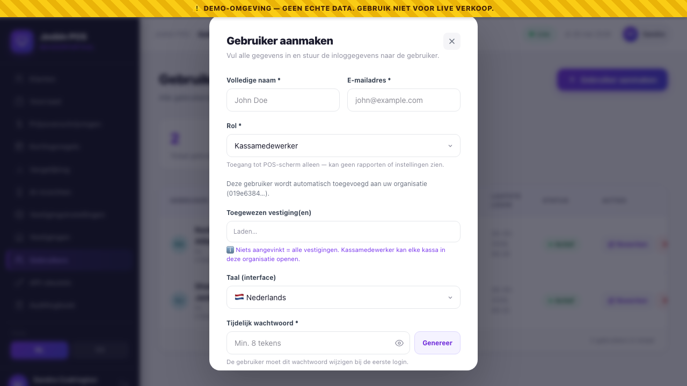

# Chapter 3 — Users: Create, Edit, Deactivate

**Who needs this:** Super Admin, Organisation Admin, Store Manager — anyone who hires, promotes, transfers or off-boards staff.

Picking the right **role** is covered in Chapter 1. This chapter is about the mechanics: where you click, what you type, how the welcome email works, and what happens when someone leaves.

---

## 3.1 Who can create whom

The system enforces three rules on every user-management action — even if a button isn't hidden, the API will refuse the operation. The checks live in `UserPolicy`:

- You can **only manage users in your own organisation** (Super Admin is the only exception).
- You can **only manage users strictly below your role** in the hierarchy.
- You **cannot delete yourself** (deactivating yourself is also a bad idea — you'd lock yourself out).

The hierarchy:

```
Super Admin    (level 0 — vendor)
   │
   ▼
Org Admin      (level 1 — HQ)
   │
   ▼
Store Manager  (level 2 — branch)
   │
   ▼
Cashier        (level 3)
Auditor        (level 3)
API Integration(level 3)
```

In practice this gives:

| If you're a… | You can create / edit | You cannot touch |
|---|---|---|
| **Super Admin** | Anyone, anywhere | (nothing — full reach) |
| **Org Admin** | Store Managers, Cashiers, Auditors, API Integration accounts — within your organisation | Other Org Admins, Super Admins, users in *other* organisations |
| **Store Manager** | Cashiers (and Auditors / API Integration if your client structure puts them at branch level) within your organisation | Other Store Managers, Org Admin, Super Admin |
| **Cashier / Auditor / API** | Nobody | Everybody |

> **You cannot demote a peer.** An Org Admin trying to change another Org Admin's role gets a 403 from the API. That's intentional — it stops one HQ admin from quietly locking another out. If this needs to happen, it's a Super Admin job.

---

## 3.2 Creating a new user step-by-step

**Path:** Dashboard → **Gebruikers / Users** (left sidebar) → **Gebruiker aanmaken / Create user** (top-right button).

The Create User modal opens. Fields:

| Field | Required | Notes |
|---|:-:|---|
| **Volledige naam / Full name** | ✅ | Real legal name. Shows on the receipt as the cashier name. |
| **E-mailadres / Email** | ✅ | Their work email. This is also their login. Must be unique across the whole platform. |
| **Rol / Role** | ✅ | Pick from the six. A one-line hint appears under the dropdown explaining what that role gets to do. |
| **Organisatie / Organisation** | ⚠️ | Required for Org Admin, Store Manager, Cashier, Auditor, API Integration. Hidden for Super Admin (platform-level, no org). For non-Super-Admin creators, the field is locked to your own org. |
| **Taal / Language** | ✅ | `Nederlands` or `English`. Default UI language. The user can change it on their My Account screen. |
| **Tijdelijk wachtwoord / Temporary password** | ✅ | Min. 8 characters. Tap **Genereer / Generate** to get a strong random one. The eye icon shows/hides the value. |
| **Welkom-e-mail versturen / Send welcome email** | optional | Default on. Emails the user the login URL + their credentials. |

Tap **Gebruiker aanmaken / Create user**.

### 3.2.1 Store assignment (cashier + store_manager only)



When you pick **Cashier** or **Store Manager** as the role, an extra **Toegewezen vestiging / Assigned store** dropdown appears below the role selector. It lists every store in the organisation — pick exactly one. **One user, one store.**

> **Where you see the result:** the Users list table shows a **Vestiging / Store** column with the store name for every cashier/manager, *n/a* for org-scoped roles, and a yellow ⚠️ *Geen vestiging / No store* warning for any cashier/manager with a missing assignment (data-entry error — fix it via Edit). Cashiers and managers also see their own assignment on their **My Account** page header (*"📍 Assigned to De Hoop — Paramaribo Centrum"*), so they can confirm it without asking you. The Edit modal pre-fills the same dropdown with whatever's already set — editing a user no longer silently wipes the store link.

**Rules:**

- **Pick exactly one store** the user works at. The cashier will see only that store on the POS (the chooser auto-selects it on login), and `register-open` returns *403 STORE_NOT_ASSIGNED* if they try to open a register at any other store. The Z-Report close and refund-approval endpoints enforce the same check for store managers.
- **Required for Cashier + Store Manager.** The Create / Save button stays disabled until you pick one. The backend also 422s a create with a missing or invalid `store_id` for these roles.
- **Prohibited for org-scoped roles** (Org Admin, Auditor, Super Admin, API Integration). The picker is hidden for them and the backend rejects any `store_id` value with a 422. They operate at the org level by design — no single store of their own.
- **Need someone on two shops?** Create two accounts (one per store). There is no multi-store assignment and no "floating cashier" pattern — that's a deliberate decision to keep audit attribution clean and prevent silent cross-store sales.

Recorded in the audit log as `user.store_assigned` with the from→to delta, by whom, and when. So a Rekenkamer auditor can prove "this cashier was assigned only to De Hoop — Paramaribo Centrum on 12 May 2026, moved to De Hoop — Nickerie on 23 May 2026".

When you change a store-scoped user's role to an org-scoped one (e.g. promote a Store Manager to Org Admin), the dashboard auto-clears the now-meaningless `store_id` and the backend logs the change. Demoting back later requires picking a store again.

### After the user is created

A green confirmation banner appears at the top of the Users screen with the email and password in plain text, plus a **Kopieer inloggegevens / Copy credentials** button. **Show this to the user once and only once.** The plaintext password is never displayed again — if they lose it, you reset it (§3.7).

The user must change the temporary password on their first login. They can also be required to enrol 2FA at that point if the policy demands it (§3.9).

### Picking the right role — quick reminder

| The person you're adding… | Pick this role |
|---|---|
| Runs the catalogue, prices, all branches at HQ | Organisation Admin |
| Runs one specific shop, supervises cashiers there | Store Manager |
| Stands at a till, rings up customers | Cashier |
| Belastingdienst / Rekenkamer inspector, internal accountant | Auditor (read-only) |
| Third-party POS or e-commerce system pushing sales | API Integration |
| Another vendor engineer | Super Admin (rare — only for your own team) |

The full role reference is Chapter 1.

> **One person, one account.** Avoid the temptation to share an account between two cashiers "just for today". Every sale is attributed to the logged-in user, and the audit log relies on that. If two people share a login, you can't tell which one rang up a refund.

---

## 3.3 Editing an existing user

**Path:** Dashboard → Users → click the **Bewerken / Edit** button on the user's row.

The Edit User modal opens with everything pre-filled. You can change:

- Name, email
- Role (see §3.4 below — this has side effects)
- Organisation (Super Admin only — moves a user between orgs)
- Language
- Status — *Actief* / *Inactief* (this is the same as the Deactivate button on the table row; see §3.5)
- **Nieuw wachtwoord / New password** — optional. Leave blank to keep current.

Tap **Opslaan / Save changes**.

> **Email changes propagate immediately.** The user's next login must use the new email. If the user is logged in right now, their existing session keeps working — but the next time they log out, they need the new email to get back in. Tell them.

---

## 3.4 Changing someone's role mid-shift

Role changes take effect **as soon as you click Save**. The system invalidates the user's existing sessions within seconds — they get force-logged-out on every device they're signed in to. Their next login shows them the new role's view.

Use this when:
- A Cashier is promoted to Store Manager
- A Store Manager temporarily covers HQ work (give them Org Admin for the week, demote later)
- An Auditor's review is over (downgrade to a deactivated state — or just deactivate)

The change is recorded in the audit log: old role, new role, who changed it, when, IP address. If a dispute ever comes up, you can prove who promoted whom and when.

> **Be careful with Cashier → Manager.** A cashier promoted mid-shift while their register is open keeps the open session. The session attribution doesn't change — sales already rung up that day still show as "rung by Cashier X" because that's what they were at the time. Their *next* sale shows under the new role.

---

## 3.5 Deactivating vs deleting

**Deactivate** (`is_active = false`) is what you want **99 % of the time**:

- The user can no longer log in.
- Their historical sales, refunds, register sessions, audit-log entries are all preserved — they still show "rung up by Sharmila Jankipersad" forever.
- You can reactivate them with one click if they come back.
- No data is lost. No reports break.

**Hard delete** is restricted: only Super Admin and Org Admin can delete, and even then only users below them in the hierarchy. The dashboard UI currently exposes only the deactivate button on each row — hard-delete is reserved for vendor support (`DELETE /api/users/{id}` via API key), because it has knock-on effects on historical reporting that need a human review.

**To deactivate from the Users list:**

1. Find the user's row.
2. Tap the red **Deactiveren / Deactivate** button.
3. Confirm the prompt.

The row's status badge flips to grey *Inactief / Inactive*. The user's open dashboard or POS sessions are killed within seconds.

**To reactivate**: same button, now green and labelled **Activeren / Activate**.

---

## 3.6 What happens to a user's data when deactivated

| Data | What happens | Why |
|---|---|---|
| **Past sales** they rang up | Still show their name. Still count in BTW reports, Z-Reports, Top Cashier rankings. | Required by Belastingdienst and Rekenkamer — receipts can't be retroactively unsigned. |
| **Past register sessions** | Still listed under their name in Registers screen history. | Discrepancies need to remain traceable to the cashier who counted that drawer. |
| **Audit log entries** they triggered | Untouched. Append-only. | Tamper-proof by design — see Chapter 13. |
| **Outstanding hold-bills** | Become orphaned — visible to other cashiers in the same store who can pick them up. | Customer still wants their hold-bill rung up. |
| **2FA secret + device** | Wiped on next reactivation (they'll re-enrol). | Re-issued cleanly if they ever come back. |
| **Login ability** | Revoked immediately. | The point of deactivation. |

> **Deactivation is the right move for people who leave.** Resist the urge to "clean up" by deleting them. The shop floor still ran on their shifts — those shifts have to live in the books.

---

## 3.7 Resetting a user's password

Both Super Admin and Org Admin (and Store Manager, within their organisation, for users below them) can reset a password.

**Path:** Dashboard → Users → **Edit** the user → scroll to **Nieuw wachtwoord / New password** → either type one or tap **Reset** to auto-generate → **Opslaan / Save**.

The new password takes effect immediately. The user's existing session keeps working until they log out — at which point they need the new password to get back in. **Communicate the new password to them out-of-band** (in person, by phone, by an encrypted channel). Email isn't ideal because email itself is usually unencrypted in transit.

> **Reset is not the same as "forgot password".** As of this release, there's no self-service "forgot password" link on the login screen — a manager has to reset on the user's behalf. If a Cashier can't log in, they call the Store Manager. If a Store Manager can't log in, they call the Org Admin. If an Org Admin can't log in, the Super Admin (your vendor support) handles it.

---

## 3.8 Self-service: what users can do for themselves

Anyone, regardless of role, can:

- Change their own **password** at any time
- Update their own **name** and **email**
- Switch their own UI **language** between `nl` and `en` (instant — no logout)
- Enrol or re-enrol their own **2FA** (if policy requires it for their role)
- See their own **performance** stats (Cashiers: own sales today, this week, this month)

This all lives in **My Account** — see Chapter 18 for the user-side walkthrough. The dashboard nav has a `Mijn Account / My Account` entry at the bottom of the sidebar (Cashiers see *only* this entry when they log into the dashboard — everything else is hidden from them).

---

## 3.9 2FA setup, from the user's perspective

Two-factor authentication is required for some roles (always Super Admin and all users in government organisations; configurable for the others via the **Tweestapsverificatie per rol / Two-factor authentication per role** panel at the top of the Users screen — Super Admin only).

When a user whose role requires 2FA logs in for the first time after the policy is enabled:

1. **They log in with email + temporary password.**
2. The system **redirects them to the 2FA enrolment screen** instead of the dashboard.
3. The screen shows a QR code. They scan it with **Google Authenticator**, **Microsoft Authenticator**, **Authy**, or any other TOTP app on their phone.
4. The screen prompts for the 6-digit code from the app to confirm the device.
5. The screen shows **recovery codes** — printable one-time backup codes for if they lose the phone. They must save these (we recommend printing two copies — one in the manager's safe, one in their own wallet).
6. They're taken to the dashboard.

On every subsequent login, after email + password they get a "Enter the 6-digit code from your authenticator app" prompt.

> **What happens if they lose the phone?** They use a recovery code. If they also lost the recovery codes, an admin who can manage them (per §3.1) has to reset their 2FA — which wipes the secret and forces re-enrolment on next login. There is no "skip 2FA just this once" option. That's by design.

For Super Admin and government users, 2FA cannot be disabled by anyone — not even by another Super Admin. The system enforces this at the API level. For configurable roles, an admin can flip the policy off in the Users screen → 2FA panel; existing 2FA enrolments stay but new users in those roles won't be forced to enrol.

### What the 2FA column in the users table tells you

The **2FA** column in the Users list shows a green ✓ *Actief / Active* badge for any user who has completed enrolment. A dash (`—`) means they haven't enrolled yet — either because their role doesn't require it, or because they're a brand-new account that hasn't reached step 2 of the enrolment flow above.

The Users screen header also has a quick stats row: **Met 2FA / With 2FA** count, alongside total users and active users. Useful for proving to a compliance auditor that all the people who should have 2FA do.

---

## 3.10 Quick reference — daily user-management actions

```
HIRE              Users → + Create user → fill form → Send credentials in person
PROMOTE           Users → Edit → change Role → Save (forced logout within seconds)
RESET PASSWORD    Users → Edit → New password → Reset/type → Save → tell user out-of-band
TRANSFER ORG      (Super Admin only) Users → Edit → change Organisation → Save
DEACTIVATE        Users row → Deactivate button → confirm → grey badge
REACTIVATE        Users row → Activate button → confirm → green badge
```

For role decisions, see Chapter 1.
For audit-trail forensics ("who changed Rashied's role last Tuesday?"), see Chapter 13.

---

→ Next: [Chapter 4 — Product Catalogue & Categories](04-catalogue-and-categories.md)
