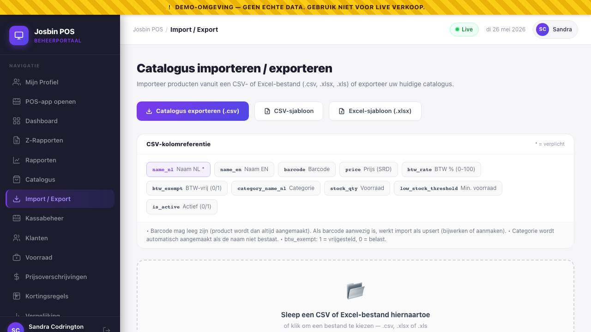
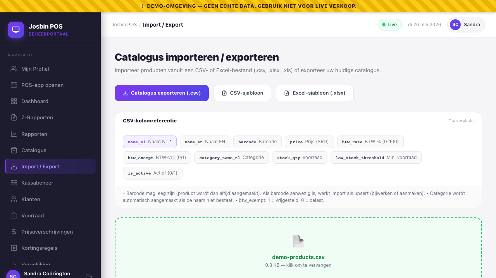

# Chapter 5 — Bulk Import (CSV / Excel)

**Who needs this:** the **Organisation Admin** (and Super Admin on behalf of a customer). Cashiers and Store Managers can't run bulk import — it's an HQ-level operation that touches every till in every branch at once.

**When you do it:** opening a new store (loading the first few hundred products), an annual price refresh, after a supplier sends a new price list, or migrating off a competitor POS.

**Why this prevents pain:** one upload replaces hours of clicking through the single-product modal in [Chapter 4](04-catalogue-and-categories.md). The same file is the **source of truth** for new products *and* price updates — the importer is idempotent, so re-uploading the same file tomorrow is safe.


---

## 5.1 What the importer actually does

Three operations in one upload, decided **per row** by whether the row has a barcode:

```
each row in your CSV / XLSX
   │
   ├── has a barcode that already exists in this org's catalogue
   │     → UPDATE that product (price, name, BTW, category, stock…)
   │
   ├── has a barcode that's NEW to this org
   │     → CREATE a new product with that barcode
   │
   └── has NO barcode at all
         → CREATE a new product (no upsert — every blank-barcode row makes
           a fresh product, even if you upload twice)
```

This is what "**idempotent upsert by barcode**" means in practice: re-running yesterday's file with a few price tweaks updates only those few rows; it does *not* create duplicates. Rows without a barcode have no key to match on, so they always create — be careful re-uploading a file full of blank-barcode rows.

Categories work the same way but matched on the Dutch name (`category_name_nl`):

```
category_name_nl on row
   │
   ├── matches an existing category in this org (Dutch name, exact)
   │     → use that category_id
   │
   ├── doesn't match anything
   │     → AUTO-CREATE a new category with that name (NL and EN both set
   │       to the value you gave, sort_order = 0, active)
   │
   └── blank
         → product saved with no category (appears under "Geen categorie /
           No category" on the POS grid until you assign one)
```

Auto-creation of categories is convenient but easy to abuse — see "Common mistakes" (§5.10).

---

## 5.2 The CSV column reference

Headers are **case-sensitive** and must be on row 1. The order doesn't matter — the importer maps by header name, not position. Columns the importer doesn't recognise are silently ignored.

| Column | Required | Type | Notes |
|---|:-:|---|---|
| `name_nl` | ✅ | text | Dutch name. The **only** mandatory column. Used on receipts and the POS grid when the cashier's UI is Dutch. |
| `name_en` | optional | text | English name. If blank, the importer copies `name_nl` into it so the English POS view never shows an empty tile. |
| `barcode` | optional | text | EAN-13 / EAN-8 / UPC-A / Code 128. Acts as the **upsert key** (see §5.1). Leave blank and every row creates a new product — including on re-upload. |
| `price` | optional | decimal | SRD price, two decimals. `12.50` not `12,50`. Negative values are clamped to `0`. Missing or blank → `0.00`. |
| `btw_rate` | optional | decimal | Suriname VAT, 0-100. Defaults to `10` (the current standard rate). Out-of-range values are clamped. |
| `btw_exempt` | optional | `0` / `1` | `1` = BTW-vrijgesteld (basic foods, medicine). `0` = taxed. When `1`, the `btw_rate` is recorded but the system writes `0` BTW on every sale of this product. Defaults to `0`. |
| `category_name_nl` | optional | text | Dutch category name. Matched case-sensitively to an existing category in this org. **Auto-created** if it doesn't exist. |
| `stock_qty` | optional | decimal | Starting stock count for the master catalogue. Per-store stock takes over from then on (see [Chapter 8](08-stock-management.md)). Decimals allowed (`2.500` kg). |
| `low_stock_threshold` | optional | decimal | Below this, the POS shows a low-stock warning. Defaults to `0` (no alert). |
| `is_active` | optional | `0` / `1` | `1` = product visible on the POS grid (default). `0` = inactive, same as the **Deact.** button in [Chapter 4 §4.4](04-catalogue-and-categories.md#44-deleting-deactivating-a-product). |

Anything else in your file is ignored. You can keep notes columns, supplier codes, etc. — they don't break the import.

### Format quirks worth knowing

- **Comma is the only delimiter.** Semicolon-separated files (common in Dutch Excel exports) won't parse correctly. Use the **CSV-sjabloon** button — it produces a comma-separated file with the right BOM.
- **UTF-8 with BOM.** The template ships with a Byte Order Mark so Excel opens accented characters (é, ï, ç) correctly. If you save your own file from Notepad as "ANSI", you'll see `Mozaïek` instead of `Mozaïek` after import.
- **Decimal point, not comma.** `12.50`. The importer reads `12,50` as the integer `12`.
- **Quoted values.** Wrap text in `"..."` if it contains a comma (`"Volle Melk 1L, geheel"`). The preview parser handles this.

---

## 5.3 Step-by-step — your first import

1. Log into the dashboard as **Organisation Admin** (or Super Admin scoped to the target org).
2. Sidebar → **Import / Export** (under the Catalogue section).
3. You land on the **Catalogus importeren / exporteren** screen. There are three buttons across the top:
   - **Catalogus exporteren (.csv)** — download what's currently in the catalogue.
   - **CSV-sjabloon** — blank template, headers + 3 example rows.
   - **Excel-sjabloon (.xlsx)** — same template, as a real `.xlsx` file.
4. First time? Click **CSV-sjabloon** (or **Excel-sjabloon** if your supplier sent an `.xlsx`). The browser downloads `josbin-products-template.csv` (or `.xlsx`).
5. Open it in Excel, LibreOffice Calc, or Google Sheets. The first three rows are working examples:

   ```
   name_nl,name_en,barcode,price,btw_rate,btw_exempt,category_name_nl,stock_qty
   Volle Melk 1L,Full Milk 1L,8712345678901,4.99,0,1,Zuivel,50
   Brood Wit,White Bread,8712345678902,3.50,10,0,Bakkerij,30
   Coca-Cola 2L,Coca-Cola 2L,5449000054227,6.75,10,0,Dranken,100
   ```

6. **Delete the example rows** before you start adding your own — otherwise you'll create three fake products on the first import. (The importer can't tell example data from real data.)
7. Fill in your products. Only `name_nl` is required; leave anything you don't care about blank.
8. Save the file. Keep it as `.csv` (UTF-8) or `.xlsx`.
9. Back in the dashboard, drag the file onto the dotted **drop zone** in the middle of the screen — or click the zone and pick the file.


10. For CSV files the dashboard shows a **client-side preview** — the first N rows, each one flagged green (valid) or red (has errors). XLSX files don't preview client-side; you'll see *"file loaded"* and the validation happens on the server.
11. Check the preview header for two badges:
    - `✓ N geldig / valid` — these will be imported.
    - `✗ N met fouten / with errors` — these will be skipped. Hover the warning icon to see what's wrong (e.g. *"Invalid price"*).
12. If the header says `⚠ Missing required column: "name_nl"`, the file's wrong. Fix the headers and re-drop.
13. Click the green **N rijen importeren / Import N rows** button.
14. Wait for the spinner. The import runs in a single database transaction — either everything succeeds or nothing does.
15. The success banner appears:

    ```
    ✅ Import voltooid!
       42 aangemaakt   17 bijgewerkt   3 overgeslagen
       ⚠ 3 row(s) with errors  ▼  (click to expand)
    ```

16. The catalogue page refreshes; the new products are visible at every till within seconds via the WebSocket push (same mechanism as a single-product save — no extra **Push to POS** click needed).

---

## 5.4 Step-by-step — updating prices from a supplier price list

This is the most common bulk operation after the initial load.

1. **Export your current catalogue first** as a safety net: top of the import screen → **Catalogus exporteren (.csv)**. The file `josbin-products-YYYY-MM-DD.csv` is saved to your downloads. **Keep this.** It's your one-click undo if the import goes sideways.
2. Open the supplier's price list. If it's an `.xlsx` you can upload it directly (provided its column headers match — usually they don't, so step 3).
3. In a fresh spreadsheet, build a file with **the columns you want to change** plus `barcode` as the key. For pure price updates you only need two columns:

   ```
   barcode,price
   8712345678901,5.49
   8712345678902,3.95
   5449000054227,7.00
   ```

   Every other field stays untouched on the matched product.
4. Save as CSV (UTF-8) or XLSX. Drop on the import screen.
5. The preview shows every row as valid (barcode + price is enough). Click **Importeren / Import**.
6. Success banner: `0 aangemaakt · N bijgewerkt`. The "created" count should be **zero** for a pure price update — if it isn't, some barcodes in your file don't match anything (typo, missing leading zero, EAN-8 vs EAN-13 mismatch).

> **Mid-sale price changes:** if a cashier has a half-finished cart open with one of these products in it, the **cart keeps the old price** — the new price applies only the next time the product is added. This is deliberate (no surprise for the customer mid-sale). See [Chapter 4 §4.3](04-catalogue-and-categories.md#43-editing-a-product).

---

## 5.5 Step-by-step — exporting the current catalogue

Useful for: backup before a big change, sending the catalogue to an accountant or supplier, or as a starting point for a bulk price-list edit.

1. Import / Export screen → **Catalogus exporteren (.csv)** at the top.
2. Browser downloads `josbin-products-YYYY-MM-DD.csv` immediately.
3. The file contains every product in the organisation (active + inactive) with these columns:

   ```
   name_nl, name_en, barcode, price, btw_rate, btw_exempt,
   category_name_nl, stock_qty, is_active
   ```

4. Edit, then re-import. Because every row carries its barcode, this is a clean upsert — nothing duplicates.

> Note: the **export** doesn't include `low_stock_threshold`. If you've configured thresholds and want them preserved during a round-trip edit, add that column manually before re-uploading.

---

## 5.6 What "Push to POS" does — and when you need it

You usually **don't** need to press it. Every single-product save and every bulk import broadcasts a `catalogue.refresh` signal on the WebSocket; connected terminals reload within seconds.

The **📡 Catalogus pushen naar kassa's / Push catalogue to POS terminals** button (top-right of the **Catalogus / Catalogue** screen header, see [Chapter 4 §4.8](04-catalogue.md)) forces a fresh broadcast. Use it when:

- A terminal was offline during your import and you've just seen it reconnect.
- You re-enabled a category that was previously hidden and the terminal hasn't picked it up.
- You're showing a demo and want to be sure every screen is in sync within one second.

It's idempotent — pressing it twice doesn't hurt anything.

---

## 5.7 The preview, validation, and the error report

Two levels of validation:

| Stage | Where | What it catches |
|---|---|---|
| **Client-side preview** (CSV only) | Your browser, before upload | Missing `name_nl` header. Per-row: missing `name_nl`, non-numeric `price`, `btw_rate` outside 0-100. |
| **Server-side validation** | Laravel, during upload | Same checks, plus: file type allowed (`csv`, `txt`, `xlsx`, `xls`), file size ≤ 10 MB, organisation match, all DB constraints. Returns a per-row error list in the response. |

The success banner's `⚠ N row(s) with errors` drop-down lists each skipped row with the row number from your spreadsheet (row 2 = first data row, since row 1 is the header). Example:

```
Row 14: name_nl is required
Row 27: Invalid price: "twelve"
Row 31: name_nl is required
```

**Skipped rows do not roll back the import.** The 39 valid rows are saved; the 3 broken ones are reported back. Fix them in your file, drop again, and only those 3 will be processed (the others are already there and would just be `updated`-with-no-changes).

---

## 5.8 File size and performance

| Limit | Value | What happens if you exceed |
|---|---|---|
| Max file size | **10 MB** | Server returns HTTP 422 — *"file may not be greater than 10240 kilobytes"*. Split the file. |
| Max rows | no hard limit | We've tested 10,000-row imports cleanly. Bigger than that — split into two files. |
| Allowed extensions | `.csv`, `.txt`, `.xlsx`, `.xls` | Anything else is rejected before reading. |
| Transaction | **all-or-nothing** at the DB level | If a row triggers a database-level error mid-import (very rare), the whole import rolls back and you get HTTP 422 with the underlying error. None of your data changes. |

A typical 500-product import on the demo stack runs in under 3 seconds.

---

## 5.9 What gets recorded in the audit log

Every product create or update — bulk or single — writes a row in the immutable audit log via the model's `Auditable` trait. For each row you import you get:

- The **action** (`created` or `updated`).
- The **user** who triggered the import (your dashboard account).
- The **old values** and **new values** as JSON — useful for "what was the price before yesterday's import?" queries.
- The **IP address** and timestamp (AST).

Auto-created categories are recorded the same way (event = `created`, auditable type = `Category`). The audit log is append-only — even Super Admin cannot delete a row. Auditors can review the full history in [Chapter 13 — Audit log](13-audit-log.md).

If a Belastingdienst or Rekenkamer inspection ever asks *"who changed this product's price on 12 May 2026?"* — the answer is one filter away.

---

## 5.10 Common mistakes (and how to fix them quickly)

| Symptom | Likely cause | Fix |
|---|---|---|
| Preview shows `⚠ Missing required column: "name_nl"` | Headers row is missing or has a typo (`Name_NL`, `name nl`, etc.). | Header names are case-sensitive: `name_nl` exactly. |
| Every accented character is mojibake (`Mozaïek`) | File saved as ANSI/Windows-1252, not UTF-8. | Re-save as **CSV UTF-8** (Excel: *File → Save As → CSV UTF-8*). Or use the XLSX template. |
| Prices come in as `12.0` when you wrote `12,50` | Dutch decimal comma. The importer reads `12,50` as two cells (`12` and `50`) under semicolon separators, or as `12` under comma. | Use a decimal **point**: `12.50`. |
| `46 aangemaakt` when you expected `0 created, 46 updated` | The barcode column was missing or blank — no upsert key, so every row created a new product. | Add the `barcode` column with the actual EAN-13s. Delete the duplicate "new" products you just created (Catalogue → Products → filter by today's date → Deact. each). |
| Suddenly there are 12 new categories named `meat`, `Meat`, `meats`, `Meat ` (trailing space) | Free-text typing in `category_name_nl` — every variant auto-creates a separate category. | Standardise. Run **Catalogue → Categories** and deactivate the typos, then re-import with the canonical Dutch name (e.g. `Vlees`). |
| Import succeeds but the new products don't appear on the POS grid | They imported as `is_active = 0` (you set the column to `0`), or the terminal is in offline mode. | Catalogue → Products → filter Inactive → Reactivate. Or: ensure `is_active` is `1` or simply absent (it defaults to active). |
| Server returns *"Could not read file: …"* on an `.xlsx` | File is password-protected, or saved as `.xls` with a Macro-Enabled (`.xlsm`) extension renamed. | Re-save as a plain `.xlsx`. Macro-enabled files aren't supported. |
| BTW figures look wrong after import | `btw_exempt` was set to a string like `"yes"` instead of `1`. The importer treats anything Laravel's `FILTER_VALIDATE_BOOLEAN` doesn't recognise as `false`. | Use `1` or `0` — not `Yes`/`No`/`true`/`false` (those happen to work but `1`/`0` is the documented contract). |
| One row keeps failing with *"name_nl is required"* even though you typed it | The cell has an invisible leading space, or the spreadsheet auto-converted it to a formula (a leading `=`). | Tap into the cell, retype. If the cell starts with `=`, prefix with `'` (Excel) or change cell type to *Text*. |

> **The big one: blank-barcode rows on re-import.** If your file has dozens of rows with no barcode, **every re-upload creates fresh duplicates** because there's no key to match on. Always assign barcodes — even internal pseudo-codes like `INT-001` — for anything you might re-import.

---

## 5.11 Permission and role recap

From [Chapter 1's matrix](01-roles-and-permissions.md#13-the-permission-matrix):

| Role | Bulk import | Bulk export | Push catalogue |
|---|:-:|:-:|:-:|
| Super Admin | ✅ | ✅ | ✅ |
| Organisation Admin | ✅ | ✅ | ✅ |
| Store Manager | ❌ | ❌ | ❌ |
| Cashier | ❌ | ❌ | ❌ |
| Auditor | ❌ | ✅ (read-only export) | ❌ |
| API Integration | ❌ | ❌ | ❌ |

Store Managers who need to add a single product in a hurry should use the [single-product Add modal](04-catalogue-and-categories.md#42-adding-a-single-product); for anything bigger they need an Org Admin to do the import.

---

## 5.12 Quick reference

```
DOWNLOAD TEMPLATE    Catalogue → Import/Export → CSV template / Excel template
EXPORT CATALOGUE     Catalogue → Import/Export → Export catalogue (.csv)
IMPORT FILE          Catalogue → Import/Export → drag file onto drop zone
                     → review preview → Import N rows
PRE-IMPORT BACKUP    Always: export first, keep the file
KEY COLUMN           barcode (matches existing products → update; missing → new)
REQUIRED COLUMN      name_nl  (only one)
DEFAULTS APPLIED     price=0.00, btw_rate=10, btw_exempt=0, stock_qty=0, is_active=1
                     name_en falls back to name_nl when blank
LIMITS               10 MB file size · no row cap (tested to 10 000)
```

Stuck? Cross-check [Chapter 4 — Catalogue & categories](04-catalogue-and-categories.md) for the single-product workflow, [Chapter 6 — Pricing & per-store overrides](06-pricing-and-per-store-overrides.md) for branch-specific prices that bypass the master price set here, and [Chapter 13 — Audit log](13-audit-log.md) to see who imported what.

---

→ Next: [Chapter 6 — Pricing & per-store overrides](06-pricing-and-per-store-overrides.md)
