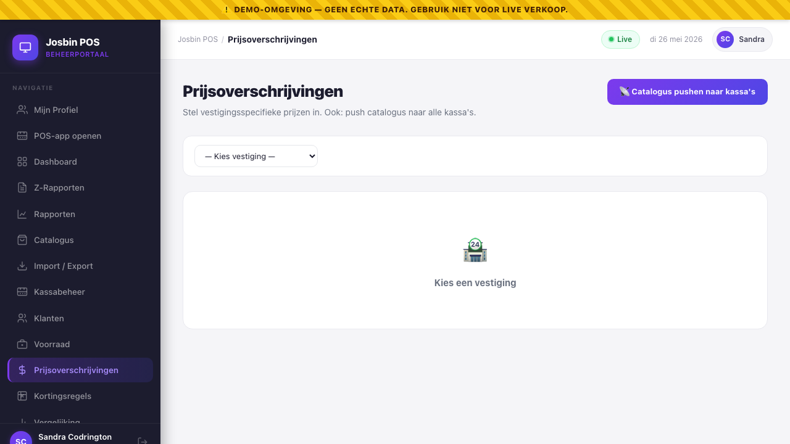
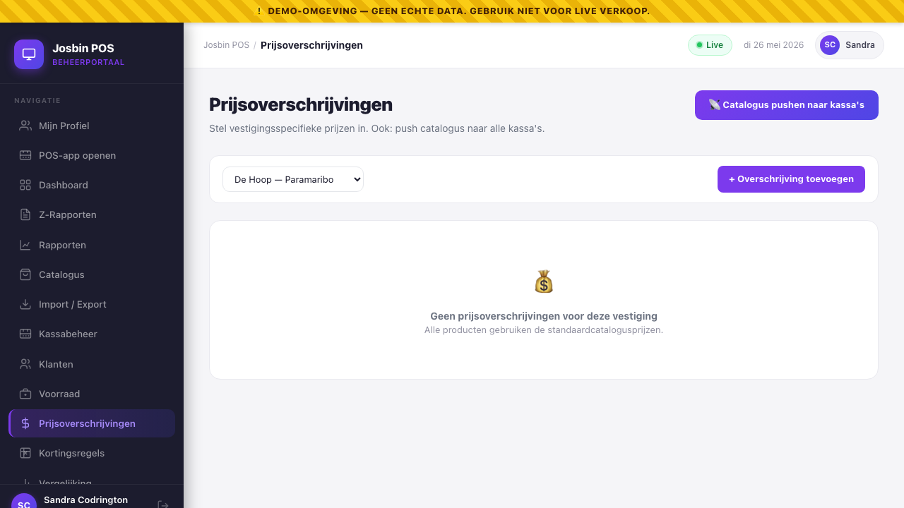

# Chapter 6 — Pricing & per-store overrides

**Who needs this:** the **Organisation Admin** (sets the master price for every product across every branch) and the **Store Manager** (read-only — managers can fix a typo on one product per [Chapter 4](04-catalogue-and-categories.md), but they can't override prices for their own store; that's deliberate, see §6.9).

**When you do it:** opening a branch in a different region with different cost structure (transport to Nickerie is more expensive than to Paramaribo), running a store-specific promotion that's *not* a general discount rule (those live in [Chapter 7](07-discount-rules.md)), or matching a local competitor on one branch without touching the rest.

**Why this prevents pain:** without overrides you'd have to maintain a separate catalogue per store — and that's exactly what every cashier-led data drift starts with. With overrides, you keep **one master catalogue** and add a small list of "this product, in this store, costs SRD X instead" exceptions on top.


---

## 6.1 The pricing model in one diagram

```
ORGANISATION (Supermarkt De Hoop)
   │
   ├── master catalogue
   │     └── product "Cola 1.5L"  →  price SRD 18.00, BTW 10 %
   │
   └── stores
         │
         ├── De Hoop — Paramaribo
         │     │  (no override row for Cola 1.5L)
         │     └── cashier rings up Cola 1.5L → SRD 18.00 ← master price
         │
         └── De Hoop — Nieuw Nickerie
               │  store_product_overrides row exists for Cola 1.5L:
               │  { store_id: nickerie, product_id: cola, price_override: 20.00 }
               │
               └── cashier rings up Cola 1.5L → SRD 20.00 ← override wins
```

**The rule is simple, and there's only one rule:**

> For a given `(store_id, product_id)` pair, if a row exists in `store_product_overrides`, that price is used. Otherwise the master `products.price` is used.

There is no "percentage above master", no "regional multiplier", no inheritance hierarchy beyond store → master. One row per exception, per store. Easy to reason about, easy to audit.

### What overrides do *not* touch

The override **only changes the SRD price**. It does **not** change:

- The product's name (Dutch or English).
- The barcode.
- The BTW rate or BTW-exempt flag — BTW is a tax-authority decision, not a per-store one.
- The category, image, or any other catalogue field.
- The product's stock count — stock is already per-store (see [Chapter 8](08-stock-management.md)).
- Discount rules — those evaluate against whatever price the till is showing, override included.

If you need to charge a different BTW rate per region, that's a different product, not an override. (Suriname BTW is national; this almost never happens.)

---

## 6.2 The entities

| Table | Purpose | Key columns |
|---|---|---|
| `products` | Master catalogue, one row per SKU per organisation. | `id`, `organisation_id`, `name_nl`, `name_en`, `price` (the **master** price), `btw_rate`, `btw_exempt` |
| `stores` | One row per physical branch under an organisation. | `id`, `organisation_id`, `name`, `city` |
| `store_product_overrides` | One row **only when** a store deviates from the master price for a product. | `store_id`, `product_id`, `price_override`, `is_active`. Unique on `(store_id, product_id)`. |

When you delete an override the cashier instantly sees the master price again. When you delete a product, all its override rows go with it (foreign-key cascade).

---

## 6.3 Step-by-step — setting one override

**Path:** Dashboard → sidebar → **Prijsoverschrijvingen / Price Overrides**.


1. Pick the **vestiging / store** from the dropdown at the top.
   - Super Admin only: pick the **organisation** dropdown to the left of the store selector first.
   - Org Admins are scoped to their own organisation — no org selector appears.
2. If this store has overrides already, you see them listed in the table — Product · Basisprijs (master) · Vestigingsprijs (override) · Verschil (delta).
3. Click **+ Overschrijving toevoegen / + Add override** (top-right of the table area).
4. The modal opens.
5. **Product** dropdown: pick the catalogue product you want to override. The dropdown shows the name in your active UI language plus the current master price for reference (`Cola 1.5L (SRD 18.00)`).
6. **Vestigingsprijs / Store price (SRD)**: type the new price in decimal SRD, two decimals — e.g. `20.00`.
7. Click **Opslaan / Save**.
8. The modal closes. The new row appears in the table with the delta calculated (e.g. `+2.00` highlighted red because it's a price increase; `-1.50` highlighted green because it's a discount).

The cashier at that store sees the new price on their next product-grid refresh — within seconds via the WebSocket push, or immediately if you click the **📡 Catalogus pushen** button at the top of the screen (see §6.7).

---

## 6.4 Step-by-step — editing an override

1. Price Overrides screen → store is selected → find the row → **Bewerken / Edit**.
2. The modal opens. The product is locked (you can't change which product the override is for — delete and re-add if you need that). The current store price is shown.
3. Change the **Vestigingsprijs / Store price** value.
4. **Opslaan / Save.**

The row updates immediately; the new price reaches connected tills within seconds.

---

## 6.5 Step-by-step — removing an override (back to master price)

1. Price Overrides screen → find the row → **✕** (red button).
2. Confirm the *"Verwijderen? / Delete?"* prompt.
3. The row disappears from the table.

From that moment on, that store rings up the product at the **master catalogue price** — there's no separate "use master" toggle, removal is the way.

---

## 6.6 Worked example — Nickerie transport surcharge

Scenario: Supermarkt De Hoop runs two stores. Nickerie is 230 km west of Paramaribo and every truck delivery adds about 8 % to the landed cost. HQ wants Nickerie to mark up only the products where the surcharge actually hurts (high-volume, low-margin) — not the whole catalogue.

**Decision matrix** (drawn up at HQ before opening the dashboard):

| Product | Master price | Nickerie price | Why |
|---|---|---|---|
| Volle Melk 1L | SRD 12.50 | SRD 13.50 | High-volume, fragile, transport-sensitive. |
| Brood Wit | SRD 6.00 | SRD 6.00 | Baked locally in Nickerie — no override needed. |
| Cola 1.5L | SRD 18.00 | SRD 20.00 | Bulky, heavy. |
| Tandpasta 100ml | SRD 14.00 | SRD 14.00 | Small, lightweight — surcharge negligible. |
| Wasmiddel 3L | SRD 65.00 | SRD 72.00 | Heavy. Per-pallet shipping cost. |

**Procedure:**

1. Price Overrides → select store **De Hoop — Nieuw Nickerie**.
2. **+ Add override** → Volle Melk 1L → 13.50 → Save.
3. Repeat for Cola 1.5L → 20.00 and Wasmiddel 3L → 72.00.
4. Brood Wit and Tandpasta 100ml get **no override row** — they ring up at the master price automatically.
5. Verify: at the Nickerie till, scan each product. Volle Melk should show 13.50; Brood Wit should show 6.00.

Three rows in `store_product_overrides`, not five. That's the point — overrides are the exception, not the rule.

---

## 6.7 Pushing the catalogue to all POS terminals

Every save on the Price Overrides screen broadcasts a `catalogue.refresh` signal automatically. The 📡 button is there for the edge cases:

- A terminal was offline during your edit and you've just heard it's back.
- You've made a long list of overrides and want a single "settle now" pulse.
- You're showing a customer a demo and want every screen to flicker at the same time.

**To push:**

1. Top-right of the Price Overrides screen → **📡 Catalogus pushen naar kassa's / Push catalogue to POS terminals**.
2. The button flips through three states:
   - `📡 Versturen… / Pushing…` (in-flight)
   - `✓ Verstuurd! / ✓ Pushed!` (success, green for 3 seconds)
   - `✗ Fout / Error` (failure, red for 3 seconds)
3. Connected tills invalidate their product cache and refetch from `/api/products/pos` — usually within 1-2 seconds.

This pushes the **entire** active catalogue for the organisation (master + every store's override), not just changes since the last push. It's safe to spam — at worst the tills do an extra fetch.

The response includes the count of active products broadcast. If your catalogue has 1,247 active products and the push returns `product_count: 1247`, you know the broadcast went out cleanly.

---

## 6.8 Where the override price actually wins

The override price is read at three different moments. All three reach for the same `(store_id, product_id)` lookup:

| When | Where | Effect |
|---|---|---|
| Cashier adds the product to the cart | POS app product-grid tap, barcode scan, or manual search | The tile / cart line shows the override price, not master. |
| Cashier rings up the sale | POS submits the sale to the backend | The sale's `unit_price_srd` records the override price. The receipt prints it. |
| Discount rule applies | Discount rules evaluate against the line price | The override price is the basis for percentage discounts. A `pct_discount = 10` rule on a SRD 20.00 (overridden) cola gives a SRD 2.00 discount, not SRD 1.80. See [Chapter 7](07-discount-rules.md). |

The receipt itself doesn't say "(override)" anywhere. From the customer's perspective the override price *is* the price at that store. The fact it differs from another branch is an internal pricing decision, not a receipt-level concern.

---

## 6.9 Why managers can't set overrides

In the [permission matrix](01-roles-and-permissions.md#13-the-permission-matrix), per-store price overrides are gated to **Super Admin** and **Organisation Admin**. Store Managers can edit individual products' master prices ("a typo, the bottle is 1.5L not 1.6L") but cannot create override rows for their own store.

This is deliberate. If a Store Manager could set their own prices:

- Two branches would drift into incompatible pricing within a week.
- BTW reports would tell a confusing story ("why is Paramaribo selling at 18 and Nickerie at 17?").
- The audit log fills with prices changing under multiple hands.
- Refund disputes get harder ("but the receipt says 18, why does the system say 20?").

Pricing is an HQ decision. If a Store Manager genuinely needs a one-day local promotion ("competitor is dumping cola at 15, we have to match"), the right answer is a **discount rule scoped to that store** ([Chapter 7](07-discount-rules.md)), not an override — that way the original price stays visible on the receipt with the discount line underneath, which is what Belastingdienst expects.

The "I'm-a-one-shop-owner" pattern from [Chapter 1 §1.6](01-roles-and-permissions.md#16-the-im-a-single-shop-owner-pattern) — one person holding both an Org Admin and a Cashier account — is the clean way around this for genuine single-store operators.

---

## 6.10 Bulk-loading overrides (workaround)

There's no dedicated bulk-override import screen in this release. If you need to set 50+ overrides at once, the practical workaround:

1. Export the master catalogue ([Chapter 5 §5.5](05-bulk-import-csv-excel.md#55-step-by-step-exporting-the-current-catalogue)).
2. In a spreadsheet, decide your per-store prices. Keep a separate sheet per store.
3. Either:
   - **Type each override manually** in the Price Overrides screen (fine for under 20).
   - Or have a developer hit the API directly: `POST /api/stores/{store}/price-overrides` with `{product_id, price_override}` per row — easily scripted from a CSV. (See [the integration API docs in Chapter 12](12-api-integrations-and-webhooks.md).)

A real "Import overrides" CSV UI is on the roadmap; this section will be updated when it ships.

---

## 6.11 Common mistakes and gotchas

| Symptom | Likely cause | Fix |
|---|---|---|
| You set a Nickerie override but the Paramaribo till is also showing the new price | You forgot to select the store and accidentally edited a different one. | Price Overrides → re-pick the correct store → delete the wrong override. The original store still has its row — re-add it. |
| The new price isn't appearing at the till | Terminal is offline, or the WebSocket reconnect hasn't fired. | Click the **📡 Catalogus pushen** button. If it still doesn't update, restart the POS app on that terminal. |
| You can't find the override later — the table is empty | You're looking at the wrong store. Each store has its own list. | Re-pick the store. Overrides aren't org-wide; they're store-scoped. |
| The "Verschil / Difference" column shows red for what you intended to be a discount | The column shows `override − master`. A red `+2.00` means the store price is **higher**. Green `−1.50` means lower. | If you meant a discount and see a positive number, you've typed the override price higher than master. Edit the row. |
| You delete a product and the override is gone too | Expected. Foreign-key cascade — when the master product disappears, so do its per-store rows. | If you only want to remove the product from one store, deactivate the override row, not the master product. |
| You set an override of `0.00` thinking it'd disable the override | An override price of `0.00` makes the product **free** at that store. The cashier will ring it up at SRD 0. | To go back to master, **delete** the override (✕ button). Don't set it to zero. |
| The override sticks even after you change the master price | Correct. Overrides are absolute, not relative to master. | If you bump master from 18.00 → 19.00 and want the override store to mirror that, edit the override too (e.g. 20.00 → 21.00). |
| The POS shows the master price even though an override exists | The override row has `is_active = false` (only set this way via API; the UI doesn't expose the toggle). | Delete the row and re-add it (which sets `is_active = true`). |
| Multiple admins editing the same override simultaneously, you see stale data | The screen uses optimistic invalidation; the second save wins. | After saving, do a manual page reload to confirm what's in the database. The audit log records both changes. |

---

## 6.12 What's recorded in the audit log

Override changes are infrequent (compared to sales) and high-impact (a wrong override means every sale of that product at that store rings up wrong) — so they're logged with the same level of detail as catalogue changes. Each insert, update, or delete on `store_product_overrides` records:

- The **action** (`created`, `updated`, `deleted`).
- The **user** who made the change (your dashboard account).
- The **store** and **product** affected.
- The **old price_override** and **new price_override** as JSON.
- The **IP address** and timestamp in AST.

The full history is visible to Org Admin and Auditor in [Chapter 13 — Audit log](13-audit-log.md). The audit log is append-only — even Super Admin cannot delete a row — so if there's ever a dispute ("we never agreed to this price"), the answer is one filter away.

For the developer-side detail of how the audit pipeline works, see [`/docs/03-auth-and-roles.md`](../docs/03-auth-and-roles.md).

---

## 6.13 Quick reference

```
SET OVERRIDE          Dashboard → Price Overrides → pick store
                      → + Add override → pick product → set SRD price → Save
EDIT OVERRIDE         Same screen → Edit on row → change price → Save
REMOVE OVERRIDE       Same screen → ✕ on row → Confirm
PUSH TO ALL TILLS     📡 button top-right (most edits push automatically anyway)

KEY                   (store_id, product_id) → unique row in store_product_overrides
RESOLUTION            override row exists?
                          yes → use override price_override
                          no  → use master products.price
ROLES                 Super Admin + Org Admin only.
                      Store Managers cannot set overrides for their own store.
WHAT'S OVERRIDDEN     The SRD price. Only the price.
                      BTW, name, barcode, category stay master-defined.
```

Stuck? See [Chapter 4](04-catalogue-and-categories.md) for the master catalogue, [Chapter 5](05-bulk-import-csv-excel.md) for bulk loading master prices, [Chapter 7](07-discount-rules.md) for store-scoped discount promotions (the cleaner answer for short-term local price drops), and [Chapter 13](13-audit-log.md) for the audit history.

---

→ Next: [Chapter 7 — Discount rules](07-discount-rules.md)
