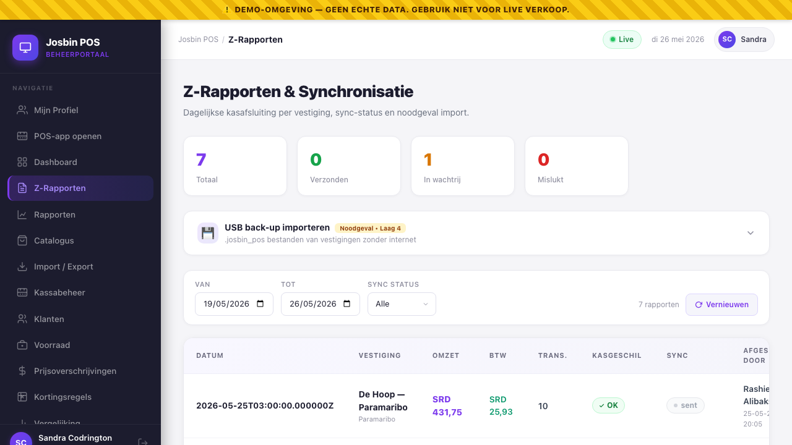
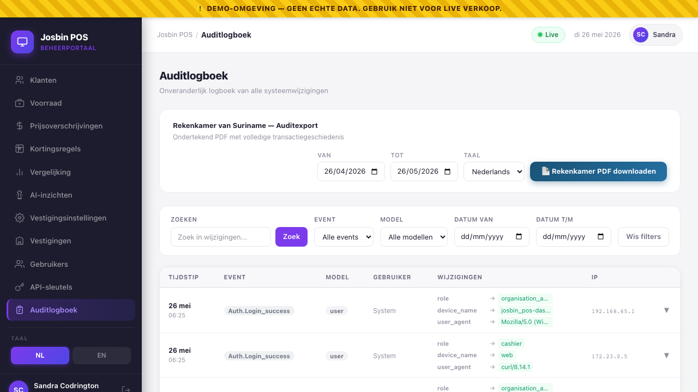
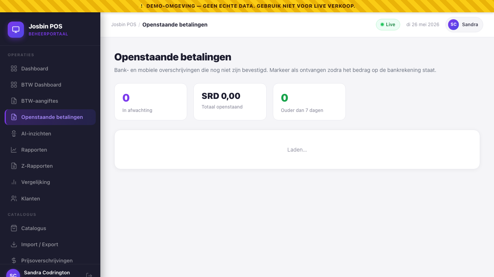

# Chapter 10 — Reports: Daily, Monthly, BTW, Rekenkamer

**Who needs this:** Organisation Admin, Store Manager, Auditor. Super Admin too, when looking at a specific customer. Cashiers see only their own performance in [My Account](18-my-account.md) — not the report screens described here.

**When you run a report:**
- **Daily / monthly** — Store Manager checks how a branch is doing. Org Admin checks how all branches are doing.
- **BTW** — once a month, for the Belastingdienst Suriname filing. Whoever does the accounting.
- **Rekenkamer** — when a Court of Audit inspector or government compliance officer asks. Or quarterly, as a defensive habit.
- **Top products / X-Report** — daily spot-check by the Store Manager during the trading day.

**What this prevents:** reports built in the dashboard come straight from the canonical sale rows, with the BTW math already pinned by the [BTW pipeline](../docs/05-btw-pipeline.md). That means no spreadsheets, no manual re-keying, no rounding drift between what the cashier rang up and what you file with Belastingdienst. The Rekenkamer export carries a SHA-256 document hash for tamper detection — if a copy in the wild differs by one byte, the hash on the cover page proves it.


---

## 10.1 The seven report types at a glance

Josbin POS exposes seven distinct report endpoints. Some live on the **dashboard Reports screen** (consolidated cross-store), others are per-store and only reachable through the API or the POS-side end-of-day flow.

| # | Report | Scope | Where | Permission | Output |
|---|---|---|---|---|---|
| 1 | **Daily** | one store, one date | API / POS reports screen | `reports.daily` | JSON, PDF |
| 2 | **Monthly** | one store, calendar month | API / POS reports screen | `reports.monthly` | JSON, PDF |
| 3 | **Custom range** | one store, any `from → to` | API / POS reports screen | `reports.custom` | JSON, PDF |
| 4 | **Top products** | one store, any range, top N | API / POS reports screen | `reports.top_products` | JSON |
| 5 | **X-Report** (mid-day) | one store, today | POS reports screen, manager-only | `reports.x_report` | JSON / printed slip |
| 6 | **BTW report** | one store *or* whole org | Dashboard → Reports → BTW | `reports.btw` | JSON, PDF |
| 7 | **Rekenkamer export** | whole org (or one store filter) | API `GET /reports/rekenkamer` | `reports.rekenkamer` or Org Admin / Auditor | **Signed PDF** |
| 8 | **Consolidated** (cross-store) | all stores in an org | Dashboard → Reports → Geconsolideerd | (Org Admin / Super Admin / Auditor) | JSON, PDF |

The dashboard's **Rapporten / Reports** screen wraps two of these (consolidated + BTW). The other five are reachable either from the POS-side report screen (for one store at a time) or from the API. The Rekenkamer export has no dedicated dashboard screen yet — it's triggered by URL or by a "Download audit export" button on the Audit Log screen ([Chapter 13](13-audit-log.md)).

> The **Z-Report** is *not* in this chapter. It's the end-of-day register close — see [Chapter 11](11-z-reports-and-end-of-day-sync.md). What lands here are the analytical reports you read; Z-Report is the operational act of closing a day.

---

## 10.2 The dashboard Reports screen

**Path:** Dashboard → left sidebar → **Rapporten / Reports**.

You land on a two-tab screen:

- **Geconsolideerd / Consolidated** — cross-store revenue, BTW, transactions, payment breakdown, per-store table, top 10 products.
- **BTW-overzicht / BTW Report** — Belastingdienst-formatted VAT report aggregated across the same store scope.

Both tabs share one filter bar at the top:

| Filter | What it does | Default |
|---|---|---|
| **Van / From** | Start date (inclusive). | First day of current month. |
| **Tot / To** | End date (inclusive). | Today. |
| **Vandaag / Today** quick pill | Sets from = to = today. | — |
| **Gisteren / Yesterday** quick pill | Sets from = to = yesterday. | — |
| **Deze maand / This month** quick pill | Sets from = first of month, to = today. | — |
| **Vernieuwen / Refresh** | Re-runs the query. The tab loads automatically when you change a date, so this is for "force-fresh" cases. | — |
| **Exporteer PDF / Export PDF** | Downloads the currently visible report as a PDF in your UI language. | — |

> The date filter is **inclusive on both ends**. `From = 2026-05-01`, `To = 2026-05-31` returns the entire month of May. Timestamps inside the data are AST (America/Paramaribo), so a sale rung up at 23:58 AST on May 31 belongs to the May report, even though it might be June 1 in UTC.

Scope rules (decided by the backend, you don't choose):

- **Super Admin** sees every active organisation by default. Pass `?org_id=…` to scope to one. There's no dropdown for this in the screen yet — Super Admins typically use the URL or the API.
- **Org Admin / Store Manager / Auditor** are scoped to their own organisation automatically. They cannot see another org's data and the query doesn't even hit that data.

---

## 10.3 Consolidated report (cross-store)

The default tab. Answers the question *"how is the whole organisation doing in this date range?"*.


### Who reads this

- **Organisation Admin** — every morning, looking at "yesterday" or "this month so far". Spots a branch that's off-pace before lunch.
- **Auditor** — checking totals tie back to what was filed.
- **Super Admin** — at a higher level, across all customers if needed.

### What you see (top to bottom)

#### KPI cards (four)

| Card | What it shows | Source |
|---|---|---|
| **Totale omzet / Total revenue** | Sum of `total_srd` across all completed sales in scope. | `sales.total_srd` |
| **Transacties / Transactions** | Count of completed sales. Voided sales are not counted. | `sales.id` count |
| **Gemiddelde bon / Avg basket** | Total revenue ÷ transaction count. Useful for spotting price-perception changes. | derived |
| **BTW** | Sum of `btw_srd` across the same set. This is the *collected* tax — not what's payable after exempt subtractions (the BTW tab handles that). | `sales.btw_srd` |

#### Payment breakdown strip

Three inline figures: **Contant / Cash · PIN/Kaart / Card · Gemengd / Mixed**, each summed for the scope. Useful for cash-flow planning (do we have a Brinks pickup tomorrow?).

#### Per-store table — columns

| Column | Notes |
|---|---|
| **Vestiging / Store** | Store name. Click to drill into [Store Detail](02-organisation-and-store-setup.md#store-detail). |
| **Stad / City** | The store's city. Helps when you have multiple branches in the same chain. |
| **Omzet / Revenue** | This store's total SRD in scope. |
| **BTW** | This store's collected BTW in scope. |
| **Transacties / Transactions** | This store's completed-sale count. |

Stores with zero sales in the range are omitted from the table (they fall out of the `GROUP BY store_id`). That's not a hidden setting — if a store doesn't appear, it had no completed sales for those dates.

#### Top products table

Top 10 products by revenue across **all** stores in scope. Columns:

| Column | Notes |
|---|---|
| **#** | Rank, 1–10. |
| **Product** | The product name as it was at the time of sale — `product_name_snapshot`, not the current catalogue name. If the cashier rang up "Volle Melk 1L" last month and you renamed it to "Melk 1L Vol" today, the report still shows "Volle Melk 1L". |
| **Aantal / Qty** | Sum of `quantity` rounded to integer (units, kg — the units depend on the product). |
| **Omzet / Revenue** | Sum of line totals (post-discount, BTW-inclusive). |

### Backend endpoint

```
GET /api/dashboard/reports/consolidated?date_from=YYYY-MM-DD&date_to=YYYY-MM-DD
```

Source: `backend/app/Http/Controllers/Api/DashboardController.php::consolidatedReport`.

### PDF export columns

Click **Exporteer PDF** while on the Consolidated tab. The file `geconsolideerd-rapport-<from>-<to>.pdf` downloads. Layout:

- Cover header — organisation name, date range, generated-at (AST), generated-by.
- Summary block — total revenue, BTW, transactions, avg basket, payment split.
- Per-store table — store, city, transactions, revenue, BTW.
- A4 portrait, Dutch headers when `locale=nl`, English when `locale=en`.

CSV/XLSX export are not yet exposed in this release — the data is in the PDF tables. For a one-off, the JSON endpoint above is the cleanest path.

---

## 10.4 BTW report (Belastingdienst format)

The single most important report in the dashboard, legally speaking. You will run this **once a month** on the second tab.


### The Suriname BTW context

| Fact | Value |
|---|---|
| Standard BTW rate (2026) | **10 %** |
| Exempt categories | Basic foodstuffs (rice, bread, milk for kids, raw fruit/veg, fresh meat), prescription medicine, a small list of other goods defined by Belastingdienst. See [Chapter 4 — BTW-exempt flag](04-catalogue-and-categories.md#47-the-btw-exempt-flag--when-to-use-it). |
| Math | Tax-**inclusive**: `btw = base × rate / (100 + rate)`. Discount is applied first, BTW extracted from the post-discount net. See [`docs/05-btw-pipeline.md`](../docs/05-btw-pipeline.md) for the worked example. |
| Filing authority | **Belastingdienst Suriname** (the Tax Authority). |
| Filing period | Monthly is canonical for VAT. Pick `from = first day of month`, `to = last day of month`. |
| Filing currency | SRD only. |

### What you see (top to bottom)

#### Two large KPI cards

| Card | What it shows |
|---|---|
| **Totale BTW te betalen / Total BTW payable** | Sum of `sale_items.btw_srd` across all completed sales in scope. This is the headline number that goes on the Belastingdienst form. |
| **Totale bruto omzet / Total gross revenue** | Sum of `sale_items.line_total_srd` (BTW-inclusive). The base from which the BTW above was extracted. |

The smaller text under "Total gross revenue" reads `Belastingdienst Suriname` — that's the `format` field the API returns, confirming you are looking at the official-format output.

#### Breakdown by BTW rate — columns

| Column | What it shows | How it's computed |
|---|---|---|
| **Tarief / Rate** | The BTW rate that line items were rung up at. Typically `0.00%` (exempt + zero-rated) and `10.00%`. | `sale_items.btw_rate` |
| **Vrijgesteld / Exempt** | `Ja / Yes` green pill if `btw_exempt = true`, `—` otherwise. Two rows can both show `0.00%` — one exempt, one zero-rated — and they appear separately so the audit trail stays unambiguous. | `sale_items.btw_exempt` |
| **Bruto incl. BTW / Gross incl. BTW** | Sum of `line_total_srd` for the rate-group. | `SUM(line_total_srd)` |
| **Netto excl. BTW / Net excl. BTW** | Gross minus the extracted BTW. The tax-exclusive base. | `SUM(line_total_srd) − SUM(btw_srd)` |
| **BTW** | The extracted tax for the rate-group. | `SUM(btw_srd)` |
| **Verkopen / Sales** | Number of distinct sales that contained items at this rate. (One sale can contain mixed rates and is counted in each.) | `COUNT(DISTINCT sales.id)` |

The breakdown is `ORDER BY btw_exempt, btw_rate` — exempt rows come first, then ascending rate. For most Surinamese retailers the table is two rows: exempt (basic foods + medicine) and 10 %.

### Why this maps cleanly to the Belastingdienst form

The Belastingdienst BTW filing asks (in essence):

1. Total tax-exclusive turnover at each rate band
2. The BTW payable at each rate band

Both come straight off the **Netto excl. BTW** and **BTW** columns. You copy them onto the form, one line per rate band, exempt turnover under the exempt section, and you're done.

> **Compliance audit note:** because the BTW values are *persisted* per-line at sale time (`sale_items.btw_srd`) — not re-derived from the rate at report time — the report cannot drift from the receipt the customer was handed. The receipt the cashier printed, the audit log entry, and the BTW report all reference the same locked numbers. See [`docs/05-btw-pipeline.md`](../docs/05-btw-pipeline.md) for the row-insert guarantee.

### Per-store BTW (when you need it)

The dashboard's BTW tab is **consolidated across all stores in your org**. For a single-store BTW report (e.g. one branch is its own legal entity with its own BTW number), call the per-store endpoint directly:

```
GET /api/reports/btw?store_id=<uuid>&date_from=YYYY-MM-DD&date_to=YYYY-MM-DD
```

Source: `backend/app/Http/Controllers/Api/ReportController.php::btwReport`.

Same shape as the consolidated version, scoped to one store. The legal common case in Suriname is one BTW number per organisation, so the dashboard's consolidated view matches what gets filed. If your client structures their business with separate BTW numbers per branch, build them a tiny report runner that hits the per-store endpoint for each branch and concatenates — that's a vendor-support job, not a self-service feature in this release.

### PDF export

Click **Exporteer PDF** while on the BTW tab. The file `btw-rapport-belastingdienst-<from>-<to>.pdf` downloads. Layout:

- Cover header — organisation name, BTW registration number, period, AST timestamp.
- Two summary lines — total gross, total BTW.
- Rate-band table — exempt row(s) first, then 10 % (and any other rates that appeared).
- A4 portrait. `locale=nl` is the default for Belastingdienst filing.

This is the PDF you attach to the BTW filing or hand to your accountant. Print it, sign it, file it.

### Backend endpoint

```
GET /api/dashboard/reports/btw?date_from=YYYY-MM-DD&date_to=YYYY-MM-DD
GET /api/dashboard/reports/btw/export?date_from=…&date_to=…&locale=nl|en
```

Source: `backend/app/Http/Controllers/Api/DashboardController.php::consolidatedBtwReport` + `::exportBtw`.

---

## 10.5 Per-store reports — daily, monthly, custom range

These five reports (`daily`, `monthly`, `custom`, `top-products`, `x-report`) live behind `/api/reports/*` and are used by the **POS-side Reports screen** rather than the dashboard. They are listed here because Store Managers regularly ask "where do I see yesterday's number for *just my store*?" — and the answer is "the POS-side Reports screen" (covered in [POS user manual ch 11](../user_manual/11-reports.md)), or one of these endpoints directly.

### 10.5.1 Daily report — `GET /api/reports/daily`

| Param | Required | Default |
|---|:-:|---|
| `store_id` (uuid) | ✅ | — |
| `date` (Y-m-d) | optional | today (AST) |

Response shape (`buildDailySummary`):

| Field | Notes |
|---|---|
| `store_id`, `date_from`, `date_to` | Both date fields = the same date. |
| `transaction_count` | Completed sales. |
| `void_count` | Voided sales in the same period (separate counter — voids are *not* in `transaction_count`). |
| `total_sales_srd` | Sum of `total_srd`. |
| `total_btw_srd` | Sum of `btw_srd`. |
| `total_discount_srd` | Sum of `discount_srd` (sale-level discount; line-item discounts are baked into `total_srd`). |
| `avg_basket_srd` | Avg `total_srd`. |
| `cash_total_srd` / `card_total_srd` / `mixed_total_srd` | Payment-method split. |
| `btw_breakdown` | Array — one row per `(btw_rate, btw_exempt)` group: `base_srd`, `btw_srd`, `rate`, `exempt`. |
| `top_products` | Top 5 by revenue: `product_name`, `quantity`, `revenue_srd`. |

### 10.5.2 Monthly report — `GET /api/reports/monthly`

| Param | Required |
|---|:-:|
| `store_id` (uuid) | ✅ |
| `year` (integer) | ✅ |
| `month` (integer 1–12) | ✅ |

Same shape as daily, but with `date_from = YYYY-MM-01`, `date_to = last day of month`, plus a `period: "YYYY-MM"` string for display.

### 10.5.3 Custom range — `GET /api/reports/custom`

| Param | Required |
|---|:-:|
| `store_id` (uuid) | ✅ |
| `date_from` (Y-m-d) | ✅ |
| `date_to` (Y-m-d, ≥ from) | ✅ |

Same shape as daily, over the chosen range. Useful for "this week", "last quarter", "Black Friday weekend" type questions.

### 10.5.4 Top products — `GET /api/reports/top-products`

| Param | Required | Default |
|---|:-:|---|
| `store_id` (uuid) | ✅ | — |
| `date_from` (Y-m-d) | optional | first of current month |
| `date_to` (Y-m-d) | optional | today |
| `limit` (5–50) | optional | 10 |

Returns `products`: array of `product_name`, `total_qty`, `total_revenue`, `sale_count` — ordered by revenue desc.

### 10.5.5 X-Report (mid-day snapshot) — `GET /api/reports/x-report`

| Param | Required |
|---|:-:|
| `store_id` (uuid) | ✅ |

Returns the same `buildDailySummary` shape as the daily report (for today), with three extra fields:

| Extra field | Value |
|---|---|
| `type` | `"X-Report"` |
| `generated_at` | AST ISO-8601 timestamp |
| `note` | `"Dit is een tussentijds overzicht. De kassalade is NIET afgesloten."` |

**This is the critical distinction:** the X-Report does **not** close the day. It produces no `ZReport` row. It's read-only — for spot-checks. Sales can keep happening immediately after, exactly like before. Compare with the Z-Report which *does* close the day and *does* persist a row (see [Chapter 11](11-z-reports-and-end-of-day-sync.md)).

### PDF export — daily / monthly / custom / btw

```
GET /api/reports/export?type=daily|monthly|custom|btw&store_id=…&date=…|date_from=…&date_to=…&locale=nl|en
```

- `type=daily` requires `date`; defaults to today.
- `type=monthly` and `type=custom` require `date_from` + `date_to`.
- `type=btw` is currently a placeholder PDF — use the dashboard's BTW export (`/api/dashboard/reports/btw/export`) for the production-ready PDF.
- `locale` defaults to `nl` (Dutch headers) — pass `en` for English.

File naming convention: `report-<type>-<today>.pdf`, A4 portrait.

CSV / XLSX export are not in the per-store endpoints. The JSON shape is the simplest path for downstream tooling; if a customer wants Excel out of the dashboard, it's a small wrapper job for vendor support.

---

## 10.6 Rekenkamer export — the Court of Audit PDF


This is the **signed PDF + full transaction list** used by the *Rekenkamer van Suriname* (the Court of Audit) when reviewing a government department's accounts. It's also useful for any client that wants a "give me everything for this period" archival document.

### Who needs this

- **Government departments** (`organisations.is_government = true`) — the Rekenkamer can request this at any time. The export is built specifically to meet their format expectations.
- **Auditors** — internal auditors, external accountants, Belastingdienst tax inspectors doing a deep dive past the regular BTW report.
- **Organisation Admin** — defensively, once per quarter, as part of your own archive.

### What's in the document

The PDF (A4 landscape) contains the **complete transaction history** for an organisation (or one store) over a chosen date range. Specifically:

| Section | Contents |
|---|---|
| **Cover page** | Organisation name + BTW number, period (`from → to`), store filter if any, generated-at (AST), generated-by (name + email), document hash (SHA-256). |
| **Executive summary** | Total revenue, total BTW, total net base, completed transaction count, voided transaction count, average basket. |
| **BTW breakdown** | Per rate-band — `btw_rate`, `btw_exempt`, `net_base`, `btw_total`. Same structure as the BTW report tab. |
| **Payment method breakdown** | Per method (cash, card, mixed) — count and total. |
| **Complete transaction list** | Every completed *and* voided sale in the range, ordered by `occurred_at`. Each row: sale number, AST timestamp, cashier name, store name, payment method, totals (subtotal, discount, BTW, total), status. |
| **Void log** | Every voided sale separately tabulated with the void reason and the user who approved it. |
| **Footer on every page** | The SHA-256 document hash, repeated for tamper-evidence. |

### The signing detail (and what it actually does today)

The document carries:

| Mechanism | What it does | Status |
|---|---|---|
| **SHA-256 document hash** in HTTP response header (`X-Document-Hash`) and on every page of the PDF. | Computed from `org_id + period + sale count + grand total + generated_at`. Changing any of those inputs after the fact produces a different hash — any tampered copy stops matching the audit-log entry we keep. | ✅ Working — every export produces a header + cover hash. |
| **Digital signature on the organisation's certificate.** | A formal cryptographic signature using the organisation's signing certificate (issued at install time). The signed PDF would carry a verifiable PKCS#7 signature visible in any modern PDF reader. | Planned. The hash above is the interim tamper-evidence; full PDF signing lands when the organisation-cert infrastructure does. |

When a Rekenkamer inspector asks "is this PDF authentic?", today the answer is:

1. The SHA-256 hash is on the PDF and also recorded in our audit log on the server side at the moment of generation.
2. Hand them the hash from our server log; they compare it to the hash on the PDF in front of them. Match = authentic.

When the signing infrastructure ships, the answer simplifies to: "open the PDF, look at the signature panel, the signer is *<Organisation Name>* on *<date>*".

### How to export

There is no dedicated screen for this in the current release. Two paths:

**Path A — Audit Log screen export button** ([Chapter 13](13-audit-log.md)): the Audit Log screen has a **Rekenkamer-export** button at the top-right that calls the endpoint with the currently active date filter.

**Path B — Direct URL** (vendor support / Super Admin):

```
GET /api/reports/rekenkamer?organisation_id=<uuid>&date_from=YYYY-MM-DD&date_to=YYYY-MM-DD&locale=nl|en
```

Optional `store_id=<uuid>` to scope to one branch. Optional `locale=en` for English headers (default `nl`).

The file `rekenkamer_<orgname>_<from>_<to>.pdf` downloads.

### Permissions

- **Super Admin** — always allowed.
- **Organisation Admin** — allowed for their own org.
- **Auditor** — allowed for their own org (this is exactly the role this PDF is built for).
- **Store Manager / Cashier** — denied. (This is a sensitive cross-store export — not within a manager's blast radius.)
- **API Integration** — denied. Machines do not pull legal audit exports.

Backend source: `backend/app/Http/Controllers/Api/RekenkamerController.php`.

### CSV companion

For analytical use (loading into a spreadsheet), pair the PDF with the Custom Range JSON endpoint (§10.5.3) for the same date span and turn it into CSV in your own tooling. A dedicated Rekenkamer-CSV export is not currently in the API — the PDF is the *legal* document; CSV is a convenience format that's not part of the Rekenkamer-required deliverable.

---

## 10.7 Permission cheat sheet

Who can run what, in one table. (Source: `backend/database/seeders/RolesAndPermissionsSeeder.php`.)

| Permission | Super Admin | Org Admin | Store Mgr | Cashier | Auditor | API Integ. |
|---|:-:|:-:|:-:|:-:|:-:|:-:|
| `reports.daily` | ✅ | ✅ | ✅ | ✅ (own store) | ✅ | ✅ |
| `reports.monthly` | ✅ | ✅ | ✅ | ✅ (own store) | ✅ | ❌ |
| `reports.custom` | ✅ | ✅ | ✅ | ✅ (own store) | ✅ | ❌ |
| `reports.top_products` | ✅ | ✅ | ✅ | ✅ | ✅ | ❌ |
| `reports.x_report` | ✅ | ✅ | ✅ | ✅ | ❌ | ❌ |
| `reports.btw` | ✅ | ✅ | ✅ | ❌ | ✅ | ❌ |
| `reports.rekenkamer` | ✅ | ✅ | ❌ | ❌ | ✅ | ❌ |
| `reports.export` (PDF) | ✅ | ✅ | ✅ | ✅ | ✅ | ❌ |
| **Consolidated cross-store** | ✅ | ✅ | ❌ (scoped to one store) | ❌ | ✅ | ❌ |

Cashier visibility is **scoped to their store** by the backend — they cannot see another branch's data even if they hold the permission.

---

## 10.8 Sync status caveat for reports

All seven reports here read from the **local back-office database**. They are *not* gated by HQ sync status. If a store has been offline for three days and its Z-Reports are queued in `pending`, its **local** daily / monthly reports for those days are accurate — the data is on the local Postgres. What's *not* accurate yet is the **HQ Super Admin Dashboard's** view of those days, because the data hasn't crossed the network.

In other words:

| Where you read from | Data freshness |
|---|---|
| **POS-side Reports screen** at the back-office | Always live — local DB. |
| **Dashboard Reports screen** at HQ | As fresh as the most recent sync. If a branch is offline, that branch's data is missing from consolidated views until the Z-Report syncs. |

See [Chapter 11](11-z-reports-and-end-of-day-sync.md) for how to read sync status and (if necessary) close the gap with USB export.

---

## 10.9 Filter field reference

Quick-glance of every filter input you'll see in the dashboard report screens.

| Field | Format | Validated as | Where |
|---|---|---|---|
| `date_from` | `YYYY-MM-DD` | `date_format:Y-m-d` | All range reports |
| `date_to` | `YYYY-MM-DD` | `date_format:Y-m-d`, `after_or_equal:date_from` | All range reports |
| `date` (daily / x-report) | `YYYY-MM-DD` | `date_format:Y-m-d` | Daily endpoint only |
| `year` (monthly) | integer ≥ 2020 | `integer, min:2020` | Monthly endpoint only |
| `month` (monthly) | integer 1–12 | `integer, min:1, max:12` | Monthly endpoint only |
| `store_id` | UUID | `uuid` + `StoreBelongsToOrg` rule | Per-store reports |
| `org_id` | UUID | `uuid` | Dashboard consolidated + BTW (Super Admin) |
| `organisation_id` | UUID | `uuid, exists:organisations,id` | Rekenkamer endpoint |
| `locale` | `nl` or `en` | `Rule::in(['nl','en'])` | All PDF exports |
| `limit` (top products) | 5–50 | `integer, min:5, max:50` | Top-products endpoint |

A failed validation returns HTTP `422` with the field-level error message. The dashboard UI prevents most of these by widget design (date pickers, etc.), so you typically only see 422 when calling the API directly.

---

## 10.10 Common report-task playbook

| Task | Where | Steps |
|---|---|---|
| **Monthly BTW filing** | Dashboard → Reports → BTW | Set From = first day of month, To = last day. Click Export PDF (`locale=nl`). Attach to filing. |
| **Yesterday's revenue across all branches** | Dashboard → Reports → Consolidated | Click **Gisteren / Yesterday** pill. KPI cards answer immediately. |
| **One store, this month so far** | POS Reports screen at that store | (Manager-side workflow.) Or hit `/api/reports/custom?store_id=…&date_from=YYYY-MM-01&date_to=today`. |
| **Spot-check a store mid-day without closing the day** | POS Reports screen → X-Report | Same workflow as Z-Report but tap **X-Report** instead of **Close day**. |
| **"What sold best last quarter?"** | Dashboard → Reports → Consolidated | Pick from = first of quarter, to = today. Scroll to **Top producten / Top products**. |
| **"Rekenkamer is coming next week"** | Dashboard → Audit Log → Rekenkamer-export | Pick range that covers the period under audit, download the PDF, store the SHA-256 hash in your filing system. |
| **Cash-flow planning** | Dashboard → Reports → Consolidated | Look at **Payment methods** strip — cash vs card split tells you Brinks pickup volume. |
| **Catch a price-perception issue** | Dashboard → Reports → Consolidated | Watch **Avg basket** over time. A drop without a transaction-count rise = customers buying less per visit. |

---

## 10.11 Troubleshooting

| Symptom | Likely cause | Fix |
|---|---|---|
| Dashboard report screen shows zeros across the board | Date filter too narrow, or no sales were rung up in that range. | Widen the date range. Try the **Deze maand / This month** pill. |
| Numbers don't match a store's POS-side daily report | One side is the local DB (POS); the other is HQ (dashboard). If sync is `pending`, dashboard is *behind*. | Check the Z-Reports screen (Ch 11) for `sync_status`. If `pending`, wait for the next retry or use USB export. |
| PDF export downloads but the file is 0 bytes | The query ran out, the data was empty, and DomPDF wrote a header-only page. | Re-check your date filter — usually the dates are inverted or in the future. |
| Per-store BTW total ≠ sum of consolidated BTW | A store has been deactivated; it's filtered out of the consolidated query (`stores.is_active = true`). The per-store endpoint doesn't apply that filter. | Reactivate the store, or read the per-store reports for each store individually. |
| "Access denied" / 403 on the Rekenkamer endpoint | You're a Store Manager — you don't hold the permission. | Hand the export off to your Org Admin or Auditor. Or have the Super Admin run it on your behalf. |
| BTW report shows two rows at `0.00%` — one exempt, one not | This is correct. **Exempt** (basic foods, medicine) and **zero-rated** (a 0 % BTW product that isn't legally exempt) are two different things on the Belastingdienst form. | If you didn't intend any zero-rated taxable products, audit the catalogue (Ch 4) — every product should be either 10 % taxable *or* exempt. |
| Top-products table looks weird (one product name appears twice) | A product was renamed mid-period; both old and new names appear because the report groups by `product_name_snapshot`. | Working as intended — historical receipts must keep their original name. |

---

## 10.11a HQ-side exchange rate visibility (audit + override)

Every sale carries the **`exchange_rate_used`** that was locked the day it was rung — same rate we show on the receipt's USD line. This isn't UI noise; it's an audit anchor.

### Where you see it as OA / SA

- **Per sale** — Sales list (Dashboard → Sales) → click a sale → the detail panel shows `Wisselkoers: 1 USD = SRD 37.5000` at the bottom. Locked at the moment of sale; never recomputed.
- **Per day** — Dashboard → Reports → Daily → the report's metadata section shows the rate locked for that date. If a manager overrode it mid-day, both rates are listed with the OA who made the change and the timestamp.
- **Per month** — Dashboard → Reports → Monthly → if the rate changed during the month, the report lists the most-used rate plus a count of sales at each distinct rate.

### Where it gets audit-logged

Three events touch the rate, all written to `audit_logs`:

| Event | When | Who | What's in `new_values` |
|---|---|---|---|
| `rate.locked` | Scheduled `rates:lock` artisan command runs (daily 06:00 AST) | system | source (api / manual), USD→SRD value, markup_pct |
| `rate.manual_override` | Manager taps "Override" on the POS rate screen | the SM | old_rate, new_rate, reason |
| `rate.fetched_unlocked` | `/rates/fetch` called outside the scheduled run (preview only — no sale impact) | OA / SM | api_response_rate, applied_markup_pct |

### Why this matters

Belastingdienst Suriname asks "what rate was used for the USD line on this receipt?" — and the answer has to be reproducible months later, even if the rate has moved since. Storing `exchange_rate_used` on every sale row makes the answer trivial: query the sale, read the column, done. No retroactive recomputation, no "well, today's rate is X so I think back then it was Y".

If a customer comes back with a receipt from 3 months ago and disputes the USD amount, you can pull the sale, see the rate that was locked, and confirm the math directly. Same for a Rekenkamer auditor reviewing a historical trade.

> **Practical reminder:** if the daily rate-fetch fails (ExchangeRate-API down, network issue), the system uses **yesterday's locked rate**. Audit log carries `rate.locked` with `source = 'fallback_previous'`. The OA gets an email so they know to manually re-lock once connectivity is back. **No sales are blocked** by a missing rate fetch — the previous day's rate just keeps applying until manually overridden.

---

## 10.11b Pending payments queue (bank + mobile transfers awaiting confirmation)

Bank transfers and mobile transfers (DSB Mobiel, Hakrinbank Online, Republic Mobile) are recorded immediately at the till, but the cash hasn't actually moved yet — the customer's bank still has to settle the transfer into the store's account. Until OA confirms funds landed, those sales sit in a **Pending Payments** queue.

**Path:** Dashboard → **Openstaande betalingen / Pending Payments** (Operations section, OA / SM).



What you do here:
1. Open your bank app / statement.
2. Match each pending row by transfer provider + reference (the cashier captured these at the till from the customer's screen).
3. Click **✓ Confirm received / Bevestig ontvangst** on the row.
4. The sale flips to fully `completed`, drops out of the queue, and counts in today's daily totals from that point.

> **Why this exists:** Belastingdienst counts a sale only when payment has actually landed, not when the cashier rang it. Carrying these in a separate queue keeps daily totals honest and prevents accidental double-counting when the funds finally arrive on a later business day. The original sale row keeps its `occurred_at` timestamp for audit; the `confirmed_at` column records when the funds actually settled, and who confirmed.

---

## 10.12 Cross-references

- **What permission lets whom run what** — [Chapter 1 — Roles & Permissions](01-roles-and-permissions.md).
- **BTW-exempt flag on a product** — [Chapter 4 — Catalogue & Categories §4.7](04-catalogue-and-categories.md#47-the-btw-exempt-flag--when-to-use-it).
- **End-of-day Z-Report (the operational close, not the analytical report)** — [Chapter 11 — Z-Reports & end-of-day sync](11-z-reports-and-end-of-day-sync.md).
- **POS-side cashier register close** — [POS user manual ch 3 — Your register](../user_manual/03-register.md).
- **Audit log (where every report-export action is recorded)** — [Chapter 13 — Audit Log](13-audit-log.md) *(coming soon)*.
- **The full BTW math** — [Developer docs §5 — BTW pipeline](../docs/05-btw-pipeline.md).
- **Rekenkamer compliance background** — [Developer docs §3 — Auth & roles](../docs/03-auth-and-roles.md).

---

→ Next: [Chapter 11 — Z-Reports & end-of-day sync](11-z-reports-and-end-of-day-sync.md)
