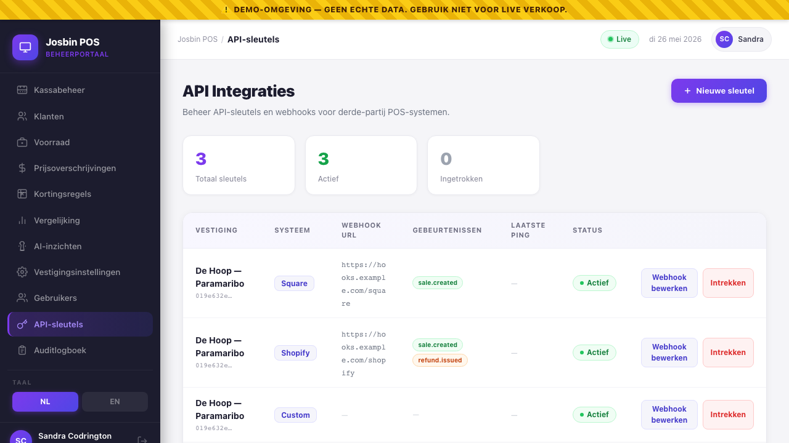

# Chapter 12 — API Integrations & Webhooks

**Who needs this:** Organisation Admin (or Super Admin, on behalf of a customer) who wants to plug a third-party system into Josbin POS. Typical examples:

- An external POS — Lightspeed, Square, a home-grown till — that already runs on the shop floor and just needs to push its sales into Josbin POS for unified BTW reporting
- A webshop pushing daily online orders into a specific store's sales feed
- An accounting tool pulling daily totals to bookkeeping software
- An inventory or supplier portal that needs a real-time ping every time a sale is rung up

**When you need it:** any time data needs to flow *into* or *out of* Josbin POS for a system other than the standard POS terminal.

**What it prevents:** the manager having to re-key sales from a second system, end-of-day reconciliations that don't add up because two systems counted the same shop's sales separately, and missed BTW lines because something happened "outside" Josbin POS.


---

## 12.1 What an "integration" actually is

An **API integration** is a credential pair — a long-lived API key + an optional webhook URL — bound to **one store**. The third-party system uses the key to authenticate every request, and Josbin POS uses the webhook URL to push events back the other way.

```
┌───────────────────────┐                    ┌─────────────────────────────┐
│  Third-party system   │                    │   Josbin POS — back-office  │
│  (their POS / shop)   │                    │   (Laravel + Postgres)      │
│                       │   X-API-Key: sk_…  │                             │
│                       │ ─────────────────► │   POST /api/v1/sales        │
│                       │ ◄───────────────── │   201 Created               │
│                       │                    │                             │
│  Webhook receiver     │   X-JosbinPOS-      │   sale.created webhook      │
│  (their endpoint)     │   Signature: sha…  │   (Redis-queued, HMAC-signed)│
│                       │ ◄───────────────── │                             │
└───────────────────────┘                    └─────────────────────────────┘
```

A few rules that follow from the model:

- **One integration = one store.** If a customer has three branches and wants to push all three over the same API key, they need three integrations. This keeps audit trails clear ("which store did this sale belong to?") and stops a key leak from giving access to a whole network.
- **An integration is owned by the organisation.** Org Admin sees and manages every integration in their org. Store Manager **cannot** create or revoke keys (those are HQ-level — see Chapter 1's permission matrix).
- **The API key is hashed at rest.** Plain key is shown **once** at creation. Nothing — not the dashboard, not the database, not vendor support — can recover it after you close that banner. Lose it, rotate it.
- **The webhook secret is also rotatable.** Rotating the secret keeps the API key working; rotating the key issues a brand-new key.
- **Revoking is soft.** Deactivating an integration (`is_active=false`) is reversible only via direct DB intervention. The dashboard treats revoke as terminal — re-create rather than re-enable.

---

## 12.2 Issuing a new API key

**Path:** Dashboard → **API Integraties / API Integrations** (left sidebar) → **+ Nieuwe sleutel / + New key** (top-right).

The modal asks for four things:

| Field | Required | Notes |
|---|:-:|---|
| **Vestiging ID / Store ID** | yes | UUID of the store this integration is scoped to. Copy it from the URL bar on the store-detail page. Future versions add a dropdown — for now it's a paste-in. |
| **POS-systeem naam / POS system name** | yes | Free-text label — e.g. `Lightspeed`, `Square`, `WooCommerce`, `Aangepast`. Shown in the integration list and in the audit log when sales arrive via this key. |
| **Webhook URL** | optional | HTTPS endpoint on the partner's side that will receive event POSTs. Leave empty to disable outbound webhooks entirely (the partner still gets to *call in* with the API key). |
| **Webhook-gebeurtenissen / Webhook events** | optional | Pick from `sale.created`, `shift.closed`, `refund.issued`. Only ticked events fire. Default is `sale.created`. |

Tap **Aanmaken / Create**. The page jumps to a **bright green success banner** at the top with:

```
sk_ABCDEFGHIJKLMNOPQRSTUVWXYZabcdefghijklmnopqrstuvwxyz0123
```

This is the only time you'll see the plain key. **Copy it now** (one click on the green **Kopiëren / Copy** button), then deliver it to the partner over a secure channel — encrypted email, password manager share, or a phone call from one trusted contact to another. Slack and SMS are *not* secure channels.

> The webhook signing secret is generated at the same moment as the key, but the dashboard does not show it in the create flow — it's exposed only when you explicitly rotate it from the edit modal (§12.4). Most integrations never need the secret at create time because they're only sending sales *in*, not receiving webhooks. If the partner needs the secret immediately, open the row's **Webhook bewerken / Edit webhook** modal and use **Geheim roteren / Rotate secret** to mint and reveal one.

---

## 12.3 The integrations list

The main API Integrations screen is a table with one row per integration. Columns:

| Column | What it shows |
|---|---|
| **Vestiging / Store** | Store name + the first eight characters of the integration UUID (handy for log searches). |
| **Systeem / System** | The POS system label you typed at create time. |
| **Webhook URL** | First 40 characters of the URL, or `—` if no webhook is configured. |
| **Gebeurtenissen / Events** | Coloured pills — green for `sale.created`, blue for `shift.closed`, orange for `refund.issued`. |
| **Laatste ping / Last ping** | Green dot "Online" if the partner has called the API within the last 10 minutes, amber "Inactief / Idle" otherwise, `—` if they've never called. |
| **Status** | Green "Actief / Active" or grey "Ingetrokken / Revoked". Revoked keys cannot authenticate. |
| (actions) | **Webhook bewerken / Edit webhook** (purple) and **Intrekken / Revoke** (red), only on active rows. |

A three-card stats strip across the top totals: total keys, active, and revoked.


---

## 12.4 Editing webhook configuration & rotating the secret

Tap **Webhook bewerken / Edit webhook** on any active row.

The modal lets you change the POS system name, the webhook URL, and the subscribed events. Saving fires nothing — the next event delivered to the integration will simply use the new config.

Beneath the form sits the **Webhook-handtekeningsleutel / Webhook signing secret** section, with a single amber **Geheim roteren / Rotate secret** button.

**Rotating the secret:**

1. Tap the button. A browser confirm prompts: *"The old secret stops working immediately. Continue?"*
2. Confirm. The dashboard shows the new 64-character hex secret in a green panel.
3. **Copy it.** Paste into the partner's receiver config — the env var or secret-manager value they use to verify incoming Josbin POS webhook signatures.
4. Close the modal.

Until the partner updates their receiver, every in-flight or future webhook will fail signature verification on their end — they'll log "invalid signature" 401s and we'll log delivery failures (§12.10). Rotate at a quiet time and coordinate with the partner first.

> **API key vs webhook secret — different things:**
> - **API key** authenticates *inbound* calls from the partner *to* Josbin POS. Rotating it requires a brand-new key issuance (revoke + create) — there is no in-place rotate.
> - **Webhook secret** authenticates *outbound* webhooks *from* Josbin POS *to* the partner. Rotating it is in-place via the button above; the API key keeps working.

---

## 12.5 Revoking a key

**When to revoke:**

- Partner contract ended
- Key suspected of being leaked
- Replacement key already issued (rolling rotation)

**To revoke:**

1. API Integrations → find the row → red **Intrekken / Revoke** button.
2. Confirm the prompt.

The status badge flips to grey *Ingetrokken / Revoked*. Within seconds:
- Any further `X-API-Key` request with that key gets `401 Unauthorized — Invalid or inactive API key.`
- The integration stays in the list (for audit purposes) but loses its action buttons.
- Pending webhook jobs for this integration silently no-op on next attempt.

There is **no undo** in the UI. To restore the same partner, issue a new integration with a new key.

---

## 12.6 Layer 3 — the Open Integration API endpoints

All Layer-3 endpoints sit under `/api/v1/` and authenticate with the `X-API-Key` header. Every endpoint is scoped to the integration's store — there is no way to query another store's data with the same key.

Base URL on the customer's back-office: `http://<back-office-ip>:8080/api/v1/`

| Endpoint | Method | What it does | Limits |
|---|---|---|---|
| `/sales` | POST | Push a single sale. BTW recalculated server-side from the rates you provide. Idempotent on `sale_ref` — re-posting the same `sale_ref` returns the existing record. | 1,000 req/min per key |
| `/sales/batch` | POST | Push up to 500 sales at once (catch-up after offline window). Each item idempotent by `sale_ref`. Failures reported per-item; the batch never fails wholesale. | 500 sales/request, 1,000 req/min |
| `/reports/sales` | GET | Paginated list of completed sales for the integration's store. Query params: `date_from`, `date_to` (YYYY-MM-DD, max 31-day window), `per_page` (10–200). | 31-day max range |
| `/reports/summary` | GET | Aggregated totals (count, total SRD, BTW, discounts, avg basket) plus BTW breakdown by rate, for any date range. Query params: `date_from`, `date_to`. | — |

The full OpenAPI/Swagger spec is auto-generated and served at:
- `GET /api/v1/openapi.json` — machine-readable spec
- `GET /api/v1/docs` — interactive Swagger UI (no API key required; useful while building)

### 12.6.1 Authentication & errors

| Status | When | Body |
|---|---|---|
| `200` | Successful read, or idempotent duplicate sale | requested data |
| `201` | Sale created for the first time | sale resource |
| `401 Unauthorized` | Missing or wrong `X-API-Key` | `{"error":"Unauthorized","message":"…"}` |
| `403 Forbidden` | Integration revoked or store mismatch | `{"error":"Forbidden",…}` |
| `422` | Validation error or business-rule violation (`InvalidRange`, `ServerError`) | `{"error":"…","message":"…","errors":{…}}` |
| `429 TooManyRequests` | Over 1,000 req/min on this key | `{"error":"TooManyRequests","message":"Rate limit exceeded: 1,000 requests per minute."}` |

The integration's `last_ping_at` updates on every authenticated call — that's what powers the "Online / Idle" indicator in the dashboard list.

### 12.6.2 Sandbox vs production

When the back-office runs with the sandbox flag enabled (`josbin_pos.sandbox=true`), every response carries an extra header:

```
X-Josbin-Environment: sandbox
```

Tell your partner to check for that header in their CI — it's the only way for them to distinguish "I'm hitting the test box" from "I'm hitting production" if they share API tokens between environments. Production responses do **not** set the header.

---

## 12.7 POST /v1/sales — submitting a sale

Sample request (the smallest valid body):

```json
POST /api/v1/sales
Host: back-office.example.com:8080
X-API-Key: sk_ABCDEF…
Content-Type: application/json

{
  "sale_ref":        "WEBSHOP-2026-0001",
  "occurred_at":     "2026-05-26T14:32:18-03:00",
  "payment_method":  "card",
  "items": [
    {
      "product_name": "Volle Melk 1L",
      "unit_price":   12.50,
      "quantity":     2,
      "btw_rate":     10,
      "btw_exempt":   false,
      "discount_srd": 0
    },
    {
      "product_name": "Brood Wit",
      "unit_price":   6.00,
      "quantity":     1,
      "btw_rate":     10,
      "btw_exempt":   true
    }
  ]
}
```

Field rules:

| Field | Rule |
|---|---|
| `sale_ref` | Your reference. **Must be unique per store** — that's how idempotency works (see §12.8). Max 100 chars. |
| `occurred_at` | ISO 8601 timestamp. Use AST (`-03:00`) for accuracy; UTC also accepted (the system converts on read). |
| `payment_method` | One of `cash`, `card`, `mixed`. |
| `items` | At least one. No upper limit per sale, but very large baskets (>200 items) should be split. |
| `items.*.btw_rate` | Decimal — `10` for 10%, `0` for exempt. The system re-applies it; you don't pre-compute the BTW amount. |
| `items.*.btw_exempt` | When `true`, BTW is forced to zero regardless of `btw_rate`. Used for basic foodstuffs and medicine per Belastingdienst rules. |
| `items.*.discount_srd` | Per-line discount in SRD (not percentage). Subtracted from `unit_price × quantity` before BTW extraction. |

Response on first submission (HTTP 201):

```json
{
  "id":             "0192e1d4-93c2-7c9a-bd11-fb6e2e2c4a90",
  "sale_ref":       "WEBSHOP-2026-0001",
  "store_id":       "0192c8e1-1c30-7c9a-bd11-fb6e2e2c4a90",
  "occurred_at":    "2026-05-26T14:32:18-03:00",
  "payment_method": "card",
  "subtotal_srd":   "31.00",
  "discount_srd":    "0.00",
  "btw_srd":         "2.27",
  "total_srd":     "31.00",
  "status":        "completed",
  "created_at":    "2026-05-26T17:32:18.456Z"
}
```

A few derived behaviours:

- The sale is created with `source = "api"` and `cashier_id = null`. The dashboard's audit log, Z-Report and BTW report all include API-sourced sales.
- The day's locked `exchange_rate_used` is attached to the sale automatically — useful when the partner later needs to know which USD→SRD rate applied.
- Webhook `sale.created` fires on the queue for every active integration in the same organisation that subscribed to it (§12.9). Includes the partner that *posted* the sale — useful for receiving an ack.

---

## 12.8 Idempotency — the `sale_ref` mechanism

Network reality: the partner POSTs `/v1/sales`, the response gets lost, they retry, and now Josbin POS has two copies of the same sale. That's how revenue gets double-counted. The fix:

1. The partner picks a stable, unique identifier for each sale **in their own system** — order number, receipt number, transaction UUID, whatever. They pass it as `sale_ref`.
2. On every POST, Josbin POS checks `external_sale_ref` (the column where `sale_ref` is stored). If a sale with that `sale_ref` already exists for this store, it returns the existing record with **HTTP 200** instead of creating a new one.
3. The partner can retry as aggressively as they like — duplicates are silently absorbed.

For `/v1/sales/batch`, the response separates the counts:

```json
{
  "created": 47,
  "skipped":  3,
  "failed":   0,
  "errors":  []
}
```

- `created` — first-time inserts
- `skipped` — idempotent duplicates (existing `sale_ref`)
- `failed` — per-item validation or DB errors, with `index` and `sale_ref` in the `errors[]` array

> **Naming `sale_ref` well:** include a partner prefix (`WEBSHOP-`, `LIGHTSPEED-`, `POS2-`) so you can grep the audit log for "where did this sale come from" without joining tables.

---

## 12.9 Outbound webhooks — the events

When something happens server-side (a sale is rung up, a shift closes, a refund is issued), Josbin POS pushes an HTTP POST to every active integration in the same org whose `webhook_events` list contains that event.

| Event | Fires when | Payload includes |
|---|---|---|
| `sale.created` | A new sale is recorded (POS, API, or import) | sale id, sale_ref, store_id, occurred_at, payment_method, totals (subtotal/discount/BTW/total), status |
| `shift.closed` | A Z-Report is run and the register session is closed | session id, store_id, register_id, cashier_id, opening_float, closing_cash_counted, expected_cash, discrepancy, totals |
| `refund.issued` | A completed sale is refunded (full or partial) | refund id, original sale id, store_id, refund amount SRD, reason, refunded_by user id, refunded_at |

Wire format:

```
POST <webhook_url>
Content-Type:           application/json
X-JosbinPOS-Event:      sale.created
X-JosbinPOS-Signature:  sha256=<hex>
X-JosbinPOS-Delivery:   <queue job id>

{
  "event":       "sale.created",
  "store_id":    "0192c8e1-…",
  "occurred_at": "2026-05-26T17:32:18+00:00",
  "data":        { … the event-specific payload … }
}
```

### 12.9.1 Verifying the signature (partner-side)

Every webhook carries `X-JosbinPOS-Signature: sha256=<hex>` where `<hex>` is `HMAC-SHA256(raw_body, webhook_secret)`. Partner pseudocode:

```python
import hmac, hashlib

expected = 'sha256=' + hmac.new(
    webhook_secret.encode(),
    raw_body,                          # bytes, EXACTLY as received
    hashlib.sha256,
).hexdigest()

if not hmac.compare_digest(expected, request.headers['X-JosbinPOS-Signature']):
    return Response(status=401)        # signature mismatch — reject
```

Critical:
- Hash the **raw bytes** of the request body, not a re-serialised JSON dict (key order and whitespace matter).
- Use a constant-time comparison (`hmac.compare_digest` in Python, `crypto.timingSafeEqual` in Node, `hash_equals` in PHP).
- If signature fails, return non-2xx. Josbin POS will retry, so a real signature mismatch (rotated secret, mid-rotation) eventually clears once the partner updates their secret.

### 12.9.2 Retry policy

Webhook delivery is **queue-backed** via Redis (Laravel Horizon). If the partner's endpoint returns any non-2xx (or times out at 10 s), the job is re-queued with exponential backoff:

| Attempt | Delay before next try |
|---|---|
| 1 (immediate) | 1 minute |
| 2 | 5 minutes |
| 3 | 30 minutes |
| 4 | 2 hours |
| (after 4 failures) | dropped, logged to `webhook_delivery_log` and Horizon `failed_jobs` |

The partner side must therefore be **idempotent on receipt** — if their endpoint is slow and we time out, they may process the same payload twice. Use the `X-JosbinPOS-Delivery` header as a dedup key on their side.

If many webhooks fail in a row (their endpoint is down for hours), vendor support gets an alert via Horizon's failed-job monitor and can re-drive deliveries manually.

---

## 12.10 Rate limit — 1,000 requests per minute per key

Every authenticated `/v1/*` request counts against a per-key counter that resets every 60 seconds. Hitting the cap returns:

```
HTTP/1.1 429 TooManyRequests
{ "error": "TooManyRequests", "message": "Rate limit exceeded: 1,000 requests per minute." }
```

Practical notes for partners:

- **1,000/min ≈ 16/sec.** Plenty for any normal POS or webshop. A sale per second per terminal is already extremely busy.
- **Batch endpoint counts as one request** regardless of how many sales it contains. For nightly catch-up of 5,000 sales, send ten 500-sale batches — that's ten requests, not five thousand.
- **GET reports also count.** Polling `/v1/reports/summary` every second from a dashboard widget is silly anyway; 60-second polling or pulling on schedule is enough.

There is no per-IP or per-org limit on top of the per-key one — keys are the throttle boundary.

---

## 12.11 Webhook deliveries — where to look when something goes wrong

| Symptom | Where to look | Likely cause |
|---|---|---|
| Partner says "we never received the webhook" | Dashboard → API Integrations → check the integration's events list includes the event | Event not subscribed |
| Webhook URL is set, events subscribed, still nothing | Horizon (`/horizon/jobs`) — search "DispatchWebhook" | Their endpoint is returning non-2xx (look in `webhook_delivery_log` table for HTTP status + first 500 chars of their response) |
| They get the webhook but reject as "invalid signature" | They're hashing a *re-serialised* JSON instead of the raw body, OR you rotated the secret and they haven't updated it | Both common — check on the partner side first |
| `sale.created` arrives but the same sale `sale_ref` is rejected on POST | The partner already submitted this sale via POST and the inbound idempotency caught the retry. The webhook *also* fires — it's an HQ feed, not a partner-only feed. | By design |
| Last ping shows green but no sales arrive | They're polling `/v1/reports/summary` to check connectivity but not actually posting sales | Tell them to POST, not GET |

For repeated delivery failures, vendor support can re-drive jobs from Horizon and (if needed) inspect `storage/logs/laravel.log` on the back-office.

---

## 12.12 Quick reference

```
ISSUE KEY          API Integrations → + Nieuwe sleutel → fill → Aanmaken
                   → COPY THE KEY NOW (shown once)

EDIT WEBHOOK       API Integrations → row → Webhook bewerken → save

ROTATE SECRET      Edit webhook modal → Geheim roteren → COPY THE NEW SECRET
                   → update partner's config

REVOKE KEY         API Integrations → row → Intrekken → confirm
                   → re-create if needed (no undo)

PARTNER POSTS      POST  /api/v1/sales            with X-API-Key + sale_ref
PARTNER BATCHES    POST  /api/v1/sales/batch      up to 500 per call
PARTNER PULLS      GET   /api/v1/reports/sales    ?date_from=…&date_to=…
                   GET   /api/v1/reports/summary  ?date_from=…&date_to=…

OPENAPI SPEC       GET   /api/v1/openapi.json     (no auth)
SWAGGER UI         GET   /api/v1/docs             (no auth — point partner here)

RATE LIMIT         1,000 req/min per key. 429 on exceed.
IDEMPOTENCY        sale_ref unique per store. Re-POST returns existing → 200.
SANDBOX            X-Josbin-Environment: sandbox header on non-prod responses.
```

For the architectural side of how Layer-3 fits the whole platform (the three-layer model, the BTW pipeline, the audit log) see [`/docs/08-integration-api.md`](../docs/08-integration-api.md). For role-based access to this screen see [Chapter 1 — Roles & permissions](01-roles-and-permissions.md).

---

→ Next: [Chapter 13 — Audit log](13-audit-log.md) *(coming soon)*
