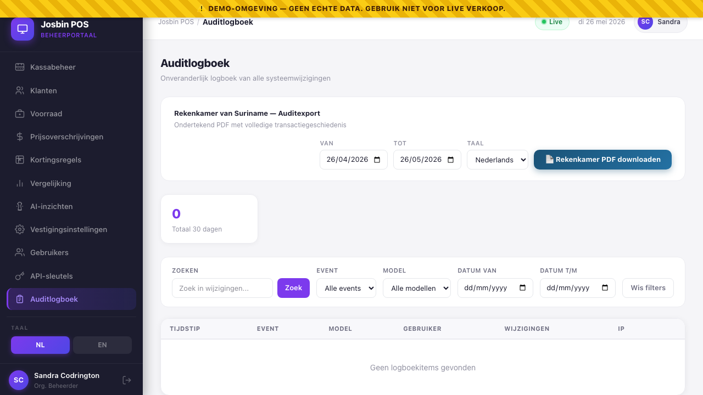
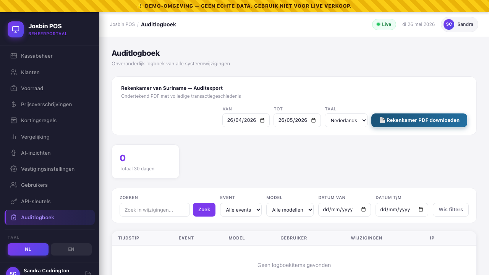

# Chapter 13 — Audit Log

**Who needs this:** Organisation Admin (occasional — "who changed this product's price last Wednesday?"), Auditor (heavily — that role exists specifically to read this screen), and any Belastingdienst inspector or Rekenkamer compliance officer issued an Auditor account during a review.
**When you use it:** disputes about *who did what*, post-incident forensics ("the price was wrong from 14:00 to 16:30 — who fixed it?"), preparing a Rekenkamer audit pack, and routine sampling by the Belastingdienst during a BTW review.
**What it prevents:** disputes that can't be resolved because nobody knows who changed something, government findings of "unauditable financial records", and any plausible deniability for tampering by an admin who later regrets a decision.

The audit log is **the single source of truth** for the question *"what happened in this system, by whose hand, when?"*. Other screens in the dashboard show the **current state**; the audit log shows the **history of every change** that got it there.


---

## 13.1 The model — why this screen is special

Most database tables can be inserted-into, updated, and deleted. The `audit_logs` table is deliberately stripped of two of those three rights, **at the model layer in code**, not just by Postgres permissions:

```php
// backend/app/Models/AuditLog.php
protected static function booted(): void
{
    static::creating(function (AuditLog $log) {
        // …compute SHA-256 row_hash + previous_row_hash here…
    });

    static::updating(fn () => false);   // ← silently blocks every UPDATE
    static::deleting(fn () => false);   // ← silently blocks every DELETE
}
```

That, plus a hash chain, gives you **three independent reasons** an admin cannot tamper with history:

| Defence layer | What it does | What it stops |
|---|---|---|
| **1. Eloquent hooks** | `static::updating(fn () => false)` and `static::deleting(fn () => false)` return `false`, which Laravel treats as "abort the operation silently". | Any code path that goes through the `AuditLog` model — including admin tools, console commands, and accidental developer mistakes. |
| **2. Database write-protection** | The Postgres role used by the application has only `INSERT, SELECT` on `audit_logs` — `UPDATE` and `DELETE` are revoked. | Anyone bypassing the model with `DB::table('audit_logs')->update(...)`. The query errors out at the DB driver level. |
| **3. SHA-256 hash chain** | Every new row stores both its own `row_hash` (computed from its content + the previous row's hash) and the previous row's hash. Tampering with any one historical row makes every row after it fail verification. | Anyone with raw filesystem access who manually rewrites Postgres data files. They can change the bytes; they can't recompute the chain without breaking it. |

```
                              ┌─ row N-1 ─┐         ┌─── row N ───┐         ┌─ row N+1 ─┐
                              │           │         │             │         │           │
                              │ row_hash  │ ──hash─▶│ prev_hash   │ ──hash─▶│ prev_hash │
                              │           │         │ row_hash    │         │           │
                              └───────────┘         └─────────────┘         └───────────┘

                          changing row N's content    →   row_hash recomputes to a different value
                                                      →   row N+1's prev_hash no longer matches
                                                      →   verifyChain() flags the breakage
```

> **Even the Super Admin can't modify the audit log.** This is deliberate. If the vendor (Super Admin) could quietly delete rows, the audit log would have no evidentiary value — and Rekenkamer would not accept the export.

### What gets audited

Anything Eloquent model that uses the `OwenIt\Auditing\Auditable` trait. Currently:

| Model | When written | Who triggers it (typically) |
|---|---|---|
| `Sale` | Created (every sale), updated (rare — manager corrections), deleted (never — sales are voided, not deleted) | Cashier, manager (refunds/voids) |
| `Product` | Created, updated (price changes, BTW changes, deactivation toggle, stock adjustments), deleted (vendor-only) | Org Admin, Store Manager |
| `User` | Created, updated (role change, 2FA reset, deactivation), deleted (rare) | Org Admin, Super Admin |
| `Organisation` | Created, updated, deleted | Super Admin |
| `Store` | Created, updated, deleted | Super Admin, Org Admin |
| `ZReport` | Created (every close), updated (only when sync status changes) | Store Manager |
| `Customer` | Created, updated. PII fields stay encrypted in the audit values too — see Chapter 9. | Cashier (POS quick-add), Org Admin, Store Manager |
| Stock-related | A stock adjustment writes both a `stock_movements` row and an `audit_logs` row | Store Manager, Org Admin |

Each row carries:

| Field | What it stores |
|---|---|
| `id` | Big int, auto-increment. Used as the natural ordering within the chain. |
| `user_id` | The actor's UUID. `null` if a system job (rare — see below). |
| `organisation_id` | The org the change belongs to. Used to scope what each role can see. |
| `event` | `created`, `updated`, or `deleted`. |
| `auditable_type` | The fully-qualified model class (e.g. `App\Models\Sale`). |
| `auditable_id` | The PK of the changed model. |
| `old_values` | JSONB. The fields' values *before* the change. `null` for `created`. |
| `new_values` | JSONB. The fields' values *after* the change. `null` for `deleted`. |
| `ip_address` | The actor's IP at the time. `inet` type in Postgres. |
| `created_at` | Wall-clock time in **AST** (America/Paramaribo). |
| `previous_row_hash` | SHA-256 hex of the previous audit row's `row_hash`. `null` for the very first row of an organisation. |
| `row_hash` | SHA-256 hex of this row's content concatenated with `previous_row_hash`. The chain link. |

---

## 13.2 Who can see what

Visibility is scoped by role. The same audit log is filtered at the database query level — there is no "I'll show you all rows but hide them in the UI" sleight of hand.

| Role | Sees audit entries for… |
|---|---|
| **Super Admin** | Every row in the table, across every organisation. |
| **Organisation Admin** | Only rows where `user_id` belongs to a user in their own organisation. |
| **Auditor** | Same scope as Org Admin (their own organisation), but read-only across the entire dashboard — they exist for compliance reviews. |
| **Store Manager, Cashier, API Integration** | No access. The menu item doesn't even render. |

> **The query scope is enforced server-side.** A Store Manager cannot reach the audit log even by typing the URL — the controller returns `403 Forbidden`.

> **Government department gotcha.** When an organisation is flagged `is_government = true`, it lives in a separately-isolated tenant database (part of the government-grade security architecture). The audit log for a government org is therefore physically separate from commercial orgs — even a Super Admin must point at the right tenant to read it. The dashboard handles this transparently in normal use; for direct DB queries (vendor support), pick the right connection.

---

## 13.3 The screen — what's on it

**Path:** Dashboard sidebar → **Audit / Auditlog**.


Three regions stacked top to bottom:

1. **Rekenkamer export panel** — date-range + language picker + "Download Rekenkamer PDF" button. See §13.7.
2. **30-day summary cards** — count of events in the last 30 days, broken down by event type (`created` / `updated` / `deleted`) and by model type.
3. **Filterable table** — the actual rows, newest first.

### Summary cards

Quick visual baseline of what's been happening. Numbers are for the **last 30 days only**, scoped to the user's visible-org range.

| Card | What it counts |
|---|---|
| **Totaal 30 dagen / Total 30 days** | Every audit row in the window (within visibility scope). |
| **Created** | Audit rows with `event = created`. |
| **Updated** | Audit rows with `event = updated`. |
| **Deleted** | Audit rows with `event = deleted`. Should be a small number — most "deletes" in Josbin POS are soft (deactivations), which show up as `updated`. |
| One card per `model_type` | Per-model counts — e.g. `Sale 432`, `Product 17`, `User 3`. |

> **A high "Deleted" count for `Product` is a red flag.** Catalogue items aren't supposed to be hard-deleted (Chapter 4) — they're supposed to be deactivated. If you see `Deleted: 12` against `Product`, it's worth pulling those rows and asking why.

---

## 13.4 Filtering the log

A bar of filters sits between the summary cards and the table. All filters compose (AND) and reset to page 1 on change.

| Filter | Type | What it matches |
|---|---|---|
| **Zoeken / Search** + button | Free-text | A case-insensitive substring of `event`, `auditable_type`, or the JSONB-serialised `new_values`. Useful for "find every audit row mentioning a specific product name". |
| **Event** | Dropdown | `Alle events` (default), `created`, `updated`, `deleted`. |
| **Model** | Dropdown | `Alle modellen`, then: `Sale`, `Product`, `User`, `Organisation`, `Store`, `ZReport`. The match is a suffix-`like` so it tolerates fully-qualified class names. |
| **Datum van / Date from** | Date input | Inclusive lower bound on `created_at::date`. AST. |
| **Datum t/m / Date to** | Date input | Inclusive upper bound on `created_at::date`. AST. |
| **Wis filters / Clear** | Button | Resets everything to defaults (`per_page: 50, page: 1`). |

### Typical filter recipes

| Question | Set these filters |
|---|---|
| "Show me every product price change in the last 7 days" | Event = `updated`, Model = `Product`, Date from = today − 7. Then look at the diff column for `price` changes. |
| "Who voided a sale yesterday?" | Event = `updated`, Model = `Sale`, Date from + Date to = yesterday. Voids show as a status field change to `voided`. |
| "Has anyone deactivated a user this month?" | Event = `updated`, Model = `User`, Date from = first of month. Look for `is_active: true → false` in the diff. |
| "Find every audit row that mentioned 'Volle Melk' last quarter" | Search = `Volle Melk`, Date from / to = quarter. Hits any row whose `new_values` JSON contains the string. |
| "Pulled all admin logins last week" | Currently the audit log does **not** record successful logins as a row (login is tracked via `last_login_at` on `users`). Failed logins are in the separate security log — not in this screen as of this release. |

### The table — column by column

| Column | Shows |
|---|---|
| **Tijdstip / Time** | Localised short date + 24-hour time (`26 mei` / `14:32`). AST. Click anywhere on the row to expand. |
| **Event** | Coloured pill — green `Created`, blue `Updated`, red `Deleted`. |
| **Model** | Coloured pill — purple `Sale`, cyan `Product`, amber `User`, green `Organisation`, indigo `Store`, pink `ZReport`. |
| **Gebruiker / User** | The actor's name + role (`Store Manager`, `Organisation Admin`, etc.) — or `System` if `user_id` is null. |
| **Wijzigingen / Changes** | A compact field-by-field diff: up to 4 changed fields, each showing `old → new` (truncated to ~20 chars). `+N more fields` if there are more. The fields `updated_at`, `last_used_at`, `last_login_at` are deliberately hidden — they fire every save and add no signal. |
| **IP** | Source IP address at the time of the action. Useful for "this change came from outside the office network". |
| **(chevron)** | ▼ / ▲ — clicking the row toggles the full-detail expansion. |

### Expanded row

Clicking a row reveals the full **Before** and **After** values as side-by-side pretty-printed JSON, plus the **Model ID** (UUID) of the changed record. PII fields (customer name, phone, etc.) appear as their *encrypted ciphertext* — see §13.6.


---

## 13.5 Reading a diff

The diff column is dense by design — most updates touch only one or two fields, so showing all of them inline saves you from clicking into every row.

A typical row reads:

```
price        12.50  →  13.00
btw_rate                10.00
is_active    true   →   false      +3 more fields
```

| Visual cue | Meaning |
|---|---|
| Two pills with `→` between | Field changed; left = before, right = after. |
| Single green pill, no `→` | Field is present in `new_values` but absent or unchanged in `old_values`. For a `created` event, every field looks like this. |
| Single red pill, no `→` | Field is in `old_values` but cleared in `new_values` (e.g. setting a barcode to null). |
| Greyed key, no pill | Field is shown but both sides empty / not relevant. |
| `+N more fields` line | More changed fields than the 4-row preview accommodates. Click into the row to see all of them. |

---

## 13.6 PII in the audit log — what an auditor actually sees

Customer records and a few other tables encrypt their PII at rest (Chapter 9). Those encrypted columns flow through to the audit log **as their ciphertext** — meaning the diff shows two long opaque strings, not two readable names.

This is intentional. It satisfies two requirements at once:

1. The auditor can verify *that a record was changed*, *by whom*, *when*, and *which fields* — sufficient for Rekenkamer's "control trace" requirement.
2. The auditor cannot harvest PII out of the audit log itself — sufficient for WBP-S's "no back-door to encrypted data" requirement.

In practice, a `Customer` `updated` row looks like:

```
name    eyJpdiI6IkVx…   →   eyJpdiI6Ik9YK…
phone   eyJpdiI6Ikta…   →   eyJpdiI6Ikta…   (no change)
```

…which reads as: "the customer's name field was changed; the phone field was rewritten to the same value (probably part of a save-all-fields edit)". Anyone with the application key can decrypt those ciphertexts if a court order requires it. Nobody else can.

> **For non-PII tables (Product, Sale, etc.), the values are plain.** A product price change shows `12.50 → 13.00` in the clear, as it should — those aren't personal data.

---

## 13.7 Rekenkamer signed-PDF export


The top of the screen carries a date-range + language picker + download button: **Rekenkamer van Suriname — Auditexport / Audit Export**.

This is the official, signed audit document that the **Rekenkamer van Suriname** (Court of Audit) accepts in a government financial review. It is *not* a casual CSV — it's a digitally-signed PDF that includes:

- A full chronological list of every audit event in the chosen window.
- For each event: actor, role, IP, AST timestamp, model, ID, full before/after values (PII fields shown encrypted, exactly as §13.6).
- A **chain verification statement** — at export time, the system replays the SHA-256 hash chain across every included row. If any row fails verification, the export is aborted and the screen shows an error rather than producing an unsigned PDF.
- A **document signature** — the entire PDF is signed with the organisation's certificate, so Rekenkamer can verify the export came from this specific Josbin POS installation and hasn't been edited after generation.
- Bilingual (`nl` or `en`) headers and labels — pick the language the receiving auditor reads in.

**To generate:**

1. Pick the **From** and **To** dates (any AST date range; default is the last 30 days).
2. Pick the **Taal / Language** — `Nederlands` if it's going to a Surinamese authority, `English` for internal review or international audit.
3. Click **Rekenkamer PDF downloaden / Download Rekenkamer PDF**.
4. The PDF downloads as `rekenkamer_<from>_<to>.pdf`. Hand it to the auditor.

> **Who can run the export.** Super Admin, Org Admin, and Auditor. Store Managers cannot — by design, the Rekenkamer pack is an organisation-level document, not a store-level one.

> **What happens if the chain breaks.** The export refuses to produce. The error message names the first failing row. This is the system telling you to call vendor support — chain failure indicates either (a) a developer error somewhere in the codebase that bypassed the model, or (b) tampering. Both are serious; do not patch over it by hand.

---

## 13.8 Common mistakes / gotchas

**"I can't find a row I expected to see."** Three usual causes:

- The acting user belongs to a different organisation and you're not Super Admin → invisible by scope.
- The model doesn't use the `Auditable` trait yet → not audited at all. As of this release this includes a few peripheral models like `HeldBill` (held cart resumes are not currently audited individually — the resulting sale is).
- The filter dates exclude it. `Date from`/`to` are *date*, not *date+time* — a row at 23:59 on the 26th is included with `Date to = 2026-05-26`.

**"Why does an admin's password reset show no diff?"** Password fields are stripped from `old_values` and `new_values` before the row is written. You'll see a `User updated` event by the admin, against the affected user's ID, but the `password` field won't be in the JSON. That's correct — exposing bcrypt hashes in the audit log would be a security finding.

**"The 30-day total card says 1,234 but the table only has 50 rows."** The table is paginated (50 per page by default). Use the pagination controls at the bottom of the table, or change the page-size via the API (`per_page` up to 200) — there's no page-size selector in the UI yet.

**"`Sale created` rows are flooding the log."** That's correct — every completed sale creates one. Use the `Model = Sale` + date filters to focus, or filter `Event = updated` to skip the noise of normal sales and see only manager interventions (voids, refunds, corrections).

**"I want to delete an old audit entry that contains a typo."** You can't. That's the entire point. Add a *new* corrective change — the old row stays.

**"Search for the customer name didn't return anything."** Customer PII is encrypted; the audit row's `new_values` JSON contains ciphertext, not the plaintext name. Substring search will never match a customer name. Filter by `Model = Customer` and the actor instead.

**"Two rows show the same change at exactly the same second."** Almost always two saves from a double-clicked button. Eloquent doesn't de-duplicate identical updates — each `save()` produces one audit row even if every field is identical. Cosmetic, not harmful.

**"I exported the Rekenkamer PDF and it took 3 minutes."** Expected for ranges over 90 days or organisations with high transaction volume. The chain verification is O(rows) and the signing step is a single big hash — both unavoidable. Schedule big exports for end-of-day.

---

## 13.9 What's recorded in the audit log when you use the audit log

This is the meta-question and it deserves a clear answer.

The **read paths** (loading the screen, applying filters, paginating, expanding a row) are **not audited**. Reading is free; audit-log fatigue is real, and recording every page load would drown the actual signal.

The **export action** (clicking *Download Rekenkamer PDF*) **is audited** — a row is written with `event = exported`, `auditable_type = AuditLog`, `user_id = <you>`, IP, and the export parameters (date range + language) in `new_values`. This way the audit log records "an export of itself happened" — important because a Rekenkamer PDF in someone's email inbox is a derivative work containing PII ciphertext, and Verwerkersovereenkomst typically requires that all such derivatives be traceable.

> **One subtlety:** the export-audit row is itself part of the hash chain. So an export at noon today, followed by a sale at 12:01, is bound together — you cannot quietly remove the export trace without breaking the chain from then on. Good.

---

## 13.10 Quick reference

```
OPEN AUDIT LOG          Dashboard → sidebar → Audit / Auditlog
                        Visible to: Super Admin, Org Admin, Auditor

FIND WHO CHANGED X      Filter Model = <model>, Event = updated, date range
                        Click row to expand for full before/after JSON

FIND AN ACTOR'S TRAIL   No direct user filter in UI (yet) — sort by clicking
                        the User column; or query the API directly with ?user_id=

RAW JSON DIFF           Click any row to expand — full Before/After panes
                        + Model ID for cross-referencing

EXPORT REKENKAMER PDF   Top of screen → date range + language → Download
                        Hash-chain verified end-to-end before signing

30-DAY OVERVIEW         Summary cards across the top of the screen
                        Auto-scoped to your role's org visibility

VERIFY CHAIN MANUALLY   Vendor command:
                        php artisan audit:verify-chain --org=<uuid>
                        Returns "OK" or names the first broken row
```

Cross-references: [Chapter 1](01-roles-and-permissions.md) for who can read the audit log, [Chapter 9](09-customers.md) for why PII is encrypted in audit rows, [Chapter 16](16-license-operations.md) for how the audit log survives license expiry (the data export tools remain available for 90 days even under hard-lock — `audit_logs` is included). For the developer-side details of how the chain is built and verified, see `/docs/03-auth-and-roles` and the `AuditHashService` class.

---

→ Next: Chapter 14 — AI insights *(coming soon)*

::: info What the tax inspector sees here
The Belastingdienst account also has this screen, with a deliberately
narrower window: **the life of every BTW filing across all organisations**
(created, submitted, accepted, disputed, superseded) plus the inspector's
own actions — and nothing else. An organisation's operational events
(products, users, sales edits) never appear for the inspector; that is the
internal auditor's surface. If the inspector's list looks short, that is
the scope working, not data missing — filings only generate a handful of
events each.
:::
