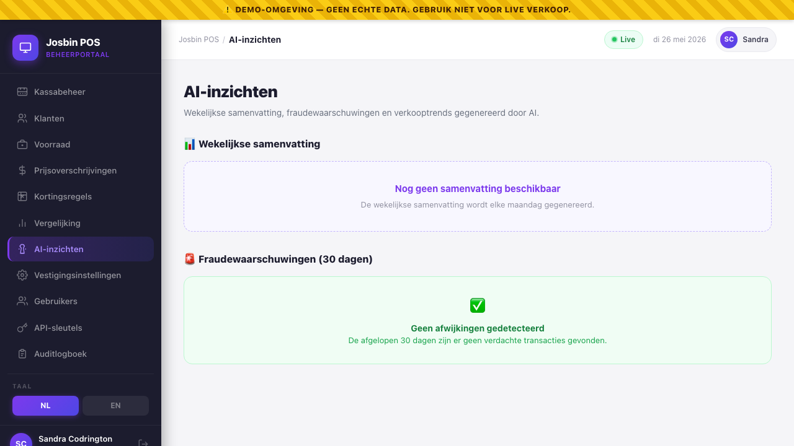
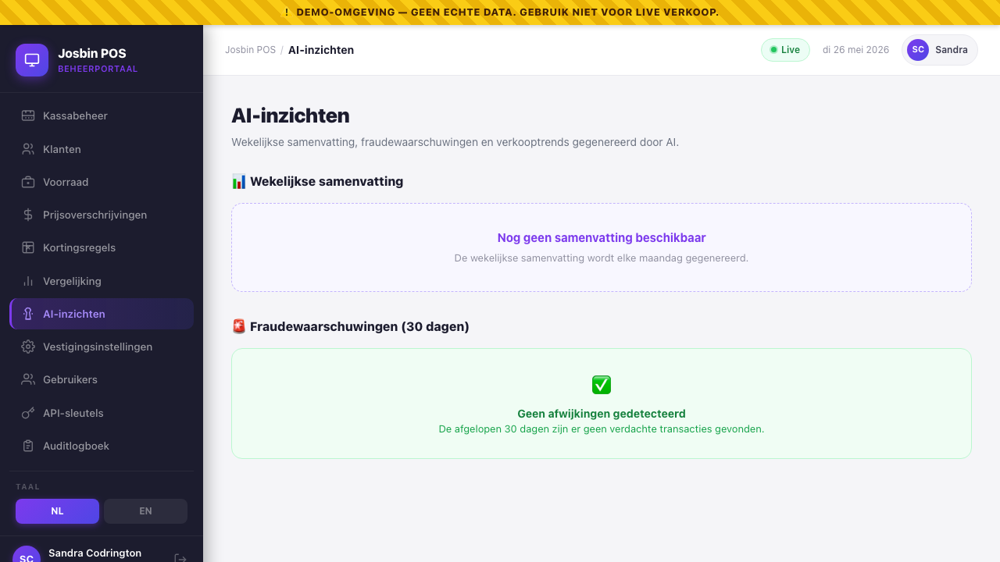

# Chapter 14 — AI Insights

**Who needs this:** Store Manager and Organisation Admin — anyone responsible for spotting unusual sales patterns, getting a quick read on the week, or making the cashier's life easier at the till. Cashiers do not see this screen, but they benefit from one of the underlying features (smart product search at the POS).

**When to use it:** Monday morning, to read the weekly summary. Any time you want to see if anything suspicious happened on the floor in the last 30 days. Or: never — the features run on their own. The screen is here so the AI's findings are visible to humans.

**What it prevents:** the manager missing a slow drift in revenue, a cashier quietly voiding sales every Wednesday afternoon, or staff hunting through the catalogue for "that thing with the picture of the cow on it" when they could have just typed `cow` and let the search find *Vleeswaren Halal Rund 500g*.


---

## 14.1 What's actually live vs what's on the roadmap

Be honest about this — there's a temptation in AI features to over-promise. Here's the split.

### Live at this release (v1)

| Feature | Where it shows | How it runs |
|---|---|---|
| **Smart product search** | POS app — type a few characters into the cart search bar | Trigram fuzzy match in PostgreSQL (`pg_trgm`), with pgvector semantic search wired in once embeddings are populated. Falls back to plain `ILIKE` if the extensions aren't available. |
| **Fraud & anomaly detection** | Dashboard → AI Insights → Fraud Alerts section | Queued job after every completed sale (Redis). Heuristic rules score the sale; flagged sales land in the immutable audit log and surface here. |
| **Weekly AI sales summary** | Dashboard → AI Insights → Weekly Summary section | Scheduled command runs every Monday 08:00 AST per organisation. Stored in `ai_summaries`, served from there to the dashboard. |
| **AI narrative on anomalies** | Dashboard → AI Insights → individual alert | Best-effort GPT-4o call when an anomaly is flagged. Falls back to a structured "no narrative" alert when no API key is configured. |

### Roadmap — Phase 2 (3–6 months post-launch), **not yet wired**

| Feature | Planned behaviour |
|---|---|
| **Auto-categorisation on product create** | A "Suggest category" button on the Add Product form proposes a category + BTW rate based on the name (and a Suriname SKU lookup). Today the Add Product form has no such button — see [Chapter 4 §4.9](04-catalogue-and-categories.md#49-ai-auto-categorisation). |
| **Natural language reports** | Type *"Toon me de top 10 producten van vorige maand"*, AI queries the DB and returns a chart. |
| **Stock reorder prediction** | Sales velocity model alerts you 3 days before stockout. |
| **Invoice OCR** | Photograph supplier invoice, AI extracts line items into stock entries. |
| **Smart promotion suggestions** | Identifies slow-movers, proposes timed discounts. |

If a customer asks about any Phase-2 feature today, the right answer is *"on the roadmap; not in this build"*.

---

## 14.2 The model — what an AI feature actually depends on

```
┌─────────────────────────────────────────┐
│  Heuristic layer (always runs)          │
│  Trigram search, anomaly rule scoring,  │
│  weekly stat aggregation                 │
└─────────────────────────────────────────┘
                  │
                  ▼ (best-effort)
┌─────────────────────────────────────────┐
│  LLM layer (when API key configured)    │
│  OpenAI GPT-4o (primary)                 │
│  Anthropic Claude (fallback / specialist)│
└─────────────────────────────────────────┘
                  │
                  ▼
┌─────────────────────────────────────────┐
│  Storage                                 │
│  - audit_logs.event = 'anomaly_detected' │
│  - ai_summaries (org, week_start)        │
│  - products.embedding (pgvector 1536)    │
└─────────────────────────────────────────┘
```

Two key implications:

- **Without an API key, the heuristic layer still works.** Anomalies still flag, weekly stats still compute. You just get a deterministic fallback narrative ("Weekoverzicht 19-05 – 25-05: SRD 12.450,00 omzet in 423 transacties…") instead of a model-written summary. Search still works as pure trigram + ILIKE.
- **Output language follows the manager's locale.** Org with `locale='nl'` gets Dutch summaries; org with `locale='en'` gets English. Anomaly narratives are always Dutch — the fraud-analyst persona is Dutch-only by design (the audience for an alert in Suriname is overwhelmingly Dutch-reading).

The OpenAI key lives in `services.openai.key` on the back-office `.env`. Vendor support populates it during install; rotating it is one config change + a `php artisan config:cache`.

---

## 14.3 Opening the AI Insights screen

**Path:** Dashboard → **AI-inzichten / AI Insights** (left sidebar).

Two sections stack down the page:

1. **Weekly Summary** (top) — current week vs last week, top products, AI narrative
2. **Fraud Alerts (30 days)** (bottom) — list of recent anomaly flags

If you're a Cashier or Auditor, this menu item is hidden — the underlying endpoints are gated by `can:ai.insights`, which only Store Manager and above have. Loading the URL directly returns 403.


---

## 14.4 The weekly summary in detail

### What gets summarised

Every Monday at 08:00 AST a scheduled command (`ai:weekly-summary`) runs for every active organisation. For each org it computes:

- **This week** (last Monday → last Sunday, in AST): completed sale count, total SRD, BTW SRD, average basket, void count, cash-vs-card split
- **Last week** (same window, shifted -7 days): same metrics
- **Percentage change** in revenue and transaction count
- **Top 5 products** by SRD revenue this week

These stats are stored on the row regardless of whether the LLM call succeeds. The narrative is what may or may not be there.

### What the dashboard shows

| Element | Detail |
|---|---|
| **Generated** date | When the summary was last produced. If older than 7 days, the scheduler is misbehaving — escalate. |
| **Revenue this week** card | Total SRD + percentage change vs last week (green up / red down). |
| **Transactions** card | Count + change vs last week. |
| **Avg basket** card | This week's average sale size. |
| **Voids** card | Only shown when > 0. Red text. |
| **AI Analysis** panel | 3–4 sentence plain-language summary in the org's language. Friendly tone, factual, mentions trend + top categories. |
| **Top products this week** | Top 5, with units sold and SRD revenue per item. |

### When there's no summary yet

A brand-new organisation that hasn't seen its first Monday gets:

> *"Nog geen samenvatting beschikbaar — de wekelijkse samenvatting wordt elke maandag gegenereerd."*

Don't trigger it manually except for testing. The vendor can force-run with `php artisan ai:weekly-summary --org=<uuid>` if a customer is impatient on day one.

### Fallback narrative when no API key is configured

Without a working OpenAI key the system writes a deterministic summary:

> *"Weekoverzicht 19-05-2026 – 25-05-2026: SRD 12.450,00 omzet in 423 transacties (gemiddeld SRD 29,43 per bon). Dit is 8,2% hoger dan vorige week. 3 annuleringen geregistreerd."*

Customers still get value; the LLM just adds a friendlier voice.

---

## 14.5 Fraud & anomaly detection

This is the section that earns its keep. After **every** completed sale, a queued job (`DetectSaleAnomaly`) runs a quick heuristic check. If anything looks off, the sale is flagged into the audit log and shows up here.

### What gets checked

| Rule | Threshold | Why it matters |
|---|---|---|
| **Off-hours sale** | Before 06:00 or after 23:00 AST | Cashiers shouldn't be ringing up before opening or after close. Common pattern for a staff member running their own private sale through the till. |
| **Large discount** | > 30% off a single sale | Manager-approved discounts are usually under 15%. > 30% is a friend-of-cashier transaction or a typo. |
| **Unusually large basket** | > 2.5 standard deviations from the store's 30-day average | A single sale ten times bigger than normal needs a second look. Could be legitimate (wholesale walk-in), could be a fake test sale never refunded. |
| **Voids stacking up** | Same cashier ≥ 3 voided sales in the last hour | Classic till-fraud signature — punch in fake sales for a friend, void them, pocket the equivalent cash later. |
| **Zero or negative total on a non-void** | Total ≤ 0 | Edge case but worth catching — usually a discount-stacking bug. |

The first two are obvious. The third (basket-size z-score) uses the store's own 30-day rolling average, so a busy supermarket and a tiny corner shop get tuned thresholds automatically — no manual config.

### What an alert looks like

Each flagged sale lands as a card with a red left border:

- **Sale number** pill (e.g. `#000-2026-1042`)
- One yellow pill per matching flag (e.g. `Off-hours sale at 23:47 AST`)
- Store, cashier, and total SRD
- Detected-at timestamp (AST, formatted in the manager's locale)
- **AI narrative** (if the OpenAI key is configured) — 2–3 sentences in Dutch from a fraud-analyst persona, explaining what's suspicious in plain language

Example narrative:

> *"Verkoop #000-2026-1042 van SRD 1.847,00 valt op door een grote afwijking van het dagelijks gemiddelde van de winkel (3,2 standaardafwijkingen). De transactie vond plaats om 23:47 — buiten reguliere openingstijden. Aanbevolen: controleer de bonregistratie en bevestig met de kassamedewerker."*

When the OpenAI key is not configured, the narrative line is absent — the flags are still actionable on their own.

### When there are no flags

> *"Geen afwijkingen gedetecteerd — de afgelopen 30 dagen zijn er geen verdachte transacties gevonden."*

Green panel. This is the goal state.

### What to do with a flagged sale

1. Click the sale number — you'll be taken to the sale detail screen (Chapter 11 — coming soon).
2. Review the line items, the cashier note, the cashier's other voids that day.
3. If it's legitimate (a wholesale walk-in, an approved manager discount, a closing-time emergency), no action needed. The flag stays in the audit log forever as a recorded "manager reviewed, OK".
4. If it's not legitimate, follow the [refund / void escalation procedure](01-roles-and-permissions.md#13-the-permission-matrix) — and consider deactivating the cashier account immediately while you investigate (Chapter 3).

> **Anomaly flags are append-only.** Once a sale has been flagged, it stays flagged. There is no "dismiss" or "mark as resolved" button — the audit-log immutability rule overrides UX convenience here. Flags are evidence, not a TODO list.

### Future: real-time push

Today, flags surface when a manager opens the AI Insights screen. The architecture supports a Reverb WebSocket push (and optional email), but the in-app push is not yet wired to a toast notification. On the roadmap.

---

## 14.6 Smart product search — what happens at the till

This feature has no UI on the dashboard — it powers the POS. Mentioned here for completeness.

When a cashier types into the search bar at the POS:

1. If the input is 8–13 digits → exact barcode match attempted first
2. Otherwise → trigram similarity (`pg_trgm`) across `name_nl`, `name_en` AND a partial-substring fallback (`ILIKE %q%`) on names + barcode
3. Once product embeddings are populated, **pgvector semantic search** is layered on top — typing `melk` matches *Volle Melk 1L*, *Halfvolle Melk 1L*, *Magere Melk 1L* even with the order ranked by semantic distance rather than alphabetically
4. Top 10 results returned, sorted by trigram similarity (most-similar first)
5. The whole round-trip is < 50 ms — feels instant at the till

If the PostgreSQL `pg_trgm` extension isn't available (e.g. an older Postgres image), the system silently falls back to plain `ILIKE` matching. The cashier doesn't notice; the search just gets slightly less typo-tolerant.

**Embedding generation** is currently a manual one-time operation (`php artisan products:generate-embeddings`). Vendor support runs it after a bulk catalogue import. Automatic on-edit re-embedding is on the roadmap.

---

## 14.7 What to tell customers

Honest talking points if a buyer asks about AI in the demo:

| Question | Honest answer |
|---|---|
| *"Does it really use AI?"* | The summary narratives and the fraud explanations are written by GPT-4o (with Claude as a configurable fallback). The fraud *detection* itself is rule-based, not an AI black-box — which is a feature, not a bug, because rules are explainable to a Belastingdienst inspector. |
| *"What if the AI is wrong?"* | The narrative is layered *on top of* hard numbers. The numbers are the source of truth; the narrative is a reading aid. Both are stored, so you can always audit the underlying figures. |
| *"What about my data privacy?"* | The summary prompt sends aggregated stats (no customer names, no card data, no addresses). The anomaly narrative sends sale number + amount + cashier name. Neither sends PII. If a customer has a hard prohibition on any data leaving the country, we disable the OpenAI key entirely — they still get heuristic flags + deterministic summaries. |
| *"Can we use a different model?"* | The service is provider-agnostic via an HTTP client wrapper. OpenAI GPT-4o is the default; Claude can be swapped in for the same prompts; future local-model support (LM Studio / Ollama) is straightforward but not in this build. |
| *"Will it learn our specific store?"* | The anomaly thresholds adapt to each store's 30-day rolling average automatically. There's no per-customer fine-tuned model — that's not a v1 feature and probably never will be (small data, big risk). |
| *"What does it cost us?"* | OpenAI usage at v1 features: one weekly summary call per org per Monday (~1k tokens) plus an anomaly narrative per flagged sale (~300 tokens). For a 50-store chain that's pennies per month. |

---

## 14.8 Operational checklist

Things to verify after a fresh install:

- [ ] OpenAI key is in the back-office `.env` (`OPENAI_API_KEY=…`) **OR** customer has agreed to "no AI narratives".
- [ ] Horizon is running so `DetectSaleAnomaly` jobs actually fire (`php artisan horizon:status`).
- [ ] Scheduler is running so `ai:weekly-summary` fires every Monday (`php artisan schedule:list` shows it).
- [ ] PostgreSQL `pg_trgm` extension is installed (`CREATE EXTENSION IF NOT EXISTS pg_trgm;`).
- [ ] PostgreSQL `vector` extension is installed (`CREATE EXTENSION IF NOT EXISTS vector;`) — required for pgvector semantic search.
- [ ] At least one week of sales data exists before complaining about "no summary yet".

For deeper architecture see [`/docs/10-jobs-and-schedules.md`](../docs/10-jobs-and-schedules.md). For the underlying tech stack rationale see the project proposal §6 "AI Layer".

---

## 14.9 Quick reference

```
WEEKLY SUMMARY   AI Insights → top section
                 Runs every Monday 08:00 AST per org
                 NL or EN narrative based on org.locale
                 No-key fallback: deterministic stat sentence

ANOMALY ALERTS   AI Insights → bottom section
                 Runs after every completed sale (queued)
                 5 heuristic rules, immutable audit log entry
                 NL narrative when OpenAI key configured

SMART SEARCH     POS app cart search bar
                 Barcode → trigram → pgvector → ILIKE fallback
                 < 50 ms round-trip

NO API KEY?      Everything still works. Just no LLM narratives.
                 Stats, flags, search all unaffected.

ROADMAP          Auto-categorisation, NL→SQL reports,
                 stock prediction, invoice OCR, promo suggestions
```

---

→ Next: [Chapter 15 — License management — UI overview](15-license-management.md)
