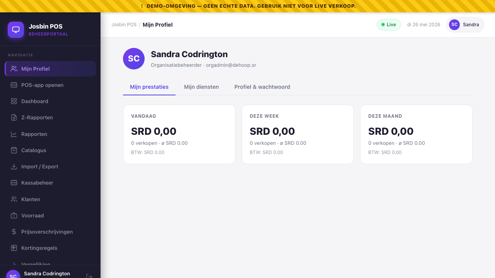
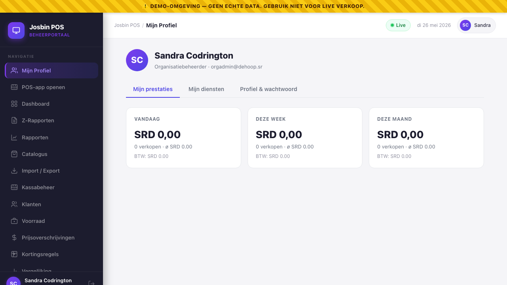
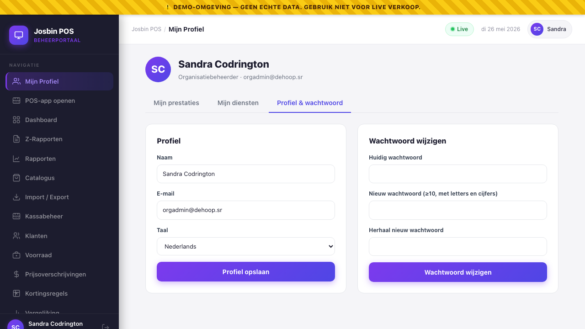

# Chapter 18 — My Account

**Who needs this:** every authenticated user — Super Admin, Organisation Admin, Store Manager, Cashier, Auditor. **Yes, cashiers and auditors too.** This is the one dashboard area available to roles that otherwise have no business in the dashboard.

**When you need it:** to change your password, switch the interface language, check how you (personally) performed today, or pull up your recent shifts to remember what happened on Tuesday. New hires open it on their first day to confirm their profile is correct.

**What it prevents:** the manager getting paged at 19:00 because someone forgot their password (they can self-serve), and the awkward all-team email asking "what was my closing cash on the 14th?" (they can look it up themselves).


---

## 18.1 The strict-scoping rule

Before anything else: **every endpoint behind My Account scopes to the calling user only.** There is no parameter, no path segment, no body field that lets you ask for "someone else's" performance or shifts. The backend reads only `$request->user()` and ignores anything that contradicts it.

Practical consequence: a cashier loading the My Account page sees their own sales — but if they curl `/api/me/sales-summary` with a different user's session token, they get *that* user's data. There is no way to peek across.

For HQ-level "see all cashiers' performance side by side", that's a different screen and a different permission — see [Chapter 1](01-roles-and-permissions.md) for the matrix, and the (forthcoming) reports chapter for the manager-side view.

---

## 18.2 Opening My Account

**Path:** Dashboard → top-right user avatar → **Mijn account / My Account** (or the user's name in the corner — both go to the same place).

For roles that don't have a real dashboard (Cashier, Auditor under certain configs), logging in routes them *automatically* to My Account as the landing page. They can't navigate elsewhere; this is their entire dashboard view.

The page header shows:

- A coloured initials avatar (`Sandra Codrington` → `SC`)
- Full name
- Role label, in the user's locale (`Organisatiebeheerder` or `Organisation Admin`)
- Email address

Below that, a three-tab strip:

1. **Mijn prestaties / My performance** (default)
2. **Mijn diensten / My shifts**
3. **Profiel & wachtwoord / Profile & password**

Click between them — no page reload.

---

## 18.3 Tab 1 — My performance

**For:** anyone who personally rings up sales (Cashier, sometimes Store Manager) or wants their personal sales attribution at a glance.

Three windowed cards across the top:

| Card | Window | Metrics shown |
|---|---|---|
| **Vandaag / Today** | Midnight AST → now | Total SRD, sale count, average basket, BTW SRD |
| **Deze week / This week** | Last Monday → now | Same metrics |
| **Deze maand / This month** | 1st of the month → now | Same metrics |

Each card is large (SRD figure prominent), with the count, average basket, and BTW total in smaller text underneath.

Below the cards: **🏆 Topproduct deze maand / Top product this month** — a single highlighted card with:

- The product name (snapshot at the time of sale — survives even if the product is later renamed)
- Units sold this month by this user
- Total revenue SRD this month from this product

> The performance attribution uses `sales.cashier_id`. If a cashier moves between registers or stores during the period, their performance follows them — it's not register-scoped, it's user-scoped. Sales pushed via the Open Integration API (Chapter 12) have `cashier_id = null` and never appear in any individual's performance.

For roles that never ring up sales (Org Admin, Auditor, Super Admin), the cards show zeros and the top-product card is absent. That's normal — the data simply isn't there for those roles.


---

## 18.4 Tab 2 — My shifts

**For:** any user who has opened or closed a register (Cashier most often; Store Manager when they covered the till).

Shows the **last 30 register sessions** owned by you, newest first.

| Column | What it shows |
|---|---|
| **Geopend / Opened** | Open timestamp, formatted as date + time |
| **Kassa / Register** | Register name + store name, e.g. *Kassa 1 · De Hoop — Paramaribo Centrum* |
| **Status** | Coloured pill — **Open** (green), **Gesloten / Closed** (grey), **Heropenen? / Reopen?** (amber — manager has asked to re-open this session, see Chapter 11) |
| **Geteld (SRD) / Counted (SRD)** | Cash counted at close, or `—` if still open |
| **Verschil / Discrepancy** | Difference between expected vs counted. Negative = short (red), positive = surplus (green), zero = clean (grey, dash) |

Discrepancies are surfaced explicitly here so the cashier sees their own history of how accurate their cash counts have been. A pattern (consistently short by SRD 5) is visible at a glance.

> Sessions older than the last 30 are not paginated in this view — by design, this is "your recent days" not "your full audit history". Auditors and managers can pull the full set from the audit log (Chapter 13, coming soon).

---

## 18.5 Tab 3 — Profile & password

Two cards side by side:

### 18.5.1 Profile card

| Field | Edits | Notes |
|---|:-:|---|
| **Naam / Name** | yes | Free text, 2–120 characters. Used on receipts as "Kassamedewerker: <name>" and in the audit log. |
| **E-mail** | yes | Used for login and password-reset. Must be unique platform-wide. |
| **Taal / Language** | yes | `nl` or `en` — instant per-user switch, no restart. Saved immediately on form submit. |

Save with **Profiel opslaan / Save profile**. On success a green `✓ Opgeslagen / Saved` confirmation appears for 2 seconds. The header above updates to reflect the new name + email + locale; the i18n bundle flips instantly if you changed locale.

The form does **not** allow editing:

- `role` — only an admin (Org Admin or above) can change a user's role, via Users screen. See [Chapter 3](03-users.md).
- `organisation_id` — fixed at creation; changing requires Super Admin intervention.
- `is_active` — controlled by admins, not the user themselves.
- `is_super_admin` — same.

Try to PATCH any of those via the API as a non-admin and the request silently drops the field; the user record is unchanged for that key.

### 18.5.2 Password change card

| Field | Required | Validation |
|---|:-:|---|
| **Huidig wachtwoord / Current password** | yes | Re-entry required. Must match the user's current `bcrypt` hash. |
| **Nieuw wachtwoord / New password** | yes | Minimum 10 characters, must contain letters AND numbers (Laravel `Password::min(10)->letters()->numbers()`). |
| **Herhaal nieuw wachtwoord / Repeat new password** | yes | Must equal the new password. |

Validation happens client-side (button is greyed out until all three are filled and the two new-password fields match) and server-side. Server-side errors return JSON with the specific field at fault.

Tap **Wachtwoord wijzigen / Change password**. On success:

> *"✓ Wachtwoord gewijzigd. Andere apparaten zijn uitgelogd."*

What just happened on the server:

1. Current password verified against the stored bcrypt hash (cost factor 12).
2. New password hashed with the same algorithm and persisted.
3. **Every Sanctum token the user holds is revoked EXCEPT the one used for this request.** Every other device the user was logged in on (a tablet at home, a second laptop, the till) is now signed out and must re-enter the new password to continue.
4. The session token in *this* browser tab keeps working — no awkward "you've been logged out from the browser you just clicked Save in".

If the current password is wrong, the server returns:

> *"Het huidige wachtwoord is onjuist."*

…in red below the password card. No tokens are revoked, nothing is changed.


---

## 18.6 What about 2FA enrollment?

Two-factor enrollment for users who are required (or have opted in) happens on the **login screen** — not on the My Account page. When 2FA is required for the user's role and they don't yet have a secret bound, the login flow detours through:

1. QR code display
2. Authenticator app pairing
3. First 6-digit code verification
4. Recovery codes shown ONCE

After that, every subsequent login challenges them for the TOTP code.

To **opt in voluntarily** when the role doesn't require it, or to **disable** 2FA when it's not policy-required for the role: that lives in a separate **Security** sub-section on the user profile — currently rolling out (referenced in `dashboard/src/screens/TwoFactorScreen.tsx`). When live, expect a *"Tweestapsverificatie / Two-factor authentication"* toggle on this Profile tab.

For the policy that determines whether 2FA is required for *your* role, see [Chapter 17 — Security policy](17-security-policy.md). For lost-phone recovery, contact your Organisation Admin — they can reset your 2FA on **Users → row → Reset 2FA**.

---

## 18.7 What other users see if they snoop

A quick note on the strict-scoping promise, demonstrated with curl. Logged in as a Cashier:

```bash
# Their own data — works
curl -s -H "Authorization: Bearer $CASHIER_TOKEN" \
     http://localhost:8080/api/me/sales-summary
# → 200 OK with their personal numbers

# Trying to access /api/users/{some_other_user}/sales-summary — there's no such route
curl -s -H "Authorization: Bearer $CASHIER_TOKEN" \
     http://localhost:8080/api/users/00000000-…/sales-summary
# → 404 Not Found (route does not exist by design)

# Trying to PATCH another user's profile through the users endpoint
curl -s -X PATCH -H "Authorization: Bearer $CASHIER_TOKEN" \
     http://localhost:8080/api/users/00000000-…
# → 403 Forbidden (cashier has no users.* permission)
```

The /me endpoints are the only self-service surface. They use `$request->user()` exclusively and accept no user-id input.

---

## 18.8 Per-role differences — what's hidden

| Tab | Super Admin | Org Admin | Store Manager | Cashier | Auditor |
|---|:-:|:-:|:-:|:-:|:-:|
| My performance | shows zeros (doesn't sell) | shows zeros | shows their till sales when they cover | full | shows zeros |
| My shifts | empty | empty | their cover shifts | full | empty |
| Profile | full | full | full | full (sometimes the only screen they see) | full |

Functionally the tabs are the same for everyone. The contents differ because the underlying data differs.

---

## 18.9 Common questions

**Q: I changed my email. Will the welcome email work for the old address?**
A: No — the old email is gone the moment you save. Use the new email at the next login. If you mistyped, ask an admin to reset it for you via the Users screen.

**Q: I changed my password but I'm still logged in on my home tablet.**
A: No, you're not. The home tablet's session was revoked the instant you saved. Refresh the tablet — it'll bounce you back to the login screen.

**Q: My language switched but the receipts I just printed are still in the old language.**
A: Receipts use the **store's** receipt-template language, not yours. To switch receipt language, an Org Admin changes the store's locale (Chapter 2).

**Q: I closed a shift with a discrepancy. Can I edit it from here to fix the count?**
A: No. Shifts are append-only. Once closed, the discrepancy is recorded permanently in the audit log. If a recount finds the cash, the manager records a *separate* cash adjustment — they don't rewrite history. See Chapter 11 (forthcoming).

**Q: I'm a cashier and the dashboard shows only My Account, nothing else.**
A: That's correct. Cashiers don't have any other dashboard menus by design — see [Chapter 1 §1.2](01-roles-and-permissions.md#12-what-each-role-actually-does). Their daily work is on the POS app.

---

## 18.10 Quick reference

```
OPEN MY ACCOUNT     Dashboard → top-right user avatar → Mijn account / My Account

TABS                1. Mijn prestaties / My performance   — Today / Week / Month sales
                    2. Mijn diensten / My shifts          — Last 30 register sessions
                    3. Profiel & wachtwoord               — Name / email / language / password

EDIT PROFILE        Profile tab → change name / email / Taal → Profiel opslaan
                    Locale switches instantly. Role/org are NOT editable here.

CHANGE PASSWORD     Profile tab → current + new + repeat → Wachtwoord wijzigen
                    ≥ 10 chars, letters + numbers required
                    All OTHER devices are signed out automatically
                    The browser you saved in stays logged in

API ENDPOINTS       GET   /api/me/sales-summary
                    GET   /api/me/shifts
                    PATCH /api/me/profile      (name / email / locale only)
                    POST  /api/me/password     (current + new + new_confirmation)

SCOPE RULE          Every /me endpoint uses $request->user() only.
                    No user-id parameter exists. No cross-user leak possible.

CASHIER LOGIN       Cashiers landing on the dashboard see ONLY this page.
                    Other menus are hidden.
```

For 2FA enrollment and the per-role policy that controls whether you're required to use it, see [Chapter 17 — Security policy](17-security-policy.md). For admin-side user management (create, deactivate, change role, reset 2FA on behalf of a user), see [Chapter 3 — Users](03-users.md).

---

→ Next: end of Dashboard Manual v1. See the [Developer Documentation](../docs/) for the technical side, or [Trainer Cheat Sheets](../trainer_cheatsheets/) for one-page printable references.
