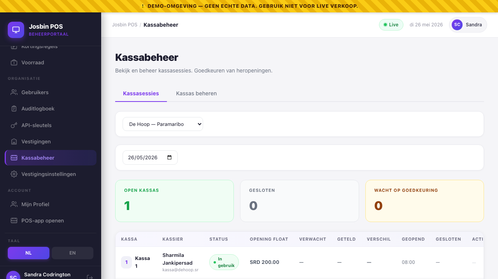

# Chapter 19 — Kassabeheer / Registers

The **Registers** screen is the manager's home for the physical tills under their store. It's the dashboard counterpart to [user_manual ch 3 — Your Register](../user_manual/03-register.md) (the cashier's view at the POS).

Path: **Dashboard → Kassabeheer / Registers** (in the *Organisation* section of the sidebar for OA / SM; *Support tools* for SA).



> This chapter was promised by cross-refs in ch 11 for some time and finally landed. If you came here via "Chapter 8" or "Chapter 19" from elsewhere, this is it.

---

## 19.1 What a "register" is

In Josbin POS terms:

- **Register** = a numbered physical till. One per cash drawer / POS terminal at the store. Has a name (e.g. "Kassa 1", "Servicebalie") and an active/inactive flag.
- **Register session** = one *opening* of a register by one cashier. From the moment the cashier opens the drawer with an opening float to the moment they close it with a cash count. Many sessions per register per day (shift hand-offs).
- **Z-Report** = end-of-day legal close for the whole store. Aggregates all register sessions for that store on that date. Once closed, the day is immutable.

This screen manages the **registers** (per-till setup) and shows the **session history** (who opened what, when, with what discrepancy). The Z-Report lives in its own screen ([ch 11](11-z-reports-and-end-of-day-sync.md)).

---

## 19.2 What you can do here, per role

| Action | OA | SM | SA | Cashier | Auditor |
|---|---|---|---|---|---|
| List registers in the store | ✅ | ✅ | ✅ | ❌ (POS only) | ✅ |
| Add a new register | ✅ | ✅ | ✅ | ❌ | ❌ |
| Rename / deactivate a register | ✅ | ✅ | ✅ | ❌ | ❌ |
| View open sessions (who's logged in where) | ✅ | ✅ | ✅ | ❌ | ✅ |
| View session history | ✅ | ✅ | ✅ | ❌ (own only) | ✅ |
| Record a cash in/out (pay-in / pay-out) on an open session | ✅ | ✅ | ✅ | ✅ (own session, at the POS) | ❌ |
| **Reopen a closed session for the next shift** | ✅ | ✅ | ✅ | ❌ | ❌ |
| Approve a cashier's reopen request | ✅ | ✅ | ✅ | ❌ | ❌ |
| Force-close a register session (rare) | ✅ | ✅ | ✅ | ❌ | ❌ |

Cashier never sees this screen — their register actions all happen on the POS.

---

## 19.3 Adding a new register

**When you'll do this:** opening a new till, adding a relief counter for busy periods, splitting a service desk off from the main till.

**Path:** Registers → **Manage** tab → store dropdown set to the right store → **+ Nieuwe kassa / + New register**.

Fill in:

- **Name** — what the cashier sees on the open-register screen. `Kassa 1`, `Kassa 2`, `Servicebalie`, `Express`. Free text.
- **Active** — defaults to on. Leave on unless you're pre-creating registers for a store that hasn't opened yet.

The system auto-assigns the next sequential **number** per store (so Paramaribo's Kassa 1 and Nickerie's Kassa 1 both have number 1 — they're per-store, not global).

Click **Aanmaken / Create**. The register appears in the list immediately. A cashier logging into the POS at that store will now see it on their Open Register screen.

> **Audit log:** `register.created` row with the register name + your user id. Visible in [ch 13 — Audit Log](13-audit-log.md).

---

## 19.4 Renaming or deactivating a register

**Rename:** click the **Bewerken / Edit** pencil on the row → change the name → save. The cashier sees the new name on next refresh. Old sessions keep the old name in their audit trail — no rewriting history.

**Deactivate:** click **Deactiveren / Deactivate**. The register stops appearing on the cashier's Open Register screen. Existing sessions and historical reports stay intact.

**You can't delete a register that has historical sessions** — instead, deactivate it. The audit log keeps the trail. To "delete" properly would invalidate historical Z-Reports, which the Suriname compliance requirement explicitly forbids.

---

## 19.5 Open Sessions tab — "who's logged in right now"

The **Open sessions / Open sessies** tab shows every register session in `open` or `reopen_requested` status across the store. One row per active cashier.

Columns:
- Register (Kassa 1)
- Cashier (Sharmila Jankipersad)
- Opened at (14:32 today)
- Duration (3h 12m)
- Opening float (SRD 50.00)
- Status (Open / Reopen requested)

**Use it when:**
- A cashier called in sick and you need to know if their drawer is still open on Kassa 2.
- You're closing the store and want to verify every till closed properly.
- The Z-Report won't close because "open sessions remain" — this tab tells you which ones.

If the cashier walked out without closing, you have two options:
1. **Wait for them to log back in** and close properly (preferred — they reconcile their own drawer).
2. **Force-close** as manager (use sparingly — see §19.7).

---

## 19.6 History tab — "who was on Kassa 2 between 09:00 and 14:00"

The **Geschiedenis / History** tab is the audit trail. Pick a date range; see every session that opened or closed in that window.

Columns: register · cashier · opened_at · closed_at · opening_float · expected_cash · actual_cash · discrepancy · closing_note · status (closed / reopened / superseded).

**Discrepancy column is colour-coded:**
- Green (≤ SRD 1.00): rounding, no action
- Yellow (SRD 1.01 – 5.00): worth a glance, usually fine
- Red (> SRD 5.00): investigate — drawer was short or over

Click any row to see the full detail: every sale rung during that session, the BTW breakdown, the closing note the cashier typed, any reopen events.

> **Why per-session history matters:** Z-Reports tell you "store X had Y total today". This tab tells you "Sharmila on Kassa 2 from 09:00–14:00 had a SRD -8.00 discrepancy with note 'lost SRD 5 in fridge transfer'". Different question, both needed.

---

## 19.7 Reopen-for-next-shift (the common case)

**Scenario:** Cashier A closes their drawer at 14:00 to go home. Cashier B arrives at 14:05 to start the evening shift on the same register. You don't want to make B work a "fresh" register with no context.

**Path:** Registers → **History** tab → find Cashier A's just-closed session → click **↺ Reopen for next shift**.

What happens:
- The session is marked `cleared_at = now`. It's officially closed (Cashier A's reconciliation stands; they're not on the hook for anything that happens after).
- Cashier B logs into the POS and opens the register fresh — new session, new opening float, new accountability.
- Both sessions roll up into the same Z-Report at end of day.

> **Why this exists:** without the cleared_at marker, the next cashier's POS would show "this register is still open by Sharmila" and force them to use her unclosed session. With cleared_at, the register is back to available — but the previous session stays in history with its own discrepancy.

**Audit log:** `register.session_cleared` with the manager's user id, the original closing time, and the cashier the manager cleared on behalf of.

---

## 19.8 Cashier-requested reopen (the rare case)

**Scenario:** Cashier already closed their drawer, then realises they forgot to ring up a customer who's still standing there.

The cashier can hit **Vraag heropening / Request reopen** on their close confirmation screen. That puts the session into `reopen_requested` status — the **manager** then sees it in their Open Sessions tab with a yellow flag.

The manager clicks **Goedkeuren / Approve** → status flips to `open` → the cashier rings the missing sale → they re-close (with a new reconciliation that hopefully matches now).

If the manager refuses:
- Click **Weigeren / Refuse**.
- The session stays closed with the original (possibly mismatched) totals.
- The cashier must process the missing customer as a **new sale** on a fresh session — manager will need to clear-for-next-shift first.

**Why approval matters:** mid-day reopens are a fraud vector. Without manager gating, a cashier could close their drawer (claiming a discrepancy), then quietly re-open and adjust. The audit log captures the approval — `register.reopen_approved` with the manager's id, the cashier's id, the reason the cashier gave, and a timestamp.

---

## 19.9 Force-close (last resort)

**Scenario:** Cashier left without closing, can't be reached, and the Z-Report needs to run.

Path: Open Sessions tab → click the session → **Force close** (red button, hidden behind a confirmation).

You provide:
- The actual cash count (you count their drawer yourself or use their last known total).
- A reason that lands in the audit log (`Cashier left without closing — counted by manager 17:30`).
- A note for the closing_note field (`Drawer forced closed by manager — see incident log 2026-05-26-003`).

**Effects:**
- The session closes with whatever cash count you provided.
- Discrepancy is calculated against expected (probably non-zero — that's the point of the note).
- The cashier's name stays on the session (they rang up the sales). Your name appears as `closed_by` in the audit log.
- The Z-Report can now run.

> **Rekenkamer-friendly:** force-closes are flagged in the Rekenkamer export. An auditor sees both the cashier's session and the manager's intervention as separate events with a clear paper trail.

---

## 19.9a Cash in/out during a shift (pay-in / pay-out)

Not every SRD that enters or leaves the drawer is a sale. The float runs out of coins and someone tops it up; a supplier gets paid cash on delivery; the manager takes SRD 2,000 to the bank mid-afternoon. If those movements aren't recorded, the drawer count at close time is wrong through no fault of the cashier.

**Who records it:** the cashier on the open session, or a manager (SM / OA / SA) — always against an **open** register session. A closed session refuses the movement (`409`).

**Where:** at the POS — top bar → **💵 Kas / Cash** → the *Cash in / out* modal. Pick a direction, enter the amount, and type the **mandatory reason** (minimum 2 characters):

| Direction | Typical uses |
|---|---|
| **Pay-in (Kas in)** | Change / float top-up, owner adds cash to the drawer. |
| **Pay-out (Kas uit)** | Bank drop mid-shift, supplier paid cash-on-delivery, petty-cash purchase (cleaning supplies, taxi). |

**The effect on reconciliation** — this is the whole point. Every movement adjusts the session's expected cash, so the drawer still reconciles at close:

```
expected cash = opening float
              + cash sales (incl. the cash portion of mixed payments)
              − cash refunds
              + pay-ins − pay-outs
```

A recorded SRD 2,000 bank drop keeps the close green. An **unrecorded** one shows up as `−SRD 2,000` cash short and triggers the mandatory discrepancy note — see [Chapter 11 §11.8](11-z-reports-and-end-of-day-sync.md#118-cash-discrepancy--how-it-lands-here).

**Where you see it back:**

- The **session-close summary** lists pay-in and pay-out as their own lines in the cash-drawer block, next to opening float and cash sales.
- The **audit log** gets a `register.cash_movement` event per movement — direction, amount, reason, user, timestamp ([ch 13](13-audit-log.md)).
- The POS echoes the **new expected cash** immediately after recording, so the cashier always knows what the drawer should hold.

> **Coaching rule:** the reason field is free text, but it should name the counterparty or purpose (`Leverancier Fernandes — SRD 350 contant`), not `eruit`. The audit log keeps it forever; an auditor reading it in six months should not have to guess.

The cashier-side walkthrough lives in [user_manual ch 3 — Your Register](../user_manual/03-register.md).

---

## 19.10 Common situations

### "We just split Kassa 1 into two tills — how do I add the new one?"
§19.3. Add the register. The new one shows up immediately on the POS.

### "Cashier closed too early and the customer's still here"
§19.8 — they request a reopen on the POS, you approve it from this screen.

### "Last cashier walked out without closing"
§19.9 — force-close with a reason. Document in your shift log.

### "Z-Report won't close — 'open sessions remain'"
§19.5 — Open Sessions tab tells you which. Either find the cashier or force-close.

### "We took cash to the bank mid-shift — how do we keep the drawer count green?"
§19.9a — record a pay-out with a reason at the moment the money leaves the drawer. Expected cash adjusts instantly and the close reconciles.

### "How do I know if anyone's currently selling?"
§19.5 — Open Sessions tab is your live view. Cashier names + how long they've been open.

### "Wrong cashier got attributed to a sale"
You can't reassign cashier to a sale. Refund the sale + ring it under the correct cashier ([user_manual ch 5a](../user_manual/05a-refunds-and-voids.md)). The audit log keeps both.

---

## §19.10 End-of-day settings — closing time & overnight auto-close

**Stores → (store) → Settings → End of day** gives each store its own
end-of-day rhythm. Nothing here is mandatory; all of it makes the *next
morning* smoother.

| Setting | What it does |
|---|---|
| **Closing time** | After this time, if a register is still open, the store's managers get an in-app notification (and e-mail) — one per store per day. Leave empty for no reminder. |
| **Auto-close registers overnight** | Off by default. On: any register still open at the **auto-close time** is sealed automatically as *system-closed — cash not counted*. The next morning starts unblocked; the manager counts the drawer as a reconciliation task instead of the till being stuck. |
| **Auto-close time** | When the overnight sweep runs (e.g. `23:59`). Only shown when auto-close is on. |
| **Manager name & phone** | Shown on the POS when a cashier hits a "yesterday was never closed" screen and needs to call a manager — with a tap-to-call and WhatsApp button. Set these so cashiers are never stuck without knowing who to reach. |

### The morning after

When a register was left open past midnight, the first person at the till
sees a clear **"Yesterday was never closed"** screen instead of a cryptic
error:

- A **manager** logging in gets an inline count-and-close (or, for an
  auto-closed session, a count-the-drawer step) — today opens in the same
  motion.
- A **cashier** sees the call-manager screen (name, phone, WhatsApp) — no
  cash figures, since counting is the manager's job.

An auto-closed drawer that still needs counting also appears in the manager's
morning flow as a skippable **"record the count"** task — do it now or
*Later*, selling is never blocked. Every auto-close and reconciliation is in
the [audit log](13-audit-log.md) (`register.auto_closed`,
`register.reconciled`).

---

## See also

- [user_manual ch 3 — Your Register](../user_manual/03-register.md) — what the cashier sees and does
- [Chapter 11 — Z-Reports & End-of-Day Sync](11-z-reports-and-end-of-day-sync.md) — the day-level close that rolls these sessions up
- [Chapter 13 — Audit Log](13-audit-log.md) — every register / session event is logged here
- [Chapter 1 §1.3 — Store Manager role](01-roles-and-permissions.md) — the role authorised to do most actions on this screen

## 19.x Register policy: self-service shift handover

**The question this answers:** a store with 10 counters and 3 shifts would
need a manager at every counter at every shift change — ±20 "reopen"
approvals a day. Real multi-shift stores run the *drawer-swap* model
instead: the outgoing cashier closes and counts, the incoming cashier
starts fresh with their own float, and no manager is involved at the
handover itself.

**Where:** Organisations → edit → **Register policy** → *Self-service
shift handover*. Org-wide, default **off**.

| | Off (default — strict) | On (multi-shift stores) |
|---|---|---|
| Register closed today, next shift arrives | Manager must reopen | Incoming cashier opens a NEW session with their own float |
| Outgoing cashier's count | Sealed, untouched | Sealed, untouched — exactly the same |
| Accountability | Per session, audited | Per session, audited — nothing is lost |
| Manager's daily register work | ~2 × counters approvals | Discrepancy review + one Z-report |

What the toggle **never** changes: one live session per register at a
time, every open and close is logged with who/when/float/count, and
discrepancies still demand a note. The policy relaxes *who may start the
next shift* — never the counting.

**Recommended:** on for supermarkets with shifts; off for single-shift
shops and government sites that want the four-eyes handover.

## 19.y Force-closing a live session (cashier unavailable)

A cashier went home sick, walked off, or the till froze — their register
shows **In use** and nobody can sell on it. As manager: **Registers → the
open register → Close**. Count the drawer, enter the amount (note
recommended, e.g. *"cashier went home sick"*), confirm. The session closes
with the normal discrepancy check, and **your name is stamped on the
close** — the shift report always shows who counted. The register can then
be opened for the next shift as usual.
