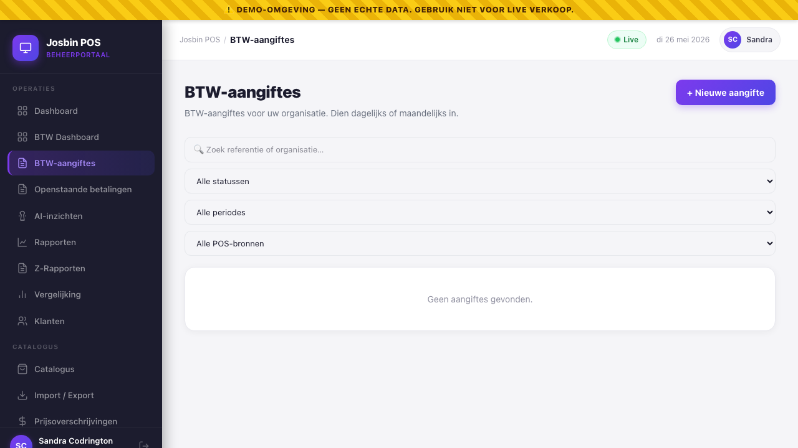
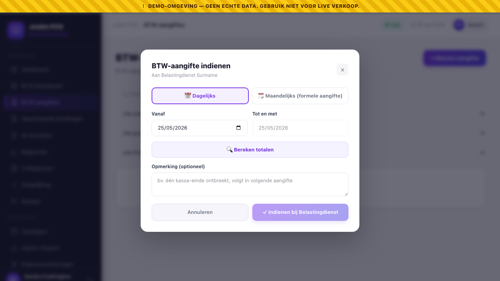

# Chapter 20 — BTW Submissions to Belastingdienst Suriname

This chapter covers the formal BTW (VAT) filing workflow: how the Org Admin / Store Manager files a daily or monthly BTW report to Belastingdienst Suriname through the platform, and how the tax inspector reviews + accepts each filing.

If you're looking for the **per-store BTW breakdown** you see inside daily/monthly reports, that's [Chapter 10 §10.4](10-reports.md). This chapter is about the **formal filing** that creates an audit-grade row Belastingdienst's inspector can see, accept, dispute, or have you correct.

Path: **Dashboard → BTW-aangiftes / BTW Submissions**.

---

## 20.1 What a "submission" is, and who files them

A **BTW submission** is a snapshot of one period's totals (sales, BTW collected, BTW exempt) sent formally to Belastingdienst Suriname.

| Period type | Use case | Belastingdienst expects this |
|---|---|---|
| **Daily** (`period_start == period_end`) | High-volume shops that want transparency, ad-hoc audits, or have an internal policy to file daily | Optional — not the legal cycle |
| **Weekly** (full Mon–Sun week) | Interim check-in between dailies and the monthly close | Optional — interim only |
| **Monthly** (1st → last day of one calendar month) | Standard | **Yes — formal monthly filing cycle** |

Both kinds are stored. The inspector can drill into a daily for a specific date even if the monthly has been accepted — they're two views of the same underlying sales data.

| Role | Can do |
|---|---|
| **Org Admin** (own org) | File · preview totals · resubmit a correction |
| **Store Manager** (own store) | Same, but only for the store assigned to them |
| **Tax Inspector** (cross-org, read-only) | List all org filings · accept · dispute · drill into sale-level detail |
| **Super Admin** | All of the above plus vendor-side visibility for client support |
| Cashier · Auditor · API integration | No access to this screen |

---

## 20.2 Filing a submission (OA / SM workflow)

**Path:** Dashboard → BTW-aangiftes → **+ Nieuwe aangifte / + New submission**.

### Step 1 — Pick the period

A modal opens. At the top it shows **who the filing is for**:

- 🏪 **Filing for: \<your store\>** — if you're a **Store Manager**. Your filings cover only your assigned store; the scope is fixed and you can't change it. (Reports, Stock and Z-Report scope to your store the same way.)
- 🏢 **Filing for: whole organisation** — if you're an **Org Admin**. This is the consolidated organisation-level return (every store combined) — the formal filing Belastingdienst expects, because BTW is filed per organisation (one BTW number).

Then pick **Dagelijks / Daily**, **Wekelijks / Weekly**, or **Maandelijks / Monthly**.

- **Daily** pre-fills *yesterday* as the date (you usually file the previous day's totals first thing in the morning).
- **Weekly** pre-fills *last week* (previous Monday–Sunday) — an interim view between dailies and the monthly close.
- **Monthly** pre-fills *last month* (1st to last day). The end-date input is locked — monthly *must* be a full calendar month per Belastingdienst format.

> A Store Manager's per-store filing and the Org Admin's org-wide filing for the **same period can both exist** — they're different scopes. What you can't do is file the *same* scope + period twice (that's the duplicate block in Step 2).

### Step 2 — Compute totals (the preview button)

Click **🔍 Bereken totalen / Compute totals**. This is a **dry-run** — nothing is saved. The system pulls every completed sale in the period and shows:

| Field | What it is |
|---|---|
| Aantal verkopen / Sales count | Number of completed sales in this period |
| Totaal omzet / Total sales | Gross SRD across all sales (tax-inclusive prices) |
| Belastbaar / Taxable | Sum of sales with at least one BTW-charged line |
| Vrijgesteld / Exempt | Sum of sales that were entirely BTW-exempt (basic foods, medicine) |
| **BTW te betalen / BTW due** | Sum of `btw_srd` — what gets remitted to Belastingdienst |

If a filing already exists for this period (filed or accepted), the preview shows a yellow warning banner: **"⚠️ Er bestaat al een aangifte voor deze periode (REF-XXX, status: …). Het systeem blokkeert dubbele indiening."** You can't double-file — to resubmit, use the resubmit flow (§20.5).

### Step 3 — Optional submitter note

A short note that lands in the audit log + is visible to the inspector. Use it for:
- *"Eén kassa-einde ontbreekt, volgt in volgende aangifte."* (One register close missing, will be in next filing.)
- *"Cashier had a system outage between 14:30–15:00; sales for that window are included from manual paper log."*

Belastingdienst inspectors *read* these — write them assuming an inspector will see them next week.

### Step 4 — Submit

Click **✓ Indienen bij Belastingdienst / File with Belastingdienst**. Three things happen atomically:

1. A `btw_submissions` row is created with `status = 'filed'`, the totals snapshot, and an auto-generated **reference** like `BTW-2026-05-DEHOOPP-DAY-001`.
2. The full list of `sale_ids` that rolled up into the totals is stored — so a Rekenkamer audit can walk back from the filing to the source sales row-by-row.
3. An audit log entry `btw.submitted` is written (visible in [ch 13](13-audit-log.md)) AND a tamper-evident SHA-256 hash chain row is appended (same pattern as `audit_logs`).

A green confirmation banner shows the reference number + the BTW amount. Done. The filing is now in the inspector's queue.

> **Snapshot ≠ recompute.** The totals stored on this filing are LOCKED at submission time. If a sale is voided or refunded *later*, the original filing's numbers don't change — the correction flows into the NEXT period's filing as a negative line. This matches how paper accounting works in Suriname and avoids retroactively rewriting history that's already been filed with Belastingdienst.

---

## 20.3 What the inspector sees and does (tax_inspector workflow)

The Belastingdienst tax inspector logs in with `belastingdienst@gov.sr` (demo) — **2FA is mandatory** for this role, like Super Admin. After login they land directly on the BTW Submissions screen (skipping the usual Dashboard overview).

What they see:

- **All filings across all organisations** on the platform, sorted by most recent
- **Filters** by status (filed / accepted / disputed / superseded), period type (daily / monthly), date range, organisation
- **Per-row columns:** reference · organisation · period · sales count · BTW (SRD) · status · submitted-at + submitter · actions

What they **don't** see:
- Catalogue, products, prices, customers, sales detail rows, stock, register sessions, store settings, anything else
- Other taxpayers' financials *beyond* the BTW totals they've formally filed

### Accepting a filing

For each `filed` row, the inspector sees two action buttons:

**✓ Accepteer / Accept** — opens a small modal:
- Optional `inspector_note` (e.g. *"Verified against bank statement."*)
- Confirm → status → `accepted`, `reviewed_at` set, `reviewed_by` = inspector
- The taxpayer's OA sees the new status next time they open the screen
- Audit log: `btw.accepted` event

### Disputing a filing

**⚠ Betwist / Dispute** — opens the same modal but the reason is **required** (min 5 chars).

- Reason examples: *"Totalen komen niet overeen met aanvullende Z-rapporten."* (Totals don't match supplementary Z-reports.)
- Confirm → status → `disputed`
- The taxpayer is **notified** — the Org Admins + whoever submitted the filing get an in-app 🔔 notification (the bell in the dashboard header, with the dispute reason and a link to the filing) **and** an official Belastingdienst-styled email. They don't have to be watching the list to find out.
- Audit log: `btw.disputed` event

A disputed filing **stays in the system** as a permanent record. The taxpayer can then resubmit a correction (§20.5). When they do, the **inspector is notified** in turn (🔔 + email) that a corrected filing is waiting; when the inspector **accepts**, the taxpayer gets a closure notification.

> 📧 **Email delivery note:** the in-app 🔔 bell always works. The *email* half only sends once real SMTP credentials are configured on the server — until then the notification lives in the bell only.

---

## 20.4 What the OA does about a disputed filing

1. You're alerted by the 🔔 notification (and email, if SMTP is configured). The filing now shows `Status = Disputed` with the inspector's reason in `inspector_note`.
2. OA reviews the reason. Common causes: missing sales, BTW-exempt classification disputed, period boundary mistake.
3. OA fixes the underlying data (records the missing sale, corrects the product's BTW flag, etc.).
4. OA clicks **↺ Corrigeer / Resubmit** on the disputed row → goes to §20.5.

---

## 20.5 Resubmitting a correction (supersede flow)

**When:** the filing is `filed` (OA spotted an error themselves) OR `disputed` (inspector flagged it). Cannot resubmit an `accepted` filing — Belastingdienst's accept is final; further changes happen via a separate adjustment process in the next period.

**Path:** BTW Submissions screen → find the row → click **↺ Corrigeer / Resubmit**.

### What happens

1. A modal explains: *"The original will be marked 'superseded'. A fresh submission is created for the same period with recomputed totals (including any voids/refunds since the first filing)."*
2. Optional reason field — recommended (e.g. *"Late-arriving receipt included."*)
3. Click **↺ Opnieuw indienen / Resubmit**.

**Atomic transaction:**
- Old row: `status = 'superseded'`, `inspector_note` appended with `[Superseded by BTW-XXX on YYYY-MM-DD]`
- New row: fresh reference number, `status = 'filed'`, **totals recomputed from CURRENT sales for the same period** (so voids/refunds since the original filing are reflected)
- Audit log: `btw.superseded` event linking both rows

Both rows survive in the audit trail forever. The inspector sees the new filing in their queue; the old reference number is still looked-up-able with the superseded status pointing at its replacement.

> **Database constraint:** the `(organisation_id, period_type, period_start, period_end)` unique on `btw_submissions` is a *partial* unique — it excludes `superseded` status. That's what makes resubmission possible without dropping history. (Migration `2026_05_26_070001_btw_submissions_partial_unique`.)

---

## 20.6 Audit log entries you'll see

Every state transition writes an `audit_logs` row. From the [Audit Log screen](13-audit-log.md) you can filter on these events:

| Event | When | `new_values` includes |
|---|---|---|
| `btw.submitted` | OA/SM files | reference, period, totals, submitter_note |
| `btw.accepted` | Inspector accepts | inspector_note |
| `btw.disputed` | Inspector disputes | inspector_note (the dispute reason) |
| `btw.superseded` | OA/SM resubmits a correction | replacement reference + new submission id |

For Rekenkamer audits, the [Rekenkamer export](10-reports.md) includes the BTW submission history alongside the underlying sales.

---

## 20.7 Common situations

### "We forgot to file last week's daily — can we still file it?"
Yes. Period dates are validated as `<= today`, not "this week". Pick the past date, click Compute totals, submit. The reference will land in last week's audit window.

### "The Belastingdienst inspector says they didn't receive a filing"
The filing exists in YOUR org's screen as `filed` — but the inspector hasn't accepted it yet. Two possibilities:
1. Inspector hasn't logged in yet (most common — they're a human, not an API).
2. Real-world miscommunication. Use the audit log to show *when* you filed and *what* reference you got. They can search by reference in their own dashboard.

### "We filed monthly but realised one store was missed"
Resubmit the monthly filing (§20.5). The new totals will pick up the missed store's sales automatically. Original gets `superseded`; new one gets `filed`; both are in the audit trail.

### "Inspector accepted but we found an error days later"
You can't resubmit an accepted filing. Two paths:
- **Small error**: file an offset entry in the next month's filing with a `submitter_note` explaining the correction.
- **Material error**: contact Belastingdienst directly via their normal channel. The system can't override their accept.

### "Where do I find the reference of the filing I sent two months ago?"
Filter by date range on the BTW Submissions screen. Or query the audit log (Audit Log → event = `btw.submitted` → filter by your user id).

---

## See also

- [Chapter 10 — Reports](10-reports.md) — the per-report BTW breakdown that informs what gets filed
- [Chapter 13 — Audit Log](13-audit-log.md) — every BTW event is logged here
- [Chapter 21 — Tax Inspector role](21-tax-inspector.md) — the role that reviews these filings
