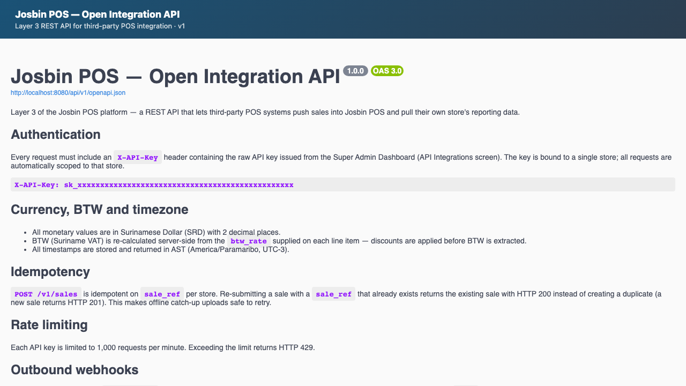

# 0 — Installation & Setup Guide

End-to-end, in order. From blank server to first live sale.

**Audience:** delivery team installing Josbin POS for a new client.
**Companion docs:** [01-architecture.md](01-architecture.md) explains *why*; this doc is *how*.
**Estimated time:** half a day for a single-store install, plus client-side data entry (catalogue size dependent).

---

## Prerequisites

### Hardware

| Role | Recommended | Minimum |
|---|---|---|
| Back-office server PC (1 per store) | i5 / 16 GB / 256 GB SSD | i3 / 8 GB / 128 GB SSD |
| POS terminal (1+ per store) | Windows 10/11, 8 GB RAM, touchscreen | Windows 10, 4 GB |
| Thermal printer | EPSON TM-T20 (Ethernet) | Any ESC/POS over TCP:9100 |
| Cash drawer | RJ11 to printer (pin 2) | RJ11 to printer (pin 2 or 5) |
| Barcode scanner | USB HID keyboard wedge | USB HID keyboard wedge |
| Android tablet (optional) | 10" tablet with USB-OTG for printer | n/a |

### Network

- Server PC and all POS terminals on the **same LAN**.
- Server reachable from terminals on port **8080** (HTTP) or **443** (HTTPS in production).
- Outbound internet for: cloud sync, exchange-rate fetch, license validation. **Not required** for sales.
- Mobile data fallback recommended for interior stores (Digicel/Telesur 4G USB dongle on the server).

### Software (server PC)

- Docker Desktop or Docker Engine + Compose v2
- Git (to pull updates)
- A modern browser (Chrome/Firefox) for the dashboard

### Software (POS terminal)

- Windows 10 or 11 (for `.exe` installer), **or** Android 10+ (for `.apk`)
- Nothing else. The installer bundles everything.

### Accounts & keys you'll need

| Key | Where to get it | Required when |
|---|---|---|
| ExchangeRate-API key | https://www.exchangerate-api.com (free tier supports SRD) | Server install |
| OpenAI API key | https://platform.openai.com (only for AI features) | Optional |
| Anthropic API key | https://console.anthropic.com (AI fallback) | Optional |
| Josbin POS license key | Issued by your team from the license server | First boot |
| BTW registration number | The client provides theirs | Per organisation |

---

## Part A — Backend server install

Run these on the back-office server PC. **Total time: ~10 minutes**, longer first time if Docker pulls images.

### A1. Get the code

```bash
git clone <your-josbin-pos-repo-url> /opt/josbin-pos
cd /opt/josbin-pos
```

For client delivery: ship the IonCube-encoded build instead — see [scripts/README.md](../scripts/README.md). Encoded code runs identically.

### A2. Configure `.env`

```bash
cp backend/.env.example backend/.env
```

Edit `backend/.env` and set:

| Key | Value |
|---|---|
| `APP_URL` | `http://&lt;server-LAN-IP&gt;:8080` (e.g. `http://192.168.1.10:8080`) |
| `EXCHANGERATE_API_KEY` | Your ExchangeRate-API key |
| `JOSBIN_POS_LICENSE_SERVER_URL` | Your license server URL |
| `JOSBIN_POS_INSTALLATION_KEY` | Leave blank — set after activation in A6 |
| `OPENAI_API_KEY` | Optional. Leave placeholder to disable AI |

Leave Postgres + Redis credentials at the defaults — they're container-internal.

### A3. Bring the stack up

```bash
docker compose up -d
```

Wait for all 8 containers to report healthy:

```bash
docker compose ps
```

You should see `josbin_pos_nginx`, `josbin_pos_app`, `josbin_pos_postgres`, `josbin_pos_pgbouncer`, `josbin_pos_redis`, `josbin_pos_reverb`, `josbin_pos_horizon`, `josbin_pos_scheduler` — all `healthy` (the scheduler shows no health column).

### A4. Generate the encryption keys

```bash
docker compose exec app php artisan key:generate --force
```

Then generate the field-level encryption key for customer PII (WBP-S compliance):

```bash
echo "ENCRYPTION_FIELD_KEY=base64:$(openssl rand -base64 32)" >> backend/.env
```

Restart so PHP-FPM picks up the new env:

```bash
docker compose restart app
```

### A5. Run database migrations

```bash
docker compose exec app php artisan migrate --force
```

For a brand-new install, also seed sample data (recommended for the delivery team's smoke test — remove before going live):

```bash
docker compose exec app php artisan db:seed --force
```

### A5a. Link public storage (required for images)

```bash
docker compose exec app php artisan storage:link
```

Without this symlink every uploaded image — receipt logos, product photos and
the wallet QR codes — returns 404. It is a one-time step per install, easy to
forget and easy to misdiagnose later, so do it right after the migrations.

### A6. Activate the license

The first time the backend boots, it will call your license server with a hardware fingerprint (MAC + CPU + UUID) and ask to activate. To pre-issue a license:

```bash
# On the license server
curl -X POST https://<license-server>/api/admin/licenses \
  -H "X-Admin-Key: <admin-key>" \
  -d '{
    "organisation": "Supermarkt De Hoop",
    "tier": "professional",
    "terminal_count": 3,
    "expires_at": "2027-05-23"
  }'
```

It returns an `installation_key`. Put that into `backend/.env`:

```
JOSBIN_POS_INSTALLATION_KEY=ik_xxxxxxxxxxxxxxxxxxxxxxxxxxx
```

Restart and force a license check:

```bash
docker compose restart app
docker compose exec app php artisan license:check --force
```

### A7. Verify

```bash
curl -s http://localhost:8080/api/health
# → 200 OK
```

Backend is now live. Visit `http://localhost:8080/api/v1/docs` in a browser to see the Open Integration API spec — useful confirmation that PHP-FPM + nginx + the routing layer are all wired correctly:



---

## Part B — Organisation onboarding (Super Admin)

The dashboard is at **http://&lt;server-LAN-IP&gt;:5174** in dev, or your production HTTPS URL. Log in as the Super Admin account your team uses.

### B1. Create the organisation

Dashboard → **Organisations** → **Create**

| Field | Value |
|---|---|
| Name | Client's legal name (e.g. *Supermarkt De Hoop NV*) |
| Type | `retail` / `govt` / `wholesale` |
| BTW number | Client's Belastingdienst registration number |
| Default BTW rate | `10.00` (current Suriname VAT) |
| Currency | `SRD` (locked) |
| Locale | `nl` (Dutch primary) |
| Subscription tier | matches the license tier |

If the client is a **government department**, the organisation flag `is_government=true` triggers:
- Mandatory 2FA for all users
- Dual approval for refunds above threshold *(schema + permission landed; SRD-threshold enforcement still in progress)*
- Isolated database (separate from commercial clients)
- Geo-alert on logins from outside Suriname

### B2. Create stores

Same screen → expand the organisation → **+ Add store**.

| Field | Value |
|---|---|
| Name | e.g. *De Hoop — Paramaribo Centrum* |
| Address, city | Physical location |
| Default BTW rate | inherits org default; override for store-specific rules |
| POS type | `native` (Electron POS) or `external` (Layer 3 API only) |
| Receipt header | Free text — usually shop name + address |
| Receipt footer | Free text — usually "thank you" + return policy |
| Receipt logo | Upload PNG/JPG, displayed on PDF + email receipts |
| BTW number on receipt | Override per-store if different |

### B2a. Payment setup per store (2 minutes)

Two optional-but-recommended steps while you are in the store's settings:

1. **Wallet QRs** — upload the store's Mopé / Uni5Pay+ merchant QR
   (Stores → Settings → *QR wallets*). The POS then shows it full-screen
   during QR payments so customers scan straight from the screen.
2. **Card terminal mode** — on each POS terminal: Settings → *Card / PIN
   terminal*. Leave on *Standalone bank terminal* for live stores; switch to
   *Simulated terminal* only for training/demo. Non-technical walkthrough:
   [/card-payments.html](/card-payments.html).

### B3. Create registers under each store

Dashboard → **Registers** → **Manage** tab → **+ Add register**.

One register per physical cash drawer. Naming convention: `Kassa 1`, `Kassa 2`, etc.

---

## Part C — Product catalogue

### C1. CSV / Excel import (recommended for >20 products)

Dashboard → **Catalogue** → **Import / Export**. Accepts **.csv, .xlsx, and .xls** files.

Required columns:
```csv
name_nl,name_en,barcode,price,btw_rate,btw_exempt,category_name_nl,stock_qty
Brood wit,White bread,8710398501234,3.50,10.00,1,Bakkerij,40
Cola 1.5L,Coca-Cola 1.5L,5449000000996,15.00,10.00,0,Dranken,120
```

`btw_exempt` is `1` (exempt) or `0`. Categories are looked up by `category_name_nl` and created if missing. Existing products are matched by `barcode` and updated; rows with a new barcode (or no barcode) are inserted. Download a starter template from the same screen: **Download CSV template** or **Download Excel template**.

BTW-exempt items (basic foodstuffs, medicine) get `btw_exempt=true` — they skip BTW entirely on the receipt.

### C2. Manual entry

Catalogue → **+ Add product** for one-offs. Use the camera barcode scanner button to capture the EAN from the package directly.

### C3. AI categorisation

For products without a category set, the AI Auto-Categorise button suggests one from the product name + barcode lookup. Manager reviews and accepts.

### C4. Per-store price overrides

Dashboard → **Price Overrides** → select store → set per-product override SRD price.

Use case: Nickerie branch sells the same item 5% higher due to transport cost.

---

## Part D — User accounts

Create in this order, top-down.

### D1. Organisation Admin

Dashboard → **Users** → **+ Add user**.

| Field | Value |
|---|---|
| Role | `organisation_admin` |
| Organisation | the one you just created |
| Email | client's HQ admin email |
| Locale | `nl` |
| 2FA required | Yes (recommended) |

System emails a welcome link. Org Admin sets their password + enrolls in 2FA on first login.

### D2. Store Manager (one per store)

| Field | Value |
|---|---|
| Role | `store_manager` |
| Store(s) | one or many — managers can run multi-store |
| 2FA required | Yes for govt orgs, optional for retail |

### D3. Cashier (one per person, not per shift)

| Field | Value |
|---|---|
| Role | `cashier` |
| Store | one |
| 2FA required | Usually no — speed of login matters at the till |

### D4. Auditor (optional, for govt orgs)

Read-only role for Belastingdienst / Rekenkamer staff doing compliance reviews.

### D5. API Integration (only if Layer 3 in use)

Dashboard → **API Keys** → **+ New key**.

This is a *machine* account, not a person. Used by third-party POS systems to push sales via `/api/v1/sales`. Bind to one store; rate limit applies.

---

## Part E — POS terminal install (per terminal)

### E1. Get the installer

Hand-delivered USB or download from your distribution server. File: `Josbin POS-1.0.0-Setup.exe` (Windows) or `josbin-pos.apk` (Android).

### E2. Install on the terminal

Windows: double-click `.exe`. Wizard installs to `C:\Program Files\Josbin POS\`. Creates a desktop shortcut.

Android: enable "Install from unknown sources" for the file manager once, then tap the `.apk`.

### E3. Point at the backend

First launch shows a **Server URL** field. Enter:

```
http://<server-LAN-IP>:8080
```

The POS does a `/api/health` ping. Green = good, red = check network/firewall.

### E4. Hardware fingerprint takes a license slot

On first successful login, the POS sends its hardware fingerprint (MAC + CPU ID + a generated UUID) to the backend, which forwards it to your license server. This terminal now occupies one of the licensed slots.

If you hit the licensed terminal count, the next install shows **"License limit reached — contact your provider."** Upgrade the license tier from the license server.

---

## Part F — Hardware setup (per terminal)

POS app → **Settings** → **Printer & Cash Drawer**.

### F1. Thermal printer — Network TCP (recommended)

1. Print a self-test on the printer (usually hold Feed while powering on) to find its IP.
2. In Settings → Printer → **Network (TCP)** → enter IP, port `9100`.
3. Click **Test print** → should print a sample receipt.
4. Click **Test cash drawer** → drawer should pop.

Works on Windows and Android without drivers. Same printer can serve multiple terminals.

### F2. Thermal printer — USB (Windows only)

1. Install the printer using the manufacturer's Windows driver.
2. Settings → Printer → **USB** → **Refresh** → pick from list.

### F3. Cash drawer

Connects via **RJ11 cable to the printer's DK port**. No separate config — the printer drives it.

- Default pin: **Pin 2** (EPSON TM-T20, Star TSP100, most Posiflex).
- If the drawer doesn't pop, switch to **Pin 5** in Settings.

### F4. Barcode scanner

USB HID scanner → just plug in. It acts as a keyboard; the POS captures scans automatically while any screen is open (focus-independent).

Test: hold a product packet up to the scanner. If `Beep + the item appears in cart` → working.

---

### F5. Bank PIN terminal (card payments)

Nothing to connect: the bank's PIN terminal is a standalone device — put it
next to the till, done. The cashier keys the amount into the bank device and
records the card sale in the POS. There is deliberately no cable or pairing
step. Details and a visual guide: [/card-payments.html](/card-payments.html).

## Part G — Daily setup (every morning)

### G1. Lock today's exchange rate (manager)

POS → **Exchange Rate** screen.

The backend's scheduled job at 06:00 AST tries to fetch USD→SRD from ExchangeRate-API. If it succeeded, today's rate is shown as **Locked**. If not (no internet, API down), the manager:

1. Enters today's rate manually (from CBvS or any bank's published rate).
2. Clicks **Lock for today**.

All sales for the rest of the day use this rate, stored on every sale row for audit.

### G2. Open the register (cashier)

POS → cashier logs in → **Open Register** gate appears.

1. Pick the register (Kassa 1 / 2 / ...).
2. Enter the **opening float** — the cash already in the drawer (e.g. 200 SRD).
3. **Open**. Now POS is ready.

---

## Part H — First end-to-end test sale

Walk through this with the client present so they see it work.

| # | Action | Expected |
|---|---|---|
| 1 | Scan or tap a product | Appears in cart with BTW shown |
| 2 | Add a second product, change qty to 2 | Subtotal updates live |
| 3 | Apply a 10% sale-level discount | Discount line + recalculated BTW (after discount) |
| 4 | Click **Pay** → **Cash** → enter `100.00` | Change calculated, large green amount |
| 5 | Click **Complete sale** | Cash drawer pops + receipt prints |
| 6 | Pick up the receipt | Header/footer/logo correct, BTW broken out as separate line, sale number, BTW registration number printed |
| 7 | Email a copy: enter your address → **Send** | Email arrives within 30s |
| 8 | Open the dashboard live overview | The sale appears in seconds (Reverb WebSocket push) |
| 9 | Cashier: **End Shift** → close register, count cash, enter actual | System shows expected vs counted, any discrepancy in red |
| 10 | Manager: **End of Day** → **Submit to Headquarters** | Z-Report row → "Sent ✓ [timestamp]" |
| 11 | Dashboard: **Z-Reports** → confirm the row arrived | Synced |

If any step fails → see [13-dev-workflow.md](13-dev-workflow.md) §Troubleshooting (once written).

---

## Part I — Backups, monitoring, ongoing ops

### I1. Database backups (3-2-1 rule)

Set this up on the server PC.

```bash
# Daily dump at 02:00 AST, kept 30 days locally
0 2 * * * docker compose exec -T postgres pg_dump -U josbin_pos josbin_pos | gzip > /var/backups/josbin-$(date +\%Y\%m\%d).sql.gz && find /var/backups -name "josbin-*.sql.gz" -mtime +30 -delete
```

Second copy: weekly sync of `/var/backups/` to external drive (NAS or rotating USB). Third copy: monthly upload to off-site (S3, encrypted).

**Test the restore monthly.** Untested backups are not backups.

### I2. Queue monitoring

Visit **http://&lt;server-LAN-IP&gt;:8080/horizon** as a Super Admin. Shows:
- Pending jobs (should normally be 0)
- Failed jobs (investigate any)
- Throughput
- Memory use

### I3. Daily license check

The scheduler runs `license:check` at 00:05 AST. If your license server is unreachable for >72 h, the POS enters offline grace mode (warning banner, sales still work). If unreachable for >72 h **and** license is past expiry, sales are blocked.

### I4. Renewal calendar

Set reminders in your calendar:

| When | What |
|---|---|
| 60 days before expiry | Reach out to client for renewal decision |
| 30 days before expiry | Yellow banner appears in dashboard |
| 14 days before expiry | Amber banner + daily email |
| Expiry | 14-day grace begins, full operation continues |
| Grace +14 days | Soft lock: new sales blocked, reports still available |
| Grace +44 days | Hard lock: login blocked, data export remains |

Renew by calling `POST /api/admin/licenses/{license}/renew` on the license server. Activation is instant — no reinstall.

### I5. Common issues

| Symptom | Likely cause | Fix |
|---|---|---|
| POS shows "Server unreachable" | Server PC off, or network issue | Power on, ping the server IP, check firewall |
| Sale completes but no receipt | Printer IP changed | Re-enter IP in Settings → Printer |
| Cash drawer doesn't pop | Wrong pin in Settings | Switch Pin 2 ↔ Pin 5 |
| "Sync pending — N transactions queued" | Internet down | Auto-retries 1m/5m/15m/30m; or USB export from Z-Report screen |
| MAC is invalid error after key rotation | APP_KEY changed; old encrypted data unreadable | Re-seed, or rotate using `php artisan key:generate --show` + custom re-encrypt |
| License expired banner | Renewal due | Renew on the license server |

---

---

## Bonus — Running a demo stack alongside live

For client demos, training, or experimenting, run the **demo stack** in parallel with your live stack. Same code, isolated database, different ports — both can be up at the same time.

```bash
# Bring up the demo stack on its own ports (8082 / 55433 / 6380)
docker compose -p josbin_demo \
  -f docker-compose.yml -f docker-compose.demo.yml up -d --build

# Migrate + seed (one-off, after first start)
docker compose -p josbin_demo -f docker-compose.yml -f docker-compose.demo.yml \
  exec app php artisan migrate --force

docker compose -p josbin_demo -f docker-compose.yml -f docker-compose.demo.yml \
  exec app php artisan db:seed --force

# Fill every screen with realistic data
docker compose -p josbin_demo -f docker-compose.yml -f docker-compose.demo.yml \
  exec app php artisan db:seed --class=DemoSeeder --force

# Point a frontend at the demo backend
cd frontend && VITE_API_URL=http://localhost:8082/api npm run dev
# (similarly for dashboard, on a different terminal/port)
```

A yellow "DEMO MODE — not real data" banner shows on every screen of POS and Dashboard whenever they're talking to the demo backend (driven by `JOSBIN_POS_DEMO_MODE=true` exposed via `GET /api/environment`).

> **⚠️ Re-run migrations on demo after every backend change.** Demo and live each have their own database. When a new migration ships, `docker compose exec app php artisan migrate` only updates the stack you point it at. After pulling new code, run the migrate command above against demo (and sandbox) too, or the demo POS will throw SQL errors against missing tables. Symptom: empty product grid, "Could not load X" messages.

Tear down without losing data: `docker compose -p josbin_demo -f docker-compose.yml -f docker-compose.demo.yml down`.
Wipe demo data too: add `--volumes` and `rm -rf docker/postgres-demo/`.

---

## Where to go next

| Audience | Doc |
|---|---|
| Cashiers, store managers (daily operations) | [user_manual/](../user_manual/) |
| HQ super admin / org admin (configuration, reports) | (dashboard manual — TODO) |
| Developers extending the system | [01-architecture.md](01-architecture.md) onward |
| Delivery / encoded build / code signing | [scripts/README.md](../scripts/README.md) |
| License server maintenance | [license-server/README.md](../license-server/README.md) |

---

→ [1 — Architecture overview](01-architecture.md)
