# Josbin POS — System Flows

> Plain-language map of how Josbin POS works end to end — onboarding a customer,
> ringing a sale, closing the day, syncing offline, and generating &
> submitting **BTW** (Surinaamse VAT) reports to the **Belastingdienst** tax
> inspector.
>
> **Two formats, one source of truth:**
> - **`docs/flows.html`** — open in any browser; polished, styled, for customers & staff (no internet-free note: it loads Mermaid from a CDN on first open).
> - **This file (`docs/FLOWS.md`)** — renders inline on GitHub; for the team. Paste any block into <https://mermaid.live> to export SVG/PNG.

**Suriname terms:** BTW = VAT (10%, some items exempt) · Belastingdienst = Tax Authority · Rekenkamer = Court of Audit · WBP-S = data-protection law · SRD = Surinamese Dollar (exact decimals) · AST = America/Paramaribo (UTC−3) · Z-Report = end-of-day register close.

---

## 1 · The big picture

Four phases take a new shop from zero to filing VAT. Everything else is a zoom-in on one of these.

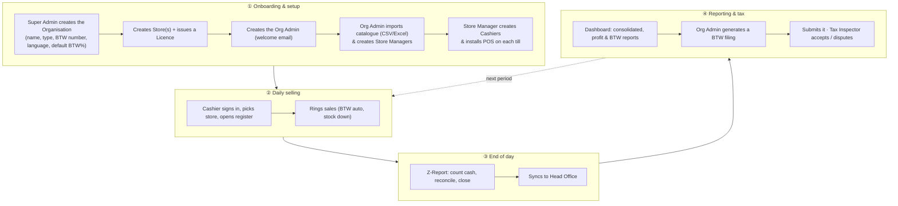

---

## 2 · Actors & the three layers

Access is denied by default and enforced on the server — not just hidden in the UI.

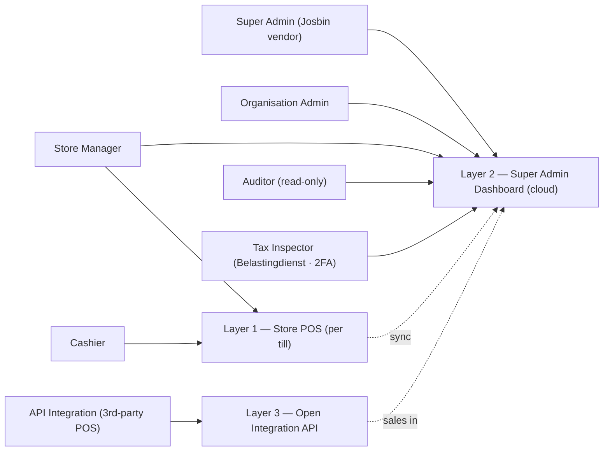

| Role | Scope |
|------|-------|
| **Super Admin** | Josbin (vendor). Every org, licences, catalogue pushes. |
| **Organisation Admin** | One customer's head office. Catalogue, users, reports, BTW filings. |
| **Store Manager** | Their store(s). Registers, stock, store reports, Z-Reports. |
| **Cashier** | The till only. Ring sales, take payment, print receipts. |
| **Auditor** | Read-only across the org. |
| **Tax Inspector** | Belastingdienst. Cross-org, read-only, BTW filings only. **2FA mandatory.** |
| **API Integration** | Machine account so a third-party POS can push sales. |

---

## 3 · Onboarding a new customer

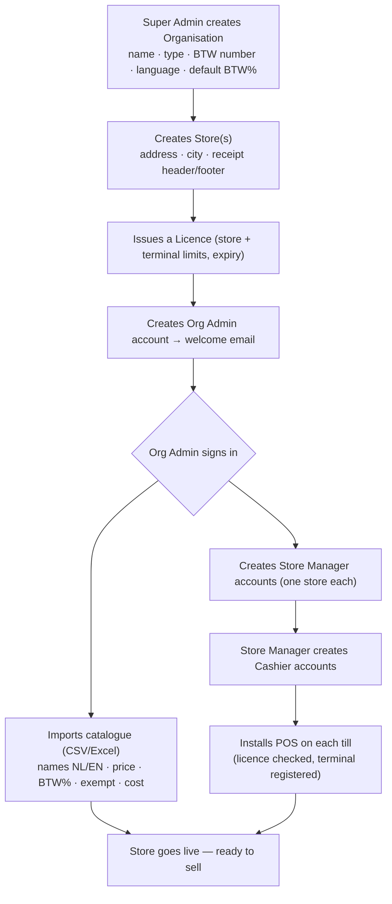

> **Catalogue is centralised** — one master list per org; optional per-store price overrides for higher-cost regions (e.g. Nickerie). Updates push to all tills in seconds over WebSocket.

---

## 4 · A sale at the till

**Money rule:** discounts are applied first, **then** BTW is extracted — the order Suriname law requires.

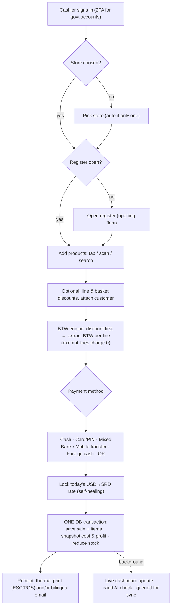

- **Rate never missing** — self-heals: already locked → rate API → carry forward yesterday → configured static fallback. Locked rate stamped on every sale.
- **No silent oversell** — stock drops inside the sale transaction (not a flaky job). Default allows honest negative stock; a store can switch to strict block-oversell.
- **Profit captured at sale time** — cost & profit snapshotted per line, so reports stay correct if cost changes later.

---

## 5 · End of day — Z-Report & cash reconciliation

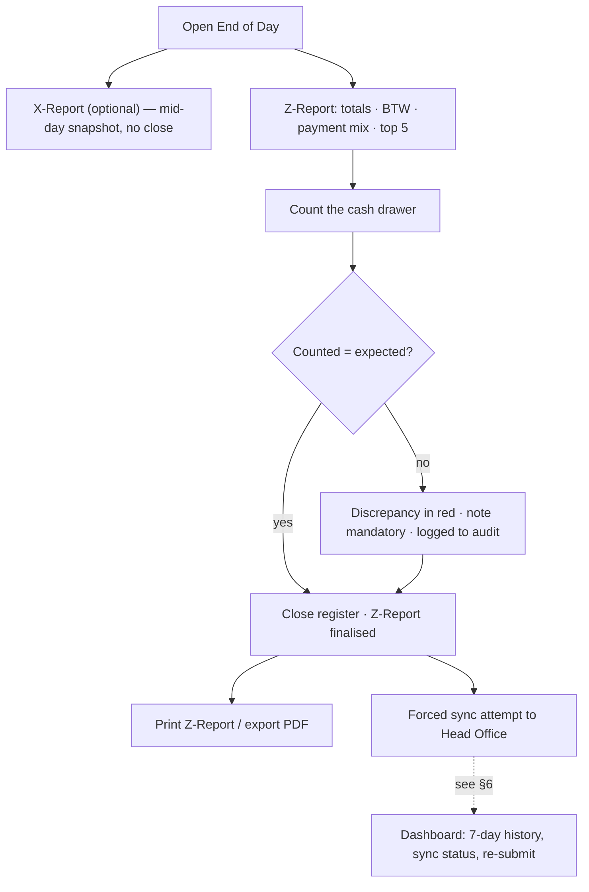

---

## 6 · Five-layer offline resilience

Selling never depends on the internet. Data finds its way to HQ via whichever layer is available.

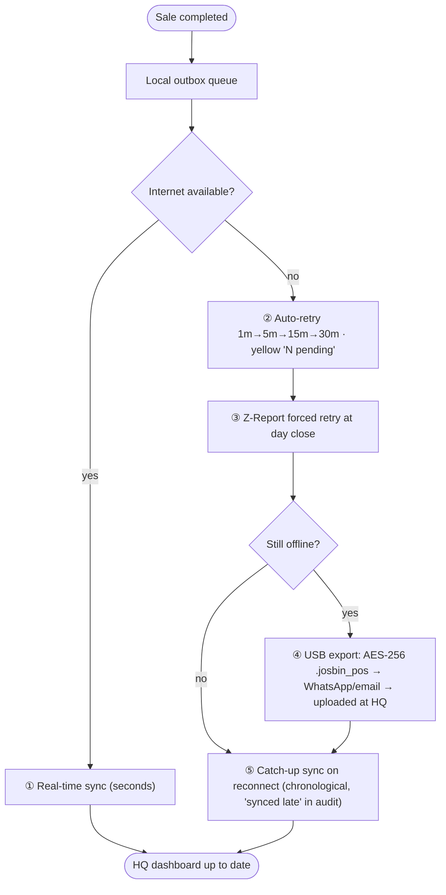

> A **4G USB dongle** (Digicel / Telesur) is a backup link — used only for the tiny sync payload (50–200 KB/day), never for selling.

---

## 7 · Reporting — store, network, profit

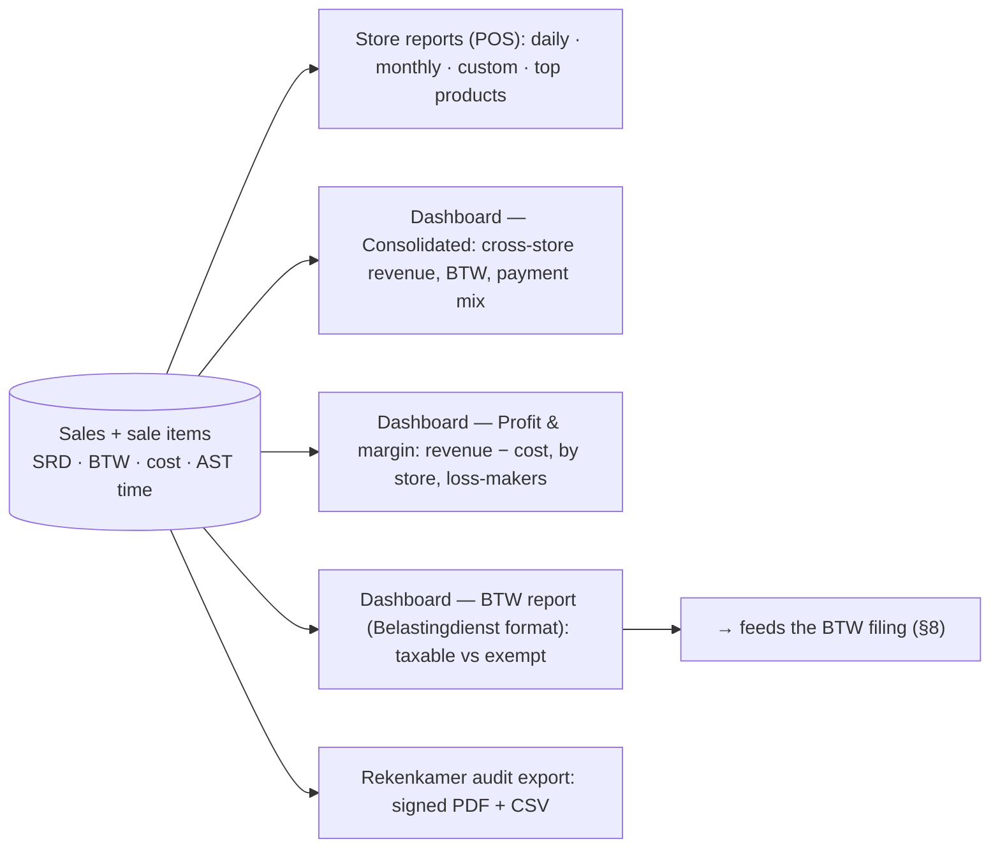

> A **store filter** drills consolidated / BTW / profit reports down to one branch, or the whole org at once. All reports honour the AST day-boundary and export to PDF/CSV (NL or EN headers).

---

## 8 · BTW report → submission → Tax Inspector

The headline compliance journey.

### 8a · Generate & submit

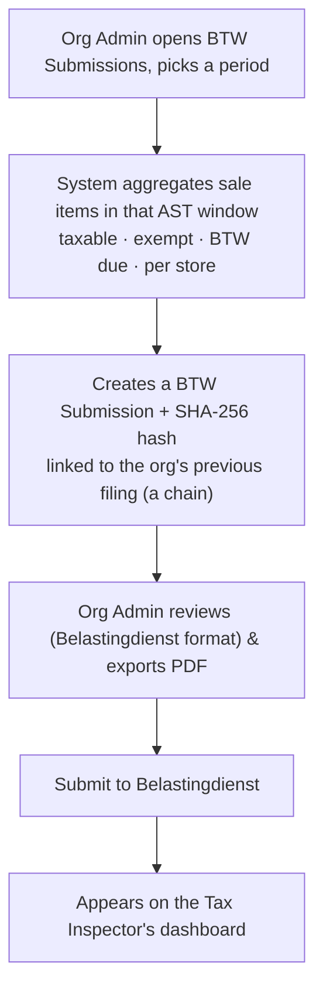

### 8b · The life of a filing

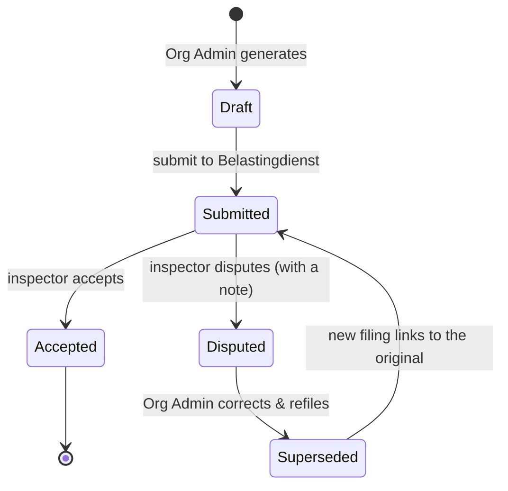

### 8c · Who does what, in order

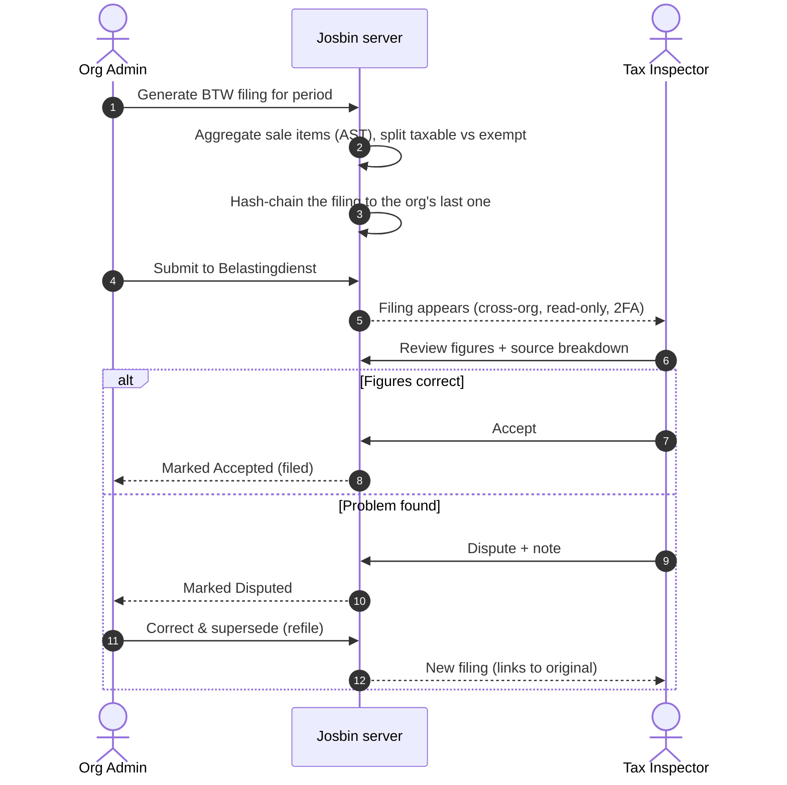

> **Why the hash chain matters.** Each filing carries a SHA-256 fingerprint of itself plus the previous filing's, **per organisation**. Change any historical figure and the chain breaks — so the Belastingdienst and Rekenkamer can trust the record wasn't altered after the fact. Day boundaries use AST, so a 23:30 sale counts on the correct day.

---

## 9 · The compliance backbone (always on)

These run underneath every flow above — not a screen, but how the system behaves on every write.

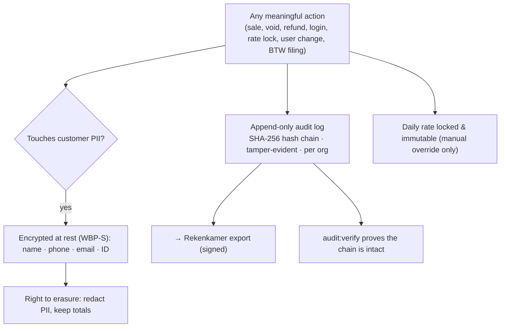

- **Immutable audit trail** — hash-chained, append-only; no user can edit/delete a row without breaking the chain.
- **PII encryption (WBP-S)** — customer data encrypted field-by-field; erasure on request keeps sales history intact.
- **Code & licence protection** — PHP IonCube-encoded, desktop app code-signed, hardware-bound licence checked on start + every 24 h.

---

*All money in SRD · all times in AST (America/Paramaribo) · BTW per Belastingdienst Suriname.*
