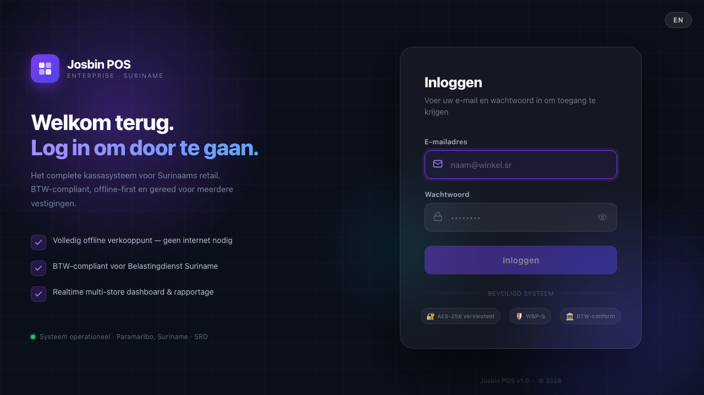
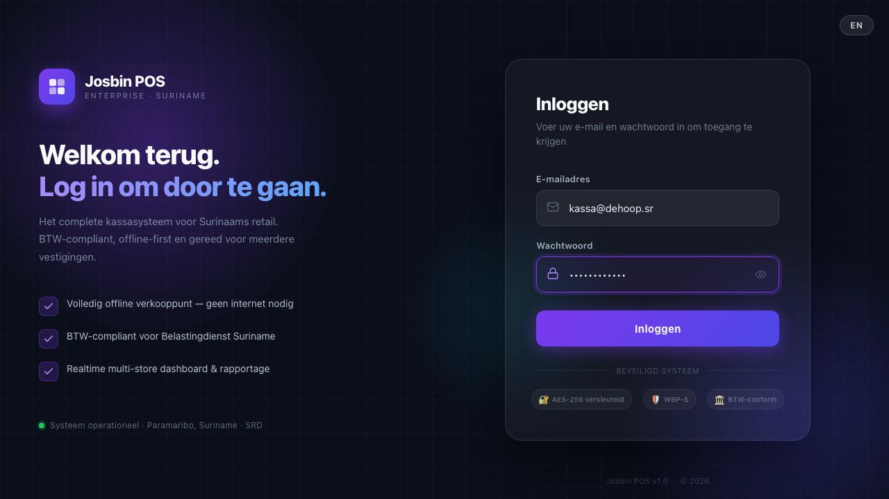
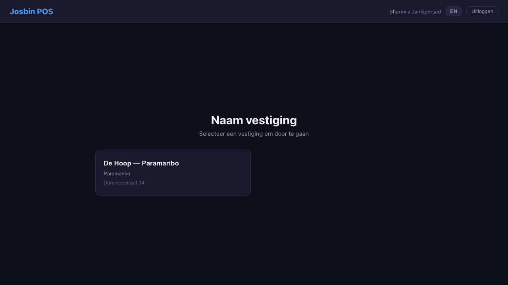

# Chapter 1 — Getting Started: Login & First Steps

This chapter explains how to open Josbin POS, log in, and find your way around the screen.

---

## 1.1 Opening the application

**On Windows (POS terminal):**

1. Double-click the **Josbin POS** icon on the desktop.
2. The application opens in full screen. The login screen appears automatically.
3. If Windows shows a security warning ("Unknown publisher"), click **Run anyway**. This is normal for the first launch.

> **Note:** Josbin POS runs entirely on your local computer. It does not need an internet connection to process sales. Internet is only used to sync data to headquarters and to fetch the daily exchange rate.

---

## 1.2 Logging in

The login screen asks for your **email address** and **password**.



**Steps:**

1. Click the **Email** field and type your email address (e.g. `kassa@dehoop.sr`).
2. Click the **Password** field and type your password.
3. Click the **Login** button or press **Enter** on your keyboard.



**What happens next:**
- If your credentials are correct, you are taken to the store selection screen.
- If the login fails, a red error message appears. Check that Caps Lock is not on and try again.
- After **5 failed attempts**, your account is locked for 15 minutes. Contact your manager if this happens.

> **Tip — Touchscreen terminals:** Tap the field you want to type in. The on-screen keyboard can be enabled from the toolbar if you do not have a physical keyboard. See [Chapter 13 — Settings](13-settings.md) for how to configure this.

---

## 1.3 Selecting your store

Cashiers and Store Managers are pinned to **one store** by the administrator who created their account. Right after login the system auto-routes you straight to that store's Open Register screen — the picker screen below is skipped entirely. This is the expected behaviour.



You only ever see this Store Selection screen if:
- You're an Organisation Admin or Super Admin (org-scoped roles see every store), **or**
- Your account is missing its store assignment (a setup error — ask your administrator to assign you to a store).

If you do see it: tap or click the name of your store. The main POS screen opens immediately.

> **Need to work in two shops?** Ask your administrator to create a **second account** for the other store. One person can have one account per store; you can't switch a single account between stores.

---

## 1.4 Understanding the screen layout

The main screen is divided into three areas:

```
┌──────────────────────────────────────────────────────────┐
│  TOP BAR  (navigation, store name, today's sales total)  │
├──────────────────────────────────┬───────────────────────┤
│                                  │                       │
│   PRODUCT GRID                   │   CART PANEL          │
│   (left side)                    │   (right side)        │
│                                  │                       │
│   Search bar at top              │   List of items added │
│   Category buttons below         │   Subtotal, BTW,      │
│   Product cards fill the rest    │   Total, Checkout btn │
│                                  │                       │
└──────────────────────────────────┴───────────────────────┘
```

**Top Bar** — contains:
- Today's total sales and transaction count
- **Online / Offline indicator** — a small pill with a green or red dot (explained below)
- Navigation buttons: POS, Transactions, Reports, Settings — plus Labels, Exchange Rate and End of Day for managers. On a narrow till the row scrolls sideways; swipe or drag it to reach the rest.
- Customer, Open Bills and Cash in / out buttons
- A green pill showing which register you are on
- **Your name, far right** — tap it for the menu described below

**Product Grid** — the main selling area:
- Type in the search bar to find any product by name or barcode
- Click a category button to filter products
- Click or tap a product card to add it to the cart

**Cart Panel** — the running total on the right:
- Lists every item added, with price and quantity
- Shows subtotal, BTW (tax) breakdown, and total in SRD
- Contains the **Checkout** button to proceed to payment
- Contains the **Hold** button to save the cart and start a new one

### The Online / Offline indicator

The top bar always shows a small status pill with a coloured dot:

| Pill | What it means | What you do |
|---|---|---|
| 🟢 **Online** | The terminal has a network connection. Hovering shows *"Connected — sales sync to head office"*. Completed sales reach headquarters within seconds. | Nothing — normal operation |
| 🔴 **Offline** | No network right now. Hovering shows *"No internet — sales are saved locally and synced later"*. | **Keep selling.** Every sale is saved locally and syncs automatically the moment the connection returns. |

Going offline is not an emergency. Josbin POS is built for Suriname's patchy connections: sales are processed on the store's own server, and a five-layer sync fallback catches up with headquarters afterwards (see [Chapter 10 — End of Day](10-end-of-day.md), section 10.6). No sale is ever lost because the internet dropped.

**When to escalate:** if the indicator stays Offline for a long stretch (an hour or more), tell your manager — a cable, Wi-Fi or router problem may need fixing so the day's data can sync before the Z-Report.

> **Keyboard tip:** if your terminal has a physical keyboard, the POS screen has function-key shortcuts (F2 hold, F9 pay, Esc close, and more). The full table is in [Chapter 4 — Making a Sale](04-making-a-sale.md), section 4.7.

---

## 1.5 Your name menu (top right)

Tap your name in the top right corner. A small panel opens showing:

| Item | What it does |
|---|---|
| Your name, role and store | Confirms who is signed in — useful on a terminal several people share |
| **NL / EN / SRN** | Switches the whole interface instantly. Saved per user, so it is still your language next time you log in. |
| **On-screen keyboard** | Windows tills only — shows or hides the typing keyboard (see [Chapter 13](13-settings.md), section 13.4) |
| **Switch store** | For staff assigned to more than one location |
| **Close register** | Ends your shift and counts the drawer (see [Chapter 3](03-register.md)) |
| **Log out** | Signs you out |

Receipts are printed in whichever language is active at the time of the sale.

> If the cart still has items, or your register is still open, the app asks you
> to confirm before it lets you log out or switch store. That is deliberate —
> it is how a drawer gets left open overnight.

---

## 1.5a What if I see a yellow / amber / red license banner?

You may occasionally see a coloured banner across the top of the dashboard when your shop logs in. It belongs to the **store's Josbin POS license**, not to you personally. What each colour means:

| Banner | Stage | What's happening | What you do |
|---|---|---|---|
| 🟢 None | License is active and has > 30 days left | Normal operation | Nothing |
| 🟡 Yellow ("30 days remaining") | License expires in less than 30 days | Manager gets a daily email reminder. POS works normally. | Mention it to the manager once; otherwise ignore |
| 🟠 Amber ("14 days remaining") | License expires within 14 days | Manager gets daily emails. POS works normally. | Mention it to the manager today |
| 🔴 Red ("Grace period") | License expired but the 14-day grace period is running | Full POS works, but the manager should renew now | Tell the manager immediately at the start of your shift |
| 🔴 Red ("Sales blocked") | Grace period expired — POS is in soft-lock | **You cannot complete new sales** until the license is renewed. Existing data, reports, and exports still work. | Stop ringing sales. Call the manager. They contact Josbin (support@josbin-pos.sr or +597 471-0000). |

> **Why this exists:** Suriname is far from the vendor's office. Network or payment delays could lock a shop out of selling for legitimate reasons. The 30 → 14 → grace → soft-lock timeline gives the manager four warnings + 28 days of "you can still sell" before any blocking happens. By the time you ever see "Sales blocked" as a cashier, the manager has had a month of yellow + amber + red warnings — not your fault, not your fix.

For the full license lifecycle (manager-side actions, renewal flow) see [dashboard manual ch 15](../dashboard_manual/15-license-management.md).

---

## 1.6 Logging out

1. Click your **name** or the **logout icon** in the top bar.
2. Confirm the logout.
3. The login screen reappears.

> **Important:** Always log out when leaving the terminal unattended. The system automatically logs you out after 15 minutes of inactivity on the POS screen.

---

## Common problems at startup

| Problem | Solution |
|---------|----------|
| Login screen shows "Cannot connect to server" | The local server may not be running. Contact your manager or IT support. |
| Password rejected but you are sure it is correct | Check Caps Lock. If still failing, contact your manager to reset the password. |
| Screen is completely black | Wait 15 seconds. If still black, close and reopen the application. |
| Application won't open | Restart the computer and try again. If the problem persists, contact IT support. |
