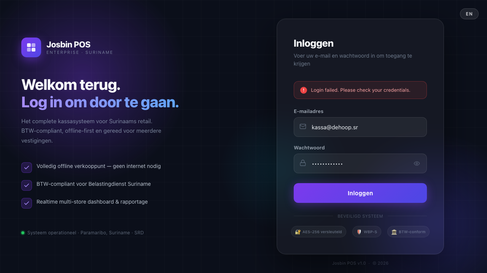

# Chapter 4 — Making a Sale

This chapter covers everything that happens before payment — adding products, changing quantities, searching, and using a barcode scanner.

---

## 4.1 Adding products to the cart



There are five ways to add a product:

### Method A — Tap/click from the product grid

1. The product grid fills most of the screen with product cards.
2. Find the product you want and **click or tap** it once.
3. The product is added to the cart on the right. Each click adds one more unit.

### Method B — Use a category filter

1. Category buttons appear as a horizontal row above the product grid.
2. Click a category (e.g. "Dranken", "Zuivel", "Vlees") to show only products in that category.
3. Click the product to add it.
4. Click **"All"** (Dutch: *"Alles"*) to go back to all products.

### Method C — Search by name

1. Click the **search bar** at the top of the product grid.
2. Type the product name (or part of it). The grid updates in real time as you type.
3. Click the product from the filtered results to add it.

> **Tip:** The search understands partial names and works in both Dutch and English. Typing "aardappel" and "potato" will both find the same product.

### Method D — Scan a barcode

**USB barcode scanner (keyboard wedge):**
1. Point the scanner at the product barcode.
2. The scanner automatically adds the product to the cart. No clicking needed.
3. The scanner works like a keyboard — it "types" the barcode and presses Enter.

**Manual barcode entry:**
1. Click the search bar.
2. Type the 8–13 digit barcode number.
3. Press **Enter**. If the barcode matches a product, it is added to the cart.

**Camera barcode scanner (Quagga2):**
1. If your terminal has a camera, the camera scanner may be enabled in Settings.
2. Point the camera at the barcode.
3. When detected, the product is added automatically.

> **Weighed goods (scale labels):** if your store has a labelling scale (deli, meat, produce) and the manager has enabled **scale barcodes** in Settings ([Chapter 13, section 13.9](13-settings.md)), scanning the label the scale printed adds the product with the weighed price or weight already filled in — you don't type anything.

### Method E — The Favorites row (★)

Above the product grid you'll usually see a row labelled **★ Favorites** (Dutch: *Favorieten*) with up to 8 product tiles. This is your quick row — the fastest path to the items you sell all day:

- **Tap a tile** to add the product to the cart — exactly like the grid, just closer to hand.
- **Pinned favorites come first.** Tap the **☆** on a tile to pin it as a favorite (it turns ★); tap **★** to unpin. Pin your store's daily top sellers.
- **Recent products fill the remaining slots.** Every product you add — by tap, search or barcode — automatically moves to the front of the recents list, so the row learns your fast movers by itself.
- The row hides while you're searching or when a category filter is active. Clear the search and pick **"All"** to see it again.

> **Per terminal:** favorites and recents are stored on this terminal (in its local browser storage), per store. Kassa 2 keeps its own list, and clearing the terminal's browser data clears the row. Nothing is lost except the shortcuts — it rebuilds itself from what you sell.

---

## 4.2 Changing the quantity

**Adding more of the same item:**
- Simply click the product card again. Each click adds one unit.

**Setting an exact quantity:**
1. Find the item in the cart (right side of screen).
2. Click the **quantity number** on that line item.
3. A line item edit panel opens.
4. Change the quantity to the number you want.
5. Click **Save** or press **Enter**.

**Setting a fractional quantity (weight/bulk items):**
- Quantities support decimal values. For example, enter `1.5` for 1.5 kg.

---

## 4.3 Removing an item from the cart

1. Find the item in the cart panel.
2. Click the **× (delete)** button or trash icon on that line.
3. The item is removed and the total is recalculated.

To remove all items at once, click the **Clear cart** button at the bottom of the cart panel.

---

## 4.4 Understanding the cart panel

The cart panel on the right shows:

```
Item name                   Qty    Unit price   Line total
────────────────────────────────────────────────────────
Melk (1L)                   2×     SRD 8.50     SRD 17.00
Brood volkoren              1×     SRD 12.00    SRD 12.00
────────────────────────────────────────────────────────
Subtotal                                        SRD 29.00
Discount                                        SRD  0.00
BTW (10%)                                       SRD  2.55  ← tax
────────────────────────────────────────────────────────
TOTAL                                           SRD 31.55
```

- **Subtotal** — the sum of all line totals before any discount
- **Discount** — any discount applied (see [Chapter 8 — Discounts](08-discounts.md))
- **BTW** — the tax amount (already included in the total — shown for transparency)
- **Total** — the amount the customer pays

> **Note on BTW:** The total already includes BTW. The BTW line is shown for information only, not as an extra charge. BTW-exempt products (basic foods, medicine) show SRD 0.00 BTW.

---

## 4.5 Viewing today's totals

The **top bar** always shows today's running totals without leaving the POS screen:

- **Total sales** — total SRD taken in sales today
- **Transaction count** — number of completed sales today

These numbers update instantly after each completed sale.

---

## 4.6a Low-stock and out-of-stock badges on the product grid

When a product's stock at your store falls below its **low-stock threshold** (set per product by your manager), a small badge appears on the product tile:

| Badge | Meaning | Can you still sell it? |
|---|---|---|
| 🟡 **LOW** | Stock is at or below the threshold (e.g. 5 left, threshold 5) | Yes — but warn the manager so they can reorder |
| 🔴 **OUT** | Zero stock recorded at your store | Yes — but flag it; either the catalogue is wrong or the product is genuinely empty |

The badges are **informational** — they don't block the sale. You can ring up a product even when it shows OUT, because:

- The number in the system may not match the shelf (a delivery hasn't been logged yet).
- The customer is holding the product, so it clearly exists.
- Blocking would break the customer experience for an inventory-data problem.

> **What the manager sees:** the dashboard's Stock screen lists every product currently LOW or OUT across the store, so they can act on shortages without waiting for a cashier to mention it. Reach out to your manager if you see a lot of red badges in one category — that's usually a missed delivery log.

**Multi-store note:** the badge shows stock at **your store only**. A product that's OUT at your shop may have plenty in stock at the neighbouring branch. If you frequently need to send customers to the other branch, ask your manager to set up a per-store stock alert.

---

## 4.6 What happens if a product is not found?

If a barcode or search returns no result:
- The search bar turns red or shows "No products found".
- The product is not in the catalogue. Contact your manager to add it.

You can still sell an unlisted product by:
1. Adding any product to the cart.
2. Editing the name and price on the line item (see [Chapter 8 — Discounts](08-discounts.md) for line item editing).

---

## 4.7 Keyboard shortcuts

If your terminal has a physical keyboard, five keys cover the whole sale rhythm — no mouse needed:

| Key | What it does | When it works |
|---|---|---|
| **F2** | Hold the current bill — opens the Hold window ([Chapter 9](09-hold-bills.md)) | Cart has at least one item |
| **F4** | Start a new sale — closes the receipt screen after a completed sale | Only while the receipt screen is showing |
| **F9** | Open the payment screen ([Chapter 5](05-payment.md)) | Cart has at least one item and no payment screen is open yet |
| **F12** | Show / hide the on-screen keyboard | Always — on every POS screen |
| **Esc** | Close whatever is open, in this order: the payment screen first, then the receipt screen, then the on-screen keyboard | When one of those is open |

Good to know:

- Shortcuts are **ignored while you are typing in a field** (search bar, numpad, reason boxes) — so a barcode scanner or a product name never triggers them by accident.
- They work on the **POS sell screen only** — on Reports, Settings and other screens the keys do nothing. The one exception is **F12**, which toggles the on-screen keyboard everywhere.
- The **Pay button shows "F9"** as a reminder. Cashiers who learn **F9 + Esc** are noticeably faster on a busy Friday.

---

## Common problems

| Problem | Solution |
|---------|----------|
| Product grid is empty | Check that a store is selected. Check internet/server connection. |
| Barcode scanner adds wrong product | The barcode may be for a different product. Check the catalogue. |
| Product shows SRD 0.00 price | The product was not priced correctly. Contact manager. |
| Cart total seems wrong | Check for unexpected discounts. Click each item to review prices. |
